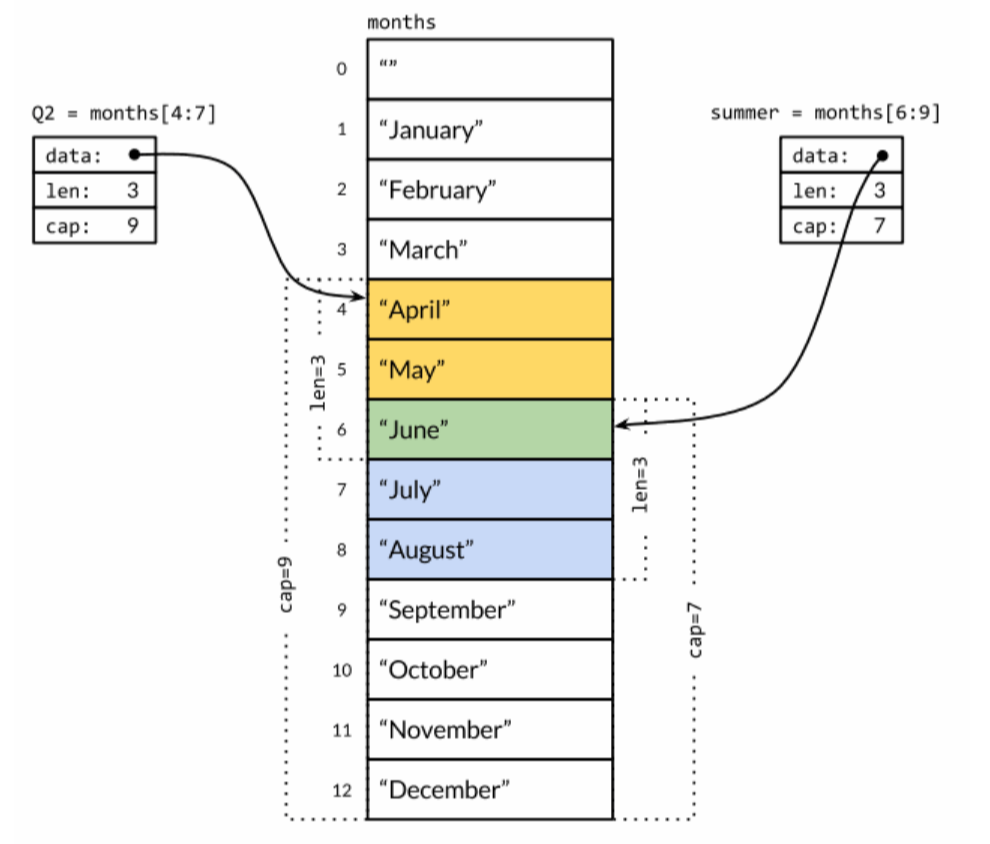

# Go 笔记

## 介绍

- 类型检查：编译时。
- 运行环境：编译成机器码直接运行 (静态编译)。
- 编程范式：面向接口，函数式编程，并发编程。
- 采用CSP (Communication Sequential Process)模型。
- 不需要锁，不需要callback。

Go语言原生支持Unicode，它可以处理全世界任何语言的文本。

main包比较特殊。它定义了一个独立可执行的程序，而不是一个库。main函数也很特殊，它是整个程序执行时的入口(C系语言差不多都这样)。

Go语言不需要在语句或者声明的末尾添加分号，除非一行上有多条语句。实际上，编译器会主动 把特定符号后的换行符转换为分号，因此换行符添加的位置会影响Go代码的正确解析。举个例子, 函数的左括号{必须和函数声明在同一行上，且位于末尾，不能独占一行。而在表达式x+y中，可在+后换行，不能在+前换行（译注:以+结尾的话不会被插入分号分隔符，但是以x结尾的话则会被分号分隔符，从而导致编译错误）。

os包以跨平台的方式，提供了一些与操作系统交互的函数和变量。程序的命令行参数可从os包的Args变量获取。os.Args变量是一个字符串(string)的切片(slice是一个简版的动态数组)。和大多数编程语言类似，区间索引时，Go言里也采用左闭右开形式，区间包括第一个索引元素，不包括最后一个(比如`a = [1, 2, 3, 4, 5]`, `a[0:3] = [1, 2, 3]`)。os.Args的第一个元素，os.Args[0], 是命令本身的名字;其它的元素则是程序启动时传给它的参数，因此可以简写成os.Args[1:]。

Go语言只有for循环这一种循环语句（没有while）。for循环的这三个部分每个都可以省略。
```go
for initializaion, condition, post {
    //...
}
```
bufio包使处理输入和输出方便高效。Scanner类型读取输入并将其拆成行或单词，通常是处理行形式的输入最简单的方法。
`input:=bufio.NewScanner(os.Stdin)`从程序的标准输入中读取内容。每次调用，即读入下一行，并移除行末的换行符，读取的内容可以调用`input.Text()`得到。

fmt.Printf函数对表达式产生格式化输出。
%d:十进制整数。%x,%o,%b:十六进制，八进制，二进制整数。%f,%g,%e:浮点数:3.141593 3.141592653589793 3.141593e+00。%t:布尔:true或false。%c:字符(rune) (Unicode码点)。%s:字符串。%q:带双引号的字符串"abc"或带单引号的字符'c'。%v:变量的自然形式(natural format)。%T:变量的类型。%%:字面上的百分号标志(无操作数)。按照惯例，以字母f结尾的格式化函数，如Printf和Errorf。而以ln结尾的在最后添加一个换行符。
 
---
## 程序结构

#### 命名
关键字有25个：

- break case chan const continue default func defer go else goto fallthrough if
for import interface map package range return select struct switch type var

此外，还有大约30多个预定义的名字，主要对应内建的常量、类型和函数。

- 内建常量: true false iota nil
- 内建类型: int int8 int16 int32 int64
uint uint8 uint16 uint32 uint64 uintptr
float32 float64 complex128 complex64 bool byte rune string error
- 内建函数: make len cap new append copy close delete complex real imag
panic recover

这些内部预先定义的名字并不是关键字，可以在定义中重新使用它们。

一个名字是在函数内部定义，就只在函数内部有效。如果是在函数外部定义，将 在当前包的所有文件中都可以访问。名字的开头字母的大小写决定了名字在包外的可见性。如果一个名字是大写字母开头的(译注:必须是在函数外部定义的包级名字;包级函数名本身也是包级名字)，那么它将是导出的，也就是说可以被外部的包访问，例如fmt包的Printf函数就是导出的，可以在fmt包外部访问。包本身的名字一般总是用小写字母。

Go语言主要有四种类型的声明语句:var、const、type和func，分别对应变量、常量、类型和函数实体对象的声明。

#### 变量
`var 变量名字 类型 = 表达式` 其中“类型”或“=表达式”两个部分可以省略其中的一个。如果省略的是类型信息，那么将根据初始化表达式来推导变量的类型信息。如果初始化表达式被省略，那么将用零值初始化该变量。数值类型变量对应的零值是0，布尔类型变量对应的零值是false，字符串类型对应的零值是空字符串。__接口或引用类型(包括slice、指针、map、chan和函数)变量对应的零值是nil。其他类型都是值类型。__ 数组或结构体等聚合类型对应的零值是每个元素或字段都是对应该类型的零值。Go语言中不存在未初始化的变量。

可以在一个声明语句中同时声明一组变量，或用一组初始化表达式声明并初始化一组变量。
```go
var i, j, k int // int, int, int
var b, f, s = true, 2.3, "four" // bool, float64, string
```
在函数内部，有一种称为__短声明__的形式可用于声明和初始化局部变量。它以`名字 := 表达式`形式声明变量，变量的类型根据表达式来自动推导。
```go
anim := gif.GIF{LoopCount: nframes} 
freq := rand.Float64() * 3.0
t := 0.0
```
简短变量声明语句也可以用来声明和初始化一组变量: `i, j := 0, 1`。

多值简短变量声明左边的变量可能并不是全部都是刚刚声明的。如果有一些已经在相同的词法域声明过了，那么简短变量声明语句对这些已经声明过的变量就只有赋值行为了。
在下面第一句声明了in和err两个变量。在第二句只声明了out一个变量，然后对已经声明的err进行了赋值操作：
```go
in, err := os.Open(infile)
out, err := os.Create(outfile)
```
简短变量声明语句中必须至少要声明一个新的变量，下面的代码将不能编译通过:
```go
f, err := os.Open(infile)
f, err := os.Create(outfile) // compile error: no new variables
```
简短变量声明语句只有对已经在同级词法域声明过的变量才和赋值操作语句等价，如果变量是在外 部词法域声明的，那么简短变量声明语句将会在当前词法域重新声明一个新的变量。

任何类型的指针的零值都是nil。如果p指向某个有效变量，那么p != nil测试为真。指针之间也是 可以进行相等测试的，只有当它们指向同一个变量或全部是nil时才相等。
```go
var x, y int
fmt.Println(&x == &x, &x == &y, &x == nil) // "true false false"
```
在Go语言中，返回函数中局部变量的地址也是安全的。下面的代码，调用f函数时创建局部变量v，在局部变量地址被返回之后依然有效，因为指针p依然引用这个变量。
```go
var p = f()
func f() *int { 
    v := 1
    return &v 
}
```
每次调用f函数都将返回不同的结果:
`fmt.Println(f() == f()) // "false"`

另一个创建变量的方法是调用用内建的new函数。表达式new(T)将创建一个T类型的匿名变量，初
始化为T类型的零值，然后返回变量地址，返回的指针类型为*T。
```go
p := new(int) // p, *int 类型, 指向匿名的 int 变量 
fmt.Println(*p) // "0"
```
new只是一个预定义的函数，它并不是一个关键字，因此我们可以将new名字重新定义为别的类型。例如下面的例子: `var new int = 1` 由于new被定义为int类型的变量名，因此在函数内部是无法使用内置的new函数的。

#### 赋值
自增语句`i++`给i加1;这和`i += 1`是等价的。这是语句，而不像C系的其它语言那样是表达式。所以`j = i++`非法，而且++和­­都只能放在变量名后面，因此`--i`也非法。

Go允许同时更新多个变量的值。在赋值之前，赋值语句右边的所有表达式将会先进行求值，然后再统一更新左边对应变量的值。这样交换两个变量的值:
```go
x, y = y, x
a[i], a[j] = a[j], a[i]
```
有些表达式会产生多个值，比如map查找、类型断言或通道接收，它们都可能会产生两个结果，有一个额外的布尔结果表示操作是否成功:
```go
v, ok = m[key] // map lookup
v, ok = x.(T)  // type assertion
v, ok = <-ch   // channel receive
```
Go语言不允许使用无用的局部变量(local variables)，这会导致编译错误。解决方法是用空标识符(blank identifier)，即_(也就是下划线)。

#### 类型
一个类型声明语句创建了一个新的类型名称。新命名的类型用来分隔不同概念的类型，这样即使它们底层类型相同也是不兼容的。

`type 类型名字 底层类型` 

类型声明语句一般出现在包一级，因此如果新创建的类型名字的首字符大写，则在外部包也可以使
用。对于中文汉字，Unicode标志都作为小写字母处理，因此中文的命名默认不能导出，在Go2中有可能会将中日韩等字符当作大写字母处理。

对于每一个类型T，都有一个对应的类型转换操作T(x)，用于将x转为T类型(译注:如果T是指针类 型，可能会需要用小括弧包装T，比如 (*int)(0))。只有当两个类型的底层基础类型相同时，才允 许这种转型操作，或者是两者都是指向相同底层结构的指针类型，这些转换只改变类型而不会影响值本身。数值类型之间的转型也是允许的，并且在字符串和一些特定类型的slice之间也是可以转换的。

底层数据类型决定了内部结构和表达方式，也决定是否可以像底层类型一样对内置运算符的支持。这意味着，`type Celsius float64`和 `type Fahrenheit float64`类型的算术运算行为和底层的float64类型是一样的。
```go
var c Celsius
var f Fahrenheit 
fmt.Println(c == 0) // "true"
fmt.Println(f >= 0) // "true"
fmt.Println(c == f) // compile error: type mismatch
fmt.Println(c == Celsius(f))  // "true"!
fmt.Println(c - f)  // compile error: type mismatch
```

#### 包和文件
Go语言的代码通过包(package)组织。一个包由位于单个目录下的一个或多个.go源代码文件组成。每个源文件都以一条package声明语句开始（例如package main）表示该文件属于哪个包，紧跟着一系列导入(import)的包。import声明必须跟在文件的package声明之后。

必须恰当导入需要的包，缺少了必要的包或者导入了不需要的包，程序都无法编译通过。这项严格 要求避免了程序开发过程中引入未使用的包(Go语言编译过程没有警告信息，争议特性之一)。在Go语言程序中，每个包都是有一个全局唯一的导入路径。例如：`"github.com/influxdata/influxdb/client/v2"`。

当我们import了一个包路径包含有多个单词的package时，比如image/color，通常我们只需要用最后那个单词表示这个包就可以。所以当我们写color.White时，这个变量指向的是image/color包里的变量，同理gif.GIF是属于image/gif包里的变量。

每个包都对应一个独立的名字空间。例如，在image包中的Decode函数和在unicode/utf16包中的 Decode函数是不同的。要在外部引用该函数，必须显式使用image.Decode或utf16.Decode形式访问。

包的初始化首先是解决包级变量的依赖顺序，然后按照包级变量声明出现的顺序依次初始化:
```go
var a = b + c//a 第三个初始化, 为 3
var b = f() //b 第二个初始化, 为 2, 通过调用 f(依赖c) 
var c = 1 //c 第一个初始化, 为 1
func f() int { 
    return c + 1 
}
```
一个特殊的init初始化函数来简化初始化工作。每个文件都可以包含多个init初始化函数
`func init() { /* ... */ }` 这样的init初始化函数除了不能被调用或引用外，其他行为和普通函数类似。

#### 作用域
不要将作用域和生命周期混为一谈。声明语句的作用域对应的是一个源代码的文本区域;它是一个 编译时的属性。一个变量的生命周期是指程序运行时变量存在的有效时间段，是一个运行时的概念。

语法块定了内部声明的名字的作用域范围。有一个语法块为整个源代码，称为全局语法块;然后是每个包的包语法块;每个for、if和switch语句的语法块;每个switch或select的分支也有独立的语法块;当然也包括显式书写的语法块(花括弧 包含的语句)。

当编译器遇到一个名字引用时，它首先从最内层的词法域向全局作用域查找。如果查找失败，则报告“未声明的名字”这样的错误。如果该名字在内部和外部的块分别声明过，则内部块的声明首先被找到。在这种情况下，内部声明屏蔽了外部同名的声明，让外部的声明的名字无法被访问。
```go
var cwd string
func init() {
    cwd, err := os.Getwd()  // compile error: unused: cwd 
    if err != nil {
        log.Fatalf("os.Getwd failed: %v", err) 
    }
}
```
虽然cwd在外部已经声明过，但是 := 语句还是将cwd和err重新声明为新的局部变量。因为内部声明 的cwd将屏蔽外部的声明，因此上面的代码并不会正确更新包级声明的cwd变量。最直接的方法是通过单独声明err变量，来避免使用:=
的简短声明方式:
```go
var cwd string
func init() {
    var err error
    cwd, err = os.Getwd() 
    if err != nil {
        log.Fatalf("os.Getwd failed: %v", err)
    }
}
```
---

## 基础数据类型
Go语言将数据类型分为四类:基础类型、复合类型、引用类型和接口类型。

基础类型包括:数字、字符串和布尔型。复合数据类型——数组和结构体，是通过组合简单类型，来表达更加复杂的数据结构。引用类型包括指针、切片、字典、函数、通道，虽然数据种类很多，但它们都是对程序中一个变量或状态的间接引用。这意味着对任一引用类型数据的修改都会影响所有该引用的拷贝。

#### 整型
Go语言同时提供了有符号和无符号类型的整数运算。这里有int8、int16、int32和int64四种不同大小的有符号整数类型，分别对应8、16、32、64bit大小的有符号整数，与此对应的是uint8、uint16、uint32和uint64四种无符号整数类型。另外两种特定CPU平台机器字大小的有符号和无符号整数int和uint;这两种类型都有同样的大小，32或64bit，不同的编译器即使在相同的硬件平台上可能产生不同的大小。int和int32是不同的类型，即使int的大小也是32bit，在需要将int当作int32类型的地方需要一个显式的类型转换操作。

Unicode字符rune类型是和int32等价的类型。这两个名称可以互换使用。同样byte也是uint8类型的等价类型，byte类型一般用于强调数值是一个原始的数据而不是一个小的整数。

还有一种无符号的整数类型uintptr，没有指定具体的bit大小但是足以容纳指针。uintptr类型 只有在底层编程时才需要，特别是Go语言和C语言函数库或操作系统接口相交互的地方。

其中有符号整数采用2的__补码__形式表示，也就是最高bit位用来表示符号位，一个n­ bit的有符号数的 值域是从`−2^(n−1)`到`2^(n-1)−1`。无符号整数的所有bit位都用于表示非负数，值域是0到`2^n-1`。例如，int8类型整数的值域是从­-128到127，而uint8类型整数的值域是从0到255。

下面是Go语言中关于算术运算、逻辑运算和比较运算的二元运算符，它们按照先级递减的顺序的排列:
```go
*  /  %  <<  >>  &  &^ 
+  -  |  ^
== != <  <=  >  >=
&&
||
```
二元运算符有五种优先级。在同一个优先级，使用左优先结合规则，但是使用括号可以明确优先顺 序，使用括号也可以用于提升优先级，例如mask & (1 << 28)。

取模运算符%仅用于整数间的运算。在Go语言中，%取模运算符的符号和被取模数的符号总是一致的，因此 `-5%3` 和 `-5%-3`结果都是­2。除法运算符 / 的行为则依赖于操作数是否为全为整数，比如 5.0/4.0 的结果是1.25，但是5/4的结果是1，因为整数除法会向着0方向截断余数。

计算结果是溢出，超出的高位的bit位部分将被丢弃。如果原始的数值是有符号类型，而且最左边的bit为是1的话，那么最终结果可能是负的：
```go
var u uint8 = 255
fmt.Println(u, u+1, u*u) // "255 0 1"
var i int8 = 127
fmt.Println(i, i+1, i*i) // "127 -128 1"
```

位操作运算符 ^ 作为二元运算符时是按位异或(XOR)，当用作一元运算符时表示按位取反;也就 是说，它返回一个每个bit位都取反的数。位操作运算符&^用于按位置零(AND NOT):如果对应y中bit位为1的话, 表达式`z = x &^ y`结果z的对应的bit位为0，否则z对应的bit位等于x相应的bit位的值。
```go
var x uint8 = 1<<1 | 1<<5 
var y uint8 = 1<<1 | 1<<2
fmt.Printf("%08b\n", x) // "00100010"
fmt.Printf("%08b\n", y) // "00000110"
fmt.Printf("%08b\n", x&y) // "00000010"
fmt.Printf("%08b\n", x|y) // "00100110"
fmt.Printf("%08b\n", x^y) // "00100100" 
fmt.Printf("%08b\n", x&^y) // "00100000"
fmt.Printf("%08b\n", x<<1) // "01000100"
fmt.Printf("%08b\n", x>>1) // "00010001"
```
整数字面值都可以用以0开始的八进制格式书写，例如0666;或用以0x或0X开头的十六进制格式书写，例如0xdeadbeef。十六进制数字可以用大写或小写字母。

当使用fmt包打印一个数值时，我们可以用%d、%o或%x参数控制输出的进制格式:
```go
o := 0666
fmt.Printf("%d %[1]o %#[1]o\n", o) // "438 666 0666" 
x := int64(0xdeadbeef)
fmt.Printf("%d %[1]x %#[1]x %#[1]X\n", x)
```
%之后的[1]副词告诉Printf函数再次使用第一个操作数。%后的#副词告诉Printf在用%o、%x或%X输出时生成0、0x或0X前缀。

##### rune
一个rune类型的值即可表示一个Unicode字符。Unicode是一个可以表示世界范围内的绝大部分字符的编码规范。关于它的详细信息，大家可以参看其官网(http://unicode.org/)上的文档，或在Google上搜索。用于代表Unicode字符的编码值也被称为Unicode代码点。一个Unicode代码点通常由“U+”和一个以十六进制表示法表示的整数表示。例如，英文字母“A”的Unicode代码点为“U+0041”。

    rune类型的值需要由单引号“'”包裹。例如，'A'或'郝'。这种表示方法一目了然。不过，我们还可以用另外几种形式表示rune类型值。请看下表。  


#### 浮点型

浮点数类型有两个，即float32和float64。存储这两个类型的值的空间分别需要4个字节和8个字节。
  
    浮点数类型的值一般由整数部分、小数点“.”和小数部分组成。其中，整数部分和小数部分均由10进制表示法表示。不过还有另一种表示方法。那就是在其中加入指数部分。指数部分由“E”或“e”以及一个带正负号的10进制数组成。比如，3.7E-2表示浮点数0.037。又比如，3.7E+1表示浮点数37。
  
    有时候，浮点数类型值的表示也可以被简化。比如，37.0可以被简化为37。又比如，0.037可以被简化为.037。
  
    有一点需要注意，在Go语言里，浮点数的相关部分只能由10进制表示法表示，而不能由8进制表示法或16进制表示法表示。比如，03.7表示的一定是浮点数3.7。

浮点数的范围极限值可以在math包找到。常量math.MaxFloat32、math.MaxFloat64。
math包提供了IEEE754浮点数标准中定义的特殊值:正无穷大和负无穷大，分别用于表示太大溢出的数字和除零的结果;还有NaN非数表示无效的除法操作结果0/0或Sqrt(­-1)。
```go
var z float64
fmt.Println(z, -z, 1/z, -1/z, z/z) // "0 -0 +Inf -Inf NaN"
```

#### 复数
复数类型:complex64和complex128，分别对应float32和float64两种浮 点数精度。

复数类型同样有两个，即complex64和complex128。存储这两个类型的值的空间分别需要8个字节和16个字节。实际上，complex64类型的值会由两个float32类型的值分别表示复数的实数部分和虚数部分。而complex128类型的值会由两个float64类型的值分别表示复数的实数部分和虚数部分。
  
  复数类型的值一般由浮点数表示的实数部分、加号“+”、浮点数表示的虚数部分，以及小写字母“i”组成。比如，3.7E+1 + 5.98E-2i。正因为复数类型的值由两个浮点数类型值组成，所以其表示法的规则自然需遵从浮点数类型的值表示法的相关规则。我们就不在这里赘述了。请你通过练习题来回顾一下相关表示法的规则。

内置的complex函数用于构建复数，内建的real和imag函数分别返回复数的实部和虚部:
```go
var x complex128 = complex(1, 2)
var y complex128 = complex(3, 4)
fmt.Println(x*y)
fmt.Println(real(x*y))
fmt.Println(imag(x*y))
```

#### 字符串 String
一个字符串是一个不可改变的字节序列。文本字符串通常被解释为采用UTF8编码的Unicode码点(Unicode码点对应Go语言中的rune整数类型，rune是int32等价类型)序列。内置的len函数可以返回一个字符串中的字节数目(不是rune字符数目)，索引操作s[i]返回第i个字节的字节值，i必须满足`0 ≤ i < len(s)`条件约束。子字符串操作s[i:j]。+操作符将两个字符串链接构造一个新字符串:
```go
s := "hello, world"
fmt.Println(len(s)) // "12"
fmt.Println(s[0], s[7]) // "104 119" ('h' and 'w')
fmt.Println(s[0:5]) // "hello"
fmt.Println("goodbye" + s[5:]) // "goodbye, world"
```
第i个字节并不一定是字符串的第i个字符，因为对于非ASCII字符的UTF8编码会要两个或多个字节。
字符串的值是不可变的:一个字符串包含的字节序列永远不会被改变。不变性意味如果两个字符串共享相同的底层数据也是安全的，这使得复制任何长度的字符串代价低廉，没有必要分配新的内存。

Go语言源文件总是用UTF8编码，并且Go语言的文本字符串也以UTF8编码的方式处理，因此我们可以将Unicode码点也写到字符串面值中。可以通过十六进制或八进制转义在字符串面值包含任意的字节。十六进制的转义形式是\xhh，其中两个h表示十六进制数字(大写或小写都可以)。八进制转义形式是\ooo，包含三个八进制的o数字(0到7)，但是不能超过\377(对应一个字节的范围，十进制为255)。
```go
fmt.Println("\x61")            // "a"
fmt.Println("\141")            // "a"
```

Unicode是字符集，UTF8是一个将Unicode码点编码为字节序列的变长编码编码规则。
Go语言字符串面值中的Unicode转义字符让我们可以通过Unicode码点输入特殊的字符。有两种形式:\uhhhh对应16bit的码点值，\Uhhhhhhhh对应32bit的码点值，其中h是一个十六进制数字。下面的字母串面值都表示相同的值。
```go
"世界" 
"\xe4\xb8\x96\xe7\x95\x8c"  //UTF8
"\u4e16\u754c"              //Unicode 16
"\U00004e16\U0000754c"      //Unicode 32
```
字符串包含13个字节，以UTF8形式编码，但是只对应9个Unicode字符
```go
import "unicode/utf8"
s := "Hello, 世界"
fmt.Println(len(s)) // "13" 
fmt.Println(utf8.RuneCountInString(s)) // "9"

//通过rune类型处理unicode字符
fmt.Println("rune:", len([]rune(s))) // "9"
```
range循环在处理字符串的时候，会自动隐式解码UTF8字符串。
```go
for i, r := range "Hello, 世界" { 
    fmt.Printf("%d\t%q\t%d\t%x\n", i, r, r, r)
}
/*
0   'H'     72      48
1   'e'     101     65
2   'l'     108     6c
3   'l'     108     6c
4   'o'     111     6f
5   ','     44      2c
6   ' '     32      20
7   '世'    19990   4e16
10  '界'    30028   754c
*/
```
UTF8字符解码，如果遇到一个错误的UTF8编码输入，将生成一个特别的Unicode字符'\uFFFD'，在印刷中这个符号通常是一个黑色六角或钻石形状，里面包含一个白色的问号"�"。这通常是一个危险信号，说明输入并不是一个完美没有错误的UTF8字符串。

一个原生的字符串面值形式是\`...\`，使用反引号代替双引号。在原生的字符串面值中，没有转义操 作;全部的内容都是字面的意思，包含退格和换行，因此一个程序中的原生字符串面值可能跨越多行(译注:在原生字符串面值内部是无法直接写\`字符的，可以用八进制或十六进制转义或+"`"链接 字符串常量完成)。

一个`[]byte(str)` 转换是分配了一个新的字节数组用于保存字符串str的拷贝。
将一个字节slice转到字符串的 string(b)操作则是构造一个字符串拷贝，以确保字符串是只读的。


byte 等同于uint8，常用来处理ascii字符
rune 等同于int32,常用来处理unicode或utf-8字符


for loop of string
```go
func main() {
    s := "abc"
    for i := 0; i < len(s); i++ {
        fmt.Println(reflect.TypeOf(s[i]))
    }
    for _, c := range s {
        fmt.Println(reflect.TypeOf(c))
    }
}

// uint8
// uint8
// uint8
// int32
// int32
// int32
```


#### 常量
常量表达式的值在编译期计算，而不是在运行期。常量的值不可修改，这样可以防止在运行期被意外或恶意的修改。如：`const pi = 3.14159` 。可以批量声明多个常量：
```go
const(
    e = 2.718
    pi = 3.14
)
```
常量间的所有算术运算、逻辑运算和比较运算的结果也是常量。一个常量的声明也可以包含一个类型和一个值，但是如果没有显式指明类型，那么将从右边的表达式推断类型。

常量声明可以使用iota常量生成器初始化，它用于生成一组以相似规则初始化的常量，但是不用每 行都写一遍初始化表达式。在一个const声明语句中，在第一个声明的常量所在的行，iota将会被置 为0，然后在每一个有常量声明的行加一。
```go
type Weekday int
const (
    Sunday Weekday = iota 
    Monday
    Tuesday
    Wednesday
    Thursday
    Friday
    Saturday
)
```
周日将对应0，周一为1，如此等等。在其它编程语言中，这种类型一般被称为枚举类型。

复杂的常量表达式中使用iota:
```go
const (
    i = 1 << iota   // i = 1 << 0, 1 
    j               // j = 1 << 1, 2 
    k               // j = 1 << 2, 4
)
```

有六种未明确类型的常量类型，分别是无类型的布尔型、无类型的整数、无类型的字符、无类型的浮点数、无类型的复数、无类型的字符串。通过延迟明确常量的具体类型，无类型的常量不仅可以提供更高的运算精度，而且可以直接用于更多的表达式而不需要显式的类型转换。

例如:math.Pi无类型的浮点数常量: `var x float32 = math.Pi` `var y float64 = math.Pi` `var z complex128 = math.Pi`。

---

## 复合数据类型
数组和结构体是聚合类型;它们的值由许多元素或成员字段的值组成。数组元素都是完全相同的类型;结构体则是由异构的元素组成的。数组和结构体都是有固定内存大小的数据结构。slice和map则是动态的数据结构，它们将根据需要动态增长。

#### 数组
一个数组可以由零个或多个元素组成。数组的长度是固定的。定义方式：
```go
var a [3]int
var b [3]int = [3]int{1, 2, 3} 
var c [3]int = [3]int{1, 2}
d := [...]int{1, 2, 2, 4}
```
数组的长度是数组类型的一个组成部分，因此[3]int和[4]int是两种不同的数组类型。数组的长度必 须是常量表达式，因为数组的长度需要在编译阶段确定。

如果一个数组的元素类型是可以相互比较的，那么数组类型也是可以相互比较的，可以直接通过`==`比较运算符来比较两个数组，只有当两个数组的所有元素都是相等的时候数组才是相等的。
```go
a := [2]int{1, 2}
b := [...]int{1, 2}
c := [2]int{1, 3}
fmt.Println(a == b, a == c, b == c) // "true false false"
d := [3]int{1, 2}
fmt.Println(a == d) // compile error
```

#### Slice
Slice(切片)代表变长的序列，序列中每个元素都有相同的类型。slice的语法和数组很像，只是没有固定长度而已。而且slice的底层引用一个数组对象。一个slice由三个部分构成:指针、长度和容量。指针指向第一个slice元素对应的底层数组元素的地址，__要注意的是slice的第一个元素并不一定就是数组的第一个元素。长度对应slice中元素的数目;长度不能超过容量，容量一般是从slice的开始位置到底层数据的结尾位置。__内置的len和cap函数分别返回slice的长度和容量。


slice值包含指向第一个slice元素的指针，因此向函数传递slice将允许在函数内部修改底层数组 的元素。换句话说，复制一个slice只是对底层的数组创建了一个新的slice别名。
```go
func reverse(s []int) {
    for i, j := 0, len(s)-1; i < j; i, j = i+1, j-1 {
        s[i], s[j] = s[j], s[i] 
    }
}

a := [...]int{0, 1, 2, 3, 4, 5} 
reverse(a[:])
fmt.Println(a) // "[5 4 3 2 1 0]"

//循环向左旋转n个元素:
s := []int{0, 1, 2, 3, 4, 5}
// Rotate s left by two positions. 
reverse(s[:2])
reverse(s[2:])
reverse(s)
fmt.Println(s) // "[2 3 4 5 0 1]"
```
slice之间不能比较，因此我们不能使用==操作符来判断两个slice是否含有全部相等元素。slice唯一合法的比较操作是和nil比较。
```go
var s []int // len(s) == 0, s == nil 
s = nil // len(s) == 0, s == nil 
s = []int(nil) // len(s) == 0, s == nil 
s = []int{} // len(s) == 0, s != nil
```
内置的make函数创建一个指定元素类型、长度和容量的slice。容量部分可以省略，在这种情况下，容量将等于长度。
```go
make([]T, len)
make([]T, len, cap) // same as make([]T, cap)[:len]
```

一个切片值的容量即为它的第一个元素值在其底层数组中的索引值与该数组长度的差值的绝对值。

__append函数__

通过appendInt函数模拟Go内置append函数。

每次调用appendInt函数，必须先检测slice底层数组是否有足够的容量来保存新添加的元素。如果 有足够空间的话，直接扩展slice(依然在原有的底层数组之上)，将新添加的y元素复制到新扩展的空间，并返回slice。因此，输入的x和输出的z共享相同的底层数组。
如果没有足够的增长空间的话，appendInt函数则会先分配一个足够大(2倍)的slice用于保存新的结果，先将输入的x复制到新的空间，然后添加y元素。结果z和输入的x引用的将是不同的底层数组。
```go
func appendInt(x []int, y int) []int {
    var z []int
    zlen := len(x) + 1
    if zlen <= cap(x) {
        // There is room to grow. Extend the slice.
        z = x[:zlen]
    } else {
        // There is insufficient space. Allocate a new array.
        // Grow by doubling, for amortized linear complexity.
        zcap := zlen
        if zcap < 2*len(x) {
            zcap = 2 * len(x)
        }
        z = make([]int, zlen, zcap)
        copy(z, x) // a built‐in function; see text
    }
    z[len(x)] = y
    return z
}
```


在进行“切片”操作的时候需要指定元素下界索引和元素上界索引，就像这样：

numbers3[1:4]
    在有些时候，我们还可以在方括号中放入第三个正整数，如下所示：

numbers3[1:4:4] 
    这第三个正整数被称为容量上界索引。它的意义在于可以把作为结果的切片值的容量设置得更小。换句话说，它可以限制我们通过这个切片值对其底层数组中的更多元素的访问。下面举个例子。让我们先来回顾下在上一节讲到的numbers3和slice1。针对它们的赋值语句是这样的：

var numbers3 = [5]int{1, 2, 3, 4, 5}
var slice1 = numbers3[1:4]  
    这时，变量slice1的值是[]int{2, 3, 4}。但是我们可以通过如下操作将其长度延展得与其容量相同：

slice1 = slice1[:cap(slice1)]   
    通过此操作，变量slice1的值变为了[]int{2, 3, 4, 5}，且其长度和容量均为4。现在，numbers3的值中的索引值在[1,5)范围内的元素都被体现在了slice1的值中。这是以numbers3的值是slice1的值的底层数组为前提的。这意味着，我们可以轻而易举地通过切片值访问其底层数组中对应索引值更大的更多元素。如果我们编写的函数返回了这样一个切片值，那么得到它的程序很可能会通过这种技巧访问到本不应该暴露给它的元素。这是确确实实是一个安全隐患。
  
    如果我们在切片表达式中加入了第三个索引（即容量上界索引），如：

var slice1 = numbers3[1:4:4]   
    那么在这之后，无论我们怎样做都无法通过slice1访问到numbers3的值中的第五个元素。因为这超出了我们刚刚设定的slice1的容量。如果我们指定的元素上界索引或容量上界索引超出了被操作对象的容量，那么就会引发一个运行时恐慌（程序异常的一种），而不会有求值结果返回。因此，这是一个有力的访问控制手段。
  
    虽然切片值在上述方面受到了其容量的限制，但是我们却可以通过另外一种手段对其进行不受任何限制地扩展。这需要使用到内建函数append。append会对切片值进行扩展并返回一个新的切片值。使用方法如下：

slice1 = append(slice1, 6, 7)
    通过上述操作，slice1的值变为了[]int{2, 3, 4, 6, 7}。注意，一旦扩展操作超出了被操作的切片值的容量，那么该切片的底层数组就会被自动更换。这也使得通过设定容量上界索引来对其底层数组进行访问控制的方法更加严谨了。
  
    我们要介绍的最后一种操作切片值的方法是“复制”。该操作的实施方法是调用copy函数。该函数接受两个类型相同的切片值作为参数，并会把第二个参数值中的元素复制到第一个参数值中的相应位置（索引值相同）上。这里有两点需要注意：
  
  1. 这种复制遵循最小复制原则，即：被复制的元素的个数总是等于长度较短的那个参数值的长度。
  2. 与append函数不同，copy函数会直接对其第一个参数值进行修改。
  
      举例如下：

var slice4 = []int{0, 0, 0, 0, 0, 0, 0}
copy(slice4, slice1)   
    通过上述复制操作，slice4会变为[]int{2, 3, 4, 6, 7, 0, 0}。


var numbers4 = [...]int{1, 2, 3, 4, 5, 6, 7, 8, 9, 10}
    slice5 := numbers4[4:6:8]
    length := 2
    capacity := 4


#### Map
一个无序的key/value对的集合，其中所有的key都是不同的，然后通过给定的key可以在__常数时间复杂度__内检索、更新或删除对应的value。map类型可以写为map[K]V，其中K和V分别对应key和value。map中所有的key都有相同的类型，所有的value也有着相同的类型，但是key和value之间可以是不同的数据类型。其中K对应的key必须是支持`==`比较运算符的数据类型，所以map可以通过测试key是否相等来判断是否已经存在。
```go
m := make(map[string]int) //创建map
n := map[string]int{} //创建map
m["alice"] = 32  //添加key value
delete(m, "alice") //删除key value
```
删除操作是安全的，即使元素不在map中，如果一个查找失败将返回value类型对应的零值。map中的元素并不是一个变量，不能对map的元素进行取址操作: `_ = &ages["bob"] // compile error` 。禁止对map元素取址的原因是map可能随着元素数量的增长而重新分配更大的内存空间，从而可能
导致之前的地址无效。 在向map存数据前必须先创建map。

`if age, ok := ages["bob"]; !ok { /* ... */ }`，map的下标语法可以产生两个值;第二个是一个布尔值，用于报告元素是否真的存
在。布尔变量一般命名为ok。

和slice一样，map之间也不能进行相等比较;唯一的例外是和nil进行比较。

#### Struct
结构体是一种聚合的数据类型，是由零个或多个任意类型的值聚合成的实体。如果结构体成员名字是以大写字母开头的，那么该成员就是导出的，一个结构体可能同时包含导出和未导出的成员。结构体类型的零值是每个成员都是零值。

二叉树排序：B_06_BinaryTreeSort

如果结构体的全部成员都是可以比较的，那么结构体也是可以比较的，那样的话两个结构体将可以使用`==`或`!=`运算符进行比较。比较两个结构体的每个成员。

#### JSON
基本的JSON类型有数字(十进制或科学记数法)、布尔值(true或false)、字符串，以双引号包含的Unicode字符序列，支持和Go语言类似的反斜杠转义特性，不过JSON使用的是`\Uhhhh`转义数字来表示一个UTF­16编码(UTF­16和UTF­8一样是一种变长的编码，有些Unicode码点较大的字符需要用4个字节表示;而且UTF­16还有大端和小端的问题)，而不是Go语言的rune类型。

这些基础类型可以通过JSON的数组和对象类型进行递归组合。
```
boolean     true
number      -273.15
string      "She said \"Hello, BF\"" 
array       ["gold", "silver", "bronze"] 
object      {"year": 1980,
             "event": "archery",
             "medals": ["gold", "silver", "bronze"]}
```

转为JSON的过程叫marshaling. encoding/json包提供marshal函数：
`data, err := json.Marshal(movies)`和格式化marshal函数: `data, err := json.MarshalIndent(movies, "", " ")`

在编码时，默认使用Go语言结构体的成员名字作为JSON的对象。只有导出的结构体成员才会被编码，也就是选择大写字母开头做成员名称。
构体成员可以添加Tag。一个构体成员Tag是和在编译阶段关联到该成员的元信息字符串:
```go
type Movie struct { 
    Title   string      `json:"name"`
    Year    int         `json:"released"`
    Color   bool        `json:"color, omitempty"`         
}
```
Color成员的Tag还带了一个额外的omitempty选项，表示当Go语言结构体成员为空或零值时不生成JSON对象(这里false为零值)。

编码的逆操作是解码，对应将JSON数据解码为Go语言的数据结构，Go语言中一般叫unmarshaling，通过`json.Unmarshal`函数完成。

#### 模板Template
一个模板是一个字符串或一个文件，里面包含了一个或多个由双花括号包含的`{{action}}`对象。actions部分将触发其它的行为。模板语言包含通过选择结构体的成员、调用函数或方法、表达式控制流if ­else语句和range循环语句，还有其它实例化模板等诸多特性。对于每一个action，都有一个当前值的概念，对应点`.`操作符。 `{{range .Items}} {{end}}` 对应一个循环action。 `|`操作符表示将前一个表达式的结果作为后一个函数的输入，类似于UNIX中管道。
```go
var report = template.Must(template.New("issuelist"). Funcs(template.FuncMap{"daysAgo": daysAgo}). Parse(templ))
```
调用链的顺序:`template.New`先创建并返回一个模板;`Funcs`方法将daysAgo等自定义函数注 册到模板中，并返回模板;最后调用`Parse`函数分析模板。`Execute`最终执行。

---

### 流程控制

类型switch语句。它与一般形式有两点差别。第一点，紧随case关键字的不是表达式，而是类型说明符。类型说明符由若干个类型字面量组成，且多个类型字面量之间由英文逗号分隔。第二点，它的switch表达式是非常特殊的。这种特殊的表达式也起到了类型断言的作用，但其表现形式很特殊，如：v.(type)，其中v必须代表一个接口类型的值。注意，该类表达式只能出现在类型switch语句中，且只能充当switch表达式。一个类型switch语句的示例如下：

v := 11
switch i := interface{}(v).(type) {
case int, int8, int16, int32, int64:
    fmt.Printf("A signed integer: %d. The type is %T. \n", i, i)
case uint, uint8, uint16, uint32, uint64:
    fmt.Printf("A unsigned integer: %d. The type is %T. \n", i, i)
default:
    fmt.Println("Unknown!")
}
    请注意，我们在这里把switch表达式的结果赋给了一个变量。如此一来，我们就可以在该switch语句中使用这个结果了。这段代码被执行后，标准输出上会打印出A signed integer: 11. The type is int.。
   
    最后，我们来说一下fallthrough。它既是一个关键字，又可以代表一条语句。fallthrough语句可被包含在表达式switch语句中的case语句中。它的作用是使控制权流转到下一个case。不过要注意，fallthrough语句仅能作为case语句中的最后一条语句出现。并且，包含它的case语句不能是其所属switch语句的最后一条case语句。


for i, v := range "Go语言" {
    fmt.Printf("%d: %c\n", i, v)
} 
    对于字符串类型的被迭代值来说，for语句每次会迭代出两个值。第一个值代表第二个值在字符串中的索引，而第二个值则代表该字符串中的某一个字符。迭代是以索引递增的顺序进行的。例如，上面的for语句被执行后会在标准输出上打印出：

0: G
1: o
2: 语
5: 言   
    可以看到，这里迭代出的索引值并不是连续的。下面我们简单剖析一下此表象的本质。我们知道，字符串的底层是以字节数组的形式存储的。而在Go语言中，字符串到字节数组的转换是通过对其中的每个字符进行UTF-8编码来完成的。字符串"Go语言"中的每一个字符与相应的字节数组之间的对应关系如下：


    注意，一个中文字符在经过UTF-8编码之后会表现为三个字节。所以，我们用语[0]、语[1]和、语[2]分别表示字符'语'经编码后的第一、二、三个字节。对于字符'言'，我们如法炮制。

  
    对照这张表格，我们就能够解释上面那条for语句打印出的内容了，即：每次迭代出的第一个值所代表的是第二个字符值经编码后的第一个字节在该字符串经编码后的字节数组中的索引值。请大家真正理解这句话的含义。
  
    对于数组值、数组的指针值和切片之来说，range子句每次也会迭代出两个值。其中，第一个值会是第二个值在被迭代值中的索引，而第二个值则是被迭代值中的某一个元素。同样的，迭代是以索引递增的顺序进行的。
  
    对于字典值来说，range子句每次仍然会迭代出两个值。显然，第一个值是字典中的某一个键，而第二个值则是该键对应的那个值。注意，对字典值上的迭代，Go语言是不保证其顺序的。

//s是string
for i, c:= range s {
    s[i] 是byte
    c 是 rune
}


---

## 函数
#### 函数声明(Declaration)
- parameter: 函数参数，局部变量，named result也是局部变量。
- argument: parameter values, supplied by the caller.
- 相同类型的参数可以只写一次类型。`func add(i, j int) int`.

Arguments are passed by value, so the function receives a copy of each argument; modifications to the copy do not affect the caller. However, if the argument contains some kind of reference, like a __pointer, slice, map, function, or channel__, then the caller may be affected.

#### 递归(Recursion)
固定大小函数栈：Fixed-size function call stack; sizes from 64KB to 2MB are typical. Fixed-size stacks impose a limit on the depth of recursion.

Go implementations use __variable-size stacks__ that start small and grow as needed up to a limit on the order of a gigabyte. This lets us use recursion safely and without worrying about overflow.

#### 多值返回
一个函数可以返回多个值。例如一个是期望得到的返回值，另一个是函数出错时的错误信息。一个函数内部可以将另一个有多返回值的函数作为返回值。

如果一个函数将所有的返回值都显示的变量名，那么该函数的return语句可以省略操作数。这称之 为bare return。
```go
func CountWordsAndImages(url string) (words, images int, err error) {
    resp, err := http.Get(url)
    if err != nil {
        return
    }
    doc, err := html.Parse(resp.Body)
    resp.Body.Close()
    if err != nil {
        err = fmt.Errorf("parsing HTML: %s", err)
        return
    }
    words, images = countWordsAndImages(doc)
    return
}
```
前两处return等价于 `return 0,0,err` (Go会将返回值words和images在函数体的开始处，根据它们的类型，将其初始化为0)，最后一处return等价于 `return words, image, nil`。

#### Error
对于将运行失败看作是预期结果的函数，会返回一个额外的返回值，来传递错误信息。如果导致失败的原因只有一个，额外的返回值可以是一个布尔值，通常被命名为ok：
`value, ok := cache.Lookup(key)` 。

导致失败的原因不止一种，尤其是对I/O操作，用户需要了解更多的错误信息。所以额外的返回值不再是简单的布尔类型，而是error类型。内置的error是接口类型，可能是nil或者non-nil，nil意味着函数运行成功，non-nil表示失败。

`fmt.Errorf`函数使用fmt.Sprintf格式化错误信息并返回。
```go
func Errorf(format string, a ...interface{}) error {
    return errors.New(Sprintf(format, a...))
}
```

处理错误的策略：1.传播错误。2.重试并限制重试的时间间隔或重试的次数。3.输出错误信息并结束程序`os.Exit(1)`或者`log.Fatalf`，这种策略只应在main中执行。4.只输出错误，不中断程序。

io包保证任何由文件结束引起的读取失败都返回同一个错误 `io.EOF`: `var EOF = errors.New("EOF")`。

调用者只需通过简单的比较，就可以检测出这个错误。下面的例子展示了如何从标准输入中读取字符，以及判断文件结束。
```go
in := bufio.NewReader(os.Stdin)
for {
    r, _, err := in.ReadRune()
    if err == io.EOF {
        break // finished reading
    }
    if err != nil {
        return fmt.Errorf("read failed:%v", err)
    }
}
```

#### 函数值
函数被看作第一类值(first­ class values):函数像其他值一样，拥有类型，可以被赋值给其他变量，传递给函数，从函数返回。对函数值(function value)的调用类似函数调用。
```go
func square(n int) int {
    return n * n
}
func main() {
    f := square
    fmt.Println(f(3)) // "9"

    var v func(int) int //函数类型
    if v != nil {
        v(3)
    }
}
```
函数类型的零值是nil。调用值为nil的函数值会引起panic错误。但是函数值之间是不可比较的，也不能用函数值作为map的key。

#### 匿名函数
Named functions can be declared only at the package level, but we can use a function literal to denote a function value within any expression. A function literal is written like a function declaration, but without a name follow ing the `func` keyword. It is an expression, and its value is called an anonymous function.
```go
func squares() func() int {
    var x int
    return func() int {
        x++
        return x * x
    }
}
func main() {
    f := squares()
    fmt.Println(f()) // "1"
    fmt.Println(f()) // "4"
    fmt.Println(f()) // "9"
    fmt.Println(f()) // "16"

    v := squares()
    fmt.Println(v()) // 1
    fmt.Println(v()) // 4
    fmt.Println(v()) // 9
    fmt.Println(v()) // 16
}
```
在squares中定义的匿名内部函数可以访问和更新squares中的局部变量，这意味着匿名函数和squares中，存在变量引用。

The squares example demonstrates that function values are not just code but can have state. The anonymous inner function can access and update the local variables of the enclosing function squares. These hidden variable references are why we classify functions as reference types and why function values are not comparable. Function values like these are implemented using a technique called closures(__闭包__), and Go programmers often use this term for function values.

Here we see an example where the lifetime of a variable is not determined by its scope: the var iable x exists after squares has returned within main, even though x is hidden inside f.


 在Go语言中，函数是一等（first-class）类型。这意味着，我们可以把函数作为值来传递和使用。函数代表着这样一个过程：它接受若干输入（参数），并经过一些步骤（语句）的执行之后再返回输出（结果）。特别的是，Go语言中的函数可以返回多个结果。
  
函数类型的字面量由关键字func、由圆括号包裹参数声明列表、空格以及可以由圆括号包裹的结果声明列表组成。其中，参数声明列表中的单个参数声明之间是由英文逗号分隔的。每个参数声明由参数名称、空格和参数类型组成。参数声明列表中的参数名称是可以被统一省略的。结果声明列表的编写方式与此相同。结果声明列表中的结果名称也是可以被统一省略的。并且，在只有一个无名称的结果声明时还可以省略括号。示例如下：

func(input1 string ,input2 string) string
    这一类型字面量表示了一个接受两个字符串类型的参数且会返回一个字符串类型的结果的函数。如果我们在它的左边加入type关键字和一个标识符作为名称的话，那就变成了一个函数类型声明，就像这样：

type MyFunc func(input1 string ,input2 string) string
    函数值（或简称函数）的写法与此不完全相同。编写函数的时候需要先写关键字func和函数名称，后跟参数声明列表和结果声明列表，最后是由花括号包裹的语句列表。例如：

func myFunc(part1 string, part2 string) (result string) {
    result = part1 + part2
    return
}
    我们在这里用到了一个小技巧：如果结果声明是带名称的，那么它就相当于一个已被声明但未被显式赋值的变量。我们可以为它赋值且在return语句中省略掉需要返回的结果值。至于什么是return语句，我就不用多说了吧。显然，该函数还有一种更常规的写法：

func myFunc(part1 string, part2 string) string {
    return part1 + part2
}  
    注意，函数myFunc是函数类型MyFunc的一个实现。实际上，只要一个函数的参数声明列表和结果声明列表中的数据类型的顺序和名称与某一个函数类型完全一致，前者就是后者的一个实现。请大家回顾上面的示例并深刻理解这句话。
  
    我们可以声明一个函数类型的变量，如：

var splice func(string, string) string // 等价于 var splice MyFunc
    然后把函数myFunc赋给它：

splice = myFunc
    如此一来，我们就可以在这个变量之上实施调用动作了：

splice("1", "2")
    实际上，这是一个调用表达式。它由代表函数的标识符（这里是splice）以及代表调用动作的、由圆括号包裹的参数值列表组成。
  
    如果你觉得上面对splice变量声明和赋值有些啰嗦，那么可以这样来简化它：

var splice = func(part1 string, part2 string) string {
    return part1 + part2
}   
    在这个示例中，我们直接使用了一个匿名函数来初始化splice变量。顾名思义，匿名函数就是不带名称的函数值。匿名函数直接由函数类型字面量和由花括号包裹的语句列表组成。注意，这里的函数类型字面量中的参数名称是不能被忽略的。
  
    其实，我们还可以进一步简化——索性省去splice变量。既然我们可以在代表函数的变量上实施调用表达式，那么在匿名函数上肯定也是可行的。因为它们的本质是相同的。后者的示例如下：

var result = func(part1 string, part2 string) string {
    return part1 + part2
}("1", "2")
    可以看到，在这个匿名函数之后的即是代表调用动作的参数值列表。注意，这里的result变量的类型不是函数类型，而与后面的匿名函数的结果类型是相同的。
  
  最后，函数类型的零值是nil。这意味着，一个未被显式赋值的、函数类型的变量的值必为nil。


#### 可变参数
variadic function: that can be calle d with varying numbers of arguments. 典型的例子就是fmt.Printf和其变体。Printf首先接收一个的必备参数，之后接收任意个数的后续参数。在声明可变参数函数时，需要在参数列表的最后一个参数类型之前加上省略符号`...`，这表示该函数会接收任意数量的该类型参数。
```go
func sum(vals ...int) int {
    total := 0
    for _, val := range vals {
        total += val
    }
    return total
}
```

#### Defer
当defer语句被执行时，跟在defer后面的函数会被延迟执行。直到包含该defer语句的函数执行完毕时，defer后的函数才会被执行，不论包含defer语句的函数是通过return正常结束，还是由于panic导致的异常结束。可以在一个函数中执行多条defer语句，它们的执行顺序与声明顺序相反。

defer语句经常被用于处理成对的操作，如打开、关闭、连接、断开连接、加锁、释放锁。通过defer机制，不论函数逻辑多复杂，都能保证在任何执行路径下，资源被释放。释放资源的defer应该直接跟在请求资源的语句后。

defer语句中的函数会在return语句更新返回值变量后再执行，又因为在函数中定义的匿名函数可以访问该函数包括返回值变量在内的所有变量，所以，对匿名函数采用defer机制，可以使其观察函数的返回值。
```go
func main() {
    _ = double(4) // "double(4) = 9"
}

func double(x int) (result int) {
    defer func() {
        result += 1
        fmt.Printf("double(%d) = %d\n", x, result) 
    }()
    return x + x
}
```
Defer栈，defer的特点就是LIFO，即后进先出，所以如果在同一个函数下多个defer的话，会逆序执行。
```go
func main() {
    f(3)
}
func f(x int) {
    fmt.Printf("f(%d)\n", x+0/x) // panics if x == 0
    defer fmt.Printf("defer %d\n", x)
    f(x - 1)
}
/* output:
f(3)
f(2)
f(1)
defer 1
defer 2
defer 3
panic: runtime error: integer divide by zero
*/
```


defer携带的表达式语句代表的是对某个函数或方法的调用。这个调用可能会有参数传入，比如：fmt.Print(i + 1)。如果代表传入参数的是一个表达式，那么在defer语句被执行的时候该表达式就会被求值了。注意，这与被携带的表达式语句的执行时机是不同的。请揣测下面这段代码的执行：

func deferIt3() {
    f := func(i int) int {
        fmt.Printf("%d ",i)
        return i * 10
    }
    for i := 1; i < 5; i++ {
        defer fmt.Printf("%d ", f(i))
    }
}
    它在被执行之后，标准输出上打印出1 2 3 4 40 30 20 10 。
   
    2. 如果defer携带的表达式语句代表的是对匿名函数的调用，那么我们就一定要非常警惕。请看下面的示例：

func deferIt4() {
    for i := 1; i < 5; i++ {
        defer func() {
            fmt.Print(i)
        }()
    }
}     
    deferIt4函数在被执行之后标出输出上会出现5555，而不是4321。原因是defer语句携带的表达式语句中的那个匿名函数包含了对外部（确切地说，是该defer语句之外）的变量的使用。注意，等到这个匿名函数要被执行（且会被执行4次）的时候，包含该defer语句的那条for语句已经执行完毕了。此时的变量i的值已经变为了5。因此该匿名函数中的打印函数只会打印出5。正确的用法是：把要使用的外部变量作为参数传入到匿名函数中。修正后的deferIt4函数如下：

func deferIt4() {
    for i := 1; i < 5; i++ {
        defer func(n int) {
            fmt.Print(n)
        }(i)
    }
}
   


#### Panic
有些错误只能在运行时检查，如数组访问越界、空指针引用等。这些运行时错误会引起painc异常。当panic异常发生时，程序会中断运行，并立即执行在该goroutine中被延迟的函数(defer机制)。

panic会停掉当前正在执行的程序（注意，不只是协程），但是与os.Exit(-1)这种直愣愣的退出不同，panic的撤退比较有秩序，他会先处理完当前goroutine已经defer挂上去的任务，执行完毕后再退出整个程序。panic仅保证当前goroutine下的defer都会被调到，但不保证其他协程的defer也会调到。

直接调用 __内置的panic函数__也会引发panic异常，panic函数接受任何值作为参数。参数通常是将出错的信息以字符串的形式来表示。panic会打印这个字符串，以及触发panic的调用栈。当某些不应该发生的场景发生时，我们就应该调用panic。

```go
package main

import (
    "fmt"
    "os"
    "time"
)

func main() {
    defer fmt.Println("defer main") // will this be printed when panic?
    var user = os.Getenv("USER_")
    go func() {
        defer fmt.Println("defer caller")
        func() {
            defer func() {
                fmt.Println("defer here")
            }()

            if user == "" {
                panic("should set user env.")
            }
        }()
    }()
    time.Sleep(1 * time.Second)
    panic("main") 
}
//defer here  
//defer caller  
//main中增加一个defer，但会睡1s，在这个过程中panic了，还没等到main睡醒，进程已经退出了，因此main的defer不会被调到；而跟panic同一个goroutine的”defer caller”还是会打印的，并且其打印在”defer here”之后。
```

#### Recover
有时可以从异常中恢复，至少可以在程序崩溃前，做一些操作。例如当web服务器遇到问题时，在崩溃前应该将所有的连接关闭，否则会使得客户端一直于等待状态。

如果在deferred函数中调用了内置函数recover，并且定义该defer语句的函数发生了panic异常， recover会使程序从panic中恢复，并返回panic value。导致panic异常的函数不会继续运行，但能 正常返回。注意recover只在defer的函数中有效，如果不是在refer上下文中调用，或在未发生panic时调用recover，recover会返回nil（选择性recover）。
```go
package main

import (
    "os"
    "fmt"
    "time"
)

func main() {
    defer fmt.Println("defer main") // will this be called when panic?
    var user = os.Getenv("USER_")
    go func() {
        defer func() {
            fmt.Println("defer caller")
            if err := recover(); err != nil {
                fmt.Println("recover success.")
            }
        }()
        func() {
            defer func() {
                fmt.Println("defer here")
            }()

            if user == "" {
                panic("should set user env.")
            }
            fmt.Println("after panic")
        }()
    }()

    time.Sleep(1 * time.Second)
}
//defer here
//defer caller
//recover success.
//defer main
//recover力挽狂澜，避免了因为panic导致的节节败退，最终main拿到了结果，有秩序的退场了。注意，panic后面的”after panic”字符串并没有打印，这正是我们想要的。遇到解决不了的难题，只管甩panic就行，外面总有人能接的住。
```

panic可被意译为运行时恐慌。因为它只有在程序运行的时候才会被“抛出来”。并且，恐慌是会被扩散的。当有运行时恐慌发生时，它会被迅速地向调用栈的上层传递。如果我们不显式地处理它的话，程序的运行瞬间就会被终止。这里有一个专有名词——程序崩溃。内建函数panic可以让我们人为地产生一个运行时恐慌。不过，这种致命错误是可以被恢复的。在Go语言中，内建函数recover就可以做到这一点。
  
    实际上，内建函数panic和recover是天生的一对。前者用于产生运行时恐慌，而后者用于“恢复”它。不过要注意，recover函数必须要在defer语句中调用才有效。因为一旦有运行时恐慌发生，当前函数以及在调用栈上的所有代码都是失去对流程的控制权。只有defer语句携带的函数中的代码才可能在运行时恐慌迅速向调用栈上层蔓延时“拦截到”它。这里有一个可以起到此作用的defer语句的示例：

defer func() {
    if p := recover(); p != nil {
        fmt.Printf("Fatal error: %s\n", p)
    }
}()
    在这条defer语句中，我们调用了recover函数。该函数会返回一个interface{}类型的值。还记得吗？interface{}代表空接口。Go语言中的任何类型都是它的实现类型。我们把这个值赋给了变量p。如果p不为nil，那么就说明当前确有运行时恐慌发生。这时我们需根据情况做相应处理。注意，一旦defer语句中的recover函数调用被执行了，运行时恐慌就会被恢复，不论我们是否进行了后续处理。所以，我们一定不要只“拦截”不处理。
  
    我们下面来反观panic函数。该函数可接受一个interface{}类型的值作为其参数。也就是说，我们可以在调用panic函数的时候可以传入任何类型的值。不过，我建议大家在这里只传入error类型的值。这样它表达的语义才是精确的。更重要的是，当我们调用recover函数来“恢复”由于调用panic函数而引发的运行时恐慌的时候，得到的值正是调用后者时传给它的那个参数。因此，有这样一个约定是很有必要的。
  
    总之，运行时恐慌代表程序运行过程中的致命错误。我们只应该在必要的时候引发它。人为引发运行时恐慌的方式是调用panic函数。recover函数是我们常会用到的。因为在通常情况下，我们肯定不想因为运行时恐慌的意外发生而使程序崩溃。最后，在“恢复”运行时恐慌的时候，大家一定要注意处理措施的得当。
    


---

## 方法
#### 方法声明
在函数声明时，在其名字之前放上一个变量，即是一个方法。这个附加的参数会将该函数附加到这种类型上，相当于为这种类型定义了一个独占的方法。这个变量叫做方法的接收器(receiver)。

对于一个给定的类型，其内部的方法都必须有唯一的方法名，但是不同的类型却可以有同样的方法名。
```go
package main

import (
    "fmt"
    "math"
)

type Point struct {
    X, Y float64
}
//a method of the Point type, p is receiver.
func (p Point) Distance(q Point) float64 {
    return math.Hypot(q.X-p.X, q.Y-p.Y)
}

type Path []Point
// Distance returns the distance traveled along the path.
func (path Path) Distance() float64 {
    sum := 0.0
    for i := range path {
        if i > 0 {
            sum += path[i-1].Distance(path[i])
        }
    }
    return sum
}

func main() {
    perim := Path{
        {1, 1},
        {5, 1},
        {5, 4},
        {1, 1},
    }
    fmt.Println(perim.Distance()) //12
}
```
`p.Distance` is called a selector, because it __selects__ the appropriate Distance method for the receiver p of type Point. Selectors are also used to select fields of struct types, as in p.X.

#### 指针对象方法
当调用一个函数时，会对其每一个参数值进行拷贝：
```go
type Point struct {
    X, Y int
}
func (p Point) set(x int) Point {
    p.X = x
    return p
}
func main() {
    p := Point{3, 3}
    fmt.Println(p)         // {3, 3}
    fmt.Println(p.set(12)) // {12, 3}
    fmt.Println(p)         // {3, 3}
}
```
如果一个函数需要更新一个变量，或参数太大，需要用到指针：
```go
type Point struct {
    X, Y int
}
func (p *Point) set(x int) *Point {
    p.X = x  // 编译器在这里也会给我们隐式地插入*，与(*p).X = x 等价，这种简写只适用于变量。
    return p
}
func main() {
    p := &Point{3, 3}
    fmt.Println(*p)           // {3, 3}
    fmt.Println(*(p.set(12))) // {12, 3}
    fmt.Println(*p)           // {12, 3}
}
```
就像一些函数允许nil指针作为参数一样，方法理论上也可以用nil指针作为其接收器，尤其当nil对于对象来说是合法的零值时，比如map或者slice。

#### 嵌入结构体扩展类型
```go
package main

import (
    "fmt"
    "image/color"
    "math"
)

type Point struct {
    X, Y float64
}

type ColoredPoint struct {
    Point
    Color color.RGBA
}

func (p Point) Distance(q Point) float64 {
    return math.Hypot(q.X-p.X, q.Y-p.Y)
}

func main() {
    var cp ColoredPoint
    cp.X = 1
    fmt.Println(cp.Point.X) // "1"
    cp.Point.Y = 2
    fmt.Println(cp.Y) // "2"  内嵌可以使我们在定义ColoredPoint时得到一种句法上的简写形式，并使其包含Point类型所具有的一切字段。

    red := color.RGBA{255, 0, 0, 255}
    blue := color.RGBA{0, 0, 255, 255}
    var p = ColoredPoint{Point{1, 1}, red}
    var q = ColoredPoint{Point{5, 4}, blue}
    fmt.Println(p.Distance(q.Point))  //方法也类似，可以省略p.Point.Distance()..
}
```

#### 方法值 方法表达式
```go
p := Point{1, 2} 
q := Point{4, 6}
distanceFromP := p.Distance  //method value
fmt.Println(distanceFromP(q)) 
distance := Point.Distance  // method expression
fmt.Println(distance(p, q))
```


我们在前面多次提到过指针及指针类型。例如，*Person是Person的指针类型。又例如，表达式&p的求值结果是p的指针。方法的接收者类型的不同会给方法的功能带来什么影响？该方法所属的类型又会因此发生哪些潜移默化的改变？现在，我们就来解答第一个问题。至于第二个问题，我会在下一小节予以解答。

    指针操作涉及到两个操作符——&和*。这两个操作符均有多个用途。但是当它们作为地址操作符出现时，前者的作用是取址，而后者的作用是取值。更通俗地讲，当地址操作符&被应用到一个值上时会取出指向该值的指针值，而当地址操作符*被应用到一个指针值上时会取出该指针指向的那个值。它们可以被视为相反的操作。
  
    除此之外，当*出现在一个类型之前（如*Person和*[3]string）时就不能被看做是操作符了，而应该被视为一个符号。如此组合而成的标识符所表达的含义是作为第二部分的那个类型的指针类型。我们也可以把其中的第二部分所代表的类型称为基底类型。例如，*[3]string是数组类型[3]string的指针类型，而[3]string是*[3]string的基底类型。
  
    好了，我们现在回过头去再看结构体类型Person。它及其两个方法的完整声明如下：

type Person struct {
    Name    string
    Gender  string
    Age     uint8
    Address string
}

func (person *Person) Grow() {
    person.Age++
}

func (person *Person) Move(newAddress string) string {
    old := person.Address
    person.Address = newAddress
    return old
}
    注意，Person的两个方法Grow和Move的接收者类型都是*Person，而不是Person。只要一个方法的接收者类型是其所属类型的指针类型而不是该类型本身，那么我就可以称该方法为一个指针方法。上面的Grow方法和Move方法都是Person类型的指针方法。
  
    相对的，如果一个方法的接收者类型就是其所属的类型本身，那么我们就可以把它叫做值方法。我们只要微调一下Grow方法的接收者类型就可以把它从指针方法变为值方法：

func (person Person) Grow() {
    person.Age++
}
    那指针方法和值方法到底有什么区别呢？我们在保留上述修改的前提下编写如下代码：

p := Person{"Robert", "Male", 33, "Beijing"}
p.Grow()
fmt.Printf("%v\n", p)   
    这段代码被执行后，标准输出会打印出什么内容呢？直觉上，34会被打印出来，但是被打印出来的却是33。这是怎么回事呢？Grow方法的功能失效了？！
  
    解答这个问题需要引出一条定论：方法的接收者标识符所代表的是该方法当前所属的那个值的一个副本，而不是该值本身。例如，在上述代码中，Person类型的Grow方法的接收者标识符person代表的是p的值的一个拷贝，而不是p的值。我们在调用Grow方法的时候，Go语言会将p的值复制一份并将其作为此次调用的当前值。正因为如此，Grow方法中的person.Age++语句的执行会使这个副本的Age字段的值变为34，而p的Age字段的值却依然是33。这就是问题所在。
  
    只要我们把Grow变回指针方法就可以解决这个问题。原因是，这时的person代表的是p的值的指针的副本。指针的副本仍会指向p的值。另外，之所以选择表达式person.Age成立，是因为如果Go语言发现person是指针并且指向的那个值有Age字段，那么就会把该表达式视为(*person).Age。其实，这时的person.Age正是(*person).Age的速记法。


#### Bit数组

#### 封装

---

## 接口
接口类型是一种抽象的类型。它不会暴露出它所代表的对象的内部值的结构和这个对象支持的基础操作的集合。它们只会展示出它们自己的方法。也就是说当你有看到一个接口类型的值时，不知道它是什么，但知道可以通过它的方法来做什么。

`fmt.Printf`会把结果写到标准输出，`fmt.Sprintf`会把结果以字符串的形式返回。这两个函数都使用了另一个函数`fmt.Fprintf`。
```go
package fmt

func Fprintf(w io.Writer, format string, args ...interface{}) (int, error) 

func Printf(format string, args ...interface{}) (int, error) {
    return Fprintf(os.Stdout, format, args...) 
}

func Sprintf(format string, args ...interface{}) string { 
    var buf bytes.Buffer
    Fprintf(&buf, format, args...)
    return buf.String()
}
//最新的源码中，Sprintf实现已经不同了。
```
在Printf函数中的第一个参数os.Stdout是*os.File类型;在Sprintf函数中的第一个参数&buf是一个指向可以写入字节的内存缓冲区。

Fprintf函数中的第一个参数也不是一个文件类型。它是io.Writer类型，这是一个接口类型
```go
package io
type Writer interface {
    Write(p []byte) (n int, err error)
}
```
\*os.File和\*bytes.Buffer都实现了io.Writer接口。所以可以用作Fprintf输入。

接口类型具体描述了一系列方法的集合，一个实现了这些方法的具体类型是这个接口类型的实例。

#### 实现接口的条件
一个类型如果拥有一个接口需要的所有方法，那么这个类型就实现了这个接口。接口指定的规则非常简单:表达一个类型属于某个接口只要这个类型实现这个接口。

例如，\*os.File类 型实现了io.Reader，Writer，Closer和ReadWriter接口。\*bytes.Buffer实现了Reader，Writer和ReadWriter这些接口，但是它没有实现Closer接口因为它不具有Close方法。
```go
    var w io.Writer
    w = os.Stdout         //OK: *os.File has Write method
    w = new(bytes.Buffer) // OK: *bytes.Buffer has Write method
    w = time.Second       // compile error: time.Duration lacks Write method

    var rwc io.ReadWriteCloser //
    rwc = os.Stdout            // OK: *os.File has Read, Write, Close methods
    rwc = new(bytes.Buffer)    //compile error: *bytes.Buffer lacks Close method

    w = rwc // OK: io.ReadWriteCloser has Write method
    rwc = w // compile error: io.Writer lacks Close method
```

对于每一个命名过的具体类型T;它一些方法的接收者是类型T本身而另一些则是一个T指针。
T类型变量上调用*T的方法是合法的，必须是变量。编译器隐式的获取了它的地址。但这仅仅是一个语法糖:T类型的值不拥有所有*T指针的方法。
```go
type IntSet struct { /* ... */ }
func (*IntSet) String() string
var _ = IntSet{}.String() // compile error: String requires *IntSet receiver
```
但是我们可以在一个IntSet值上调用这个方法:
```go
var s IntSet
var _ = s.String() // OK: s is a variable and &s has a String method
```
但由于只有*IntSet类型有String方法，也只有*IntSet类型实现了fmt.Stringer接口
```go
var _ fmt.Stringer = &s // OK
var _ fmt.Stringer = s // compile error: IntSet lacks String method
```

interface{}被称为空接口类型，因为空接口类型对实现它的类型没有要求，所以我们可以将任意一个值赋给空接口类型。`var any interface{}`

#### flag.Value接口
```go
func main() {
    var period = flag.Duration("period", 1*time.Second, "sleep period")
    flag.Parse()
    fmt.Printf("Sleeping for %v...", *period)
    time.Sleep(*period)
    fmt.Println("Done!")
}
```
可以通过`-period`这个命令行标记来控制：`go run main.go -period 5s`。

为自定义数据类型定义新的标记符号，需要定义一个实现`flag.Value`接口的类型。
```go
package flag
// Value is the interface to the value stored in a flag.
type Value interface {
    String() string
    Set(string) error
}
```
String方法格式化标记的值用在命令行帮组消息中，每一个flag.Value也是一个fmt.Stringer。Set方法解析它的字符串参数并且更新标记变量的值。实际上，Set方法和String是两个相反的操作。

#### 接口值
一个接口的值由两个部分组成，一个具体的类型和那个类型的值。它们被称为接口的动态类型和动态值。Go语言这种静态类型的语言，类型是编译期的概念；因此一个类型不是一个值。

`var w io.Writer` 在Go语言中，变量总是被一个定义明确的值初始化，即使接口类型也不例外。对于一个接口的零 值就是它的类型和值的部分都是nil。

`w = os.Stdout` 这个赋值过程调用了一个具体类型到接口类型的隐式转换，这和显式的使用io.Writer(os.Stdout)是等价的。这个接口值的动态类型被设为*os.File指针，它的动态值持有os.Stdout的拷贝。

接口值可以使用==和!=来进行比较。两个接口值相等仅当它们都是nil值或者它们的动态类型相同并且动态值也根据这个动态类型的==操作相等。可以用在map的键或者作为switch语句的操作数。如果两个接口值的动态类型相同，但这个动态类型是不可比较(比如切片)，将它们进行比较就会失败并且panic:
```go
    var x interface{} = []int{1, 2, 3}
    fmt.Printf("%T\n", x) // []int
    fmt.Println(x == x) // panic: comparing uncomparable type []int
```
使用fmt包的`%T`动作可以获得接口值动态类型。

一个不包含任何值的nil接口值和一个刚好包含nil指针的接口值是不同的。
```go
func main() {
    var buf *bytes.Buffer
    f(buf) // NOTE: subtly incorrect! //panic.
}
func f(out io.Writer) {
    if out != nil {
        out.Write([]byte("done!\n")) 
    }
}
```
当main函数调用函数f时，它给f函数的out参数赋了一个*bytes.Buffer的空指针，所以out的动态值是nil。然而，它的动态类型是*bytes.Buffer，意思就是out变量是一个包含空指针值的非空接口，所以防御性检查out!=nil的结果依然是true。解决方案就是将main函数中的变量buf的类型改为io.Writer。


 在Go语言中，一个接口类型总是代表着某一种类型（即所有实现它的类型）的行为。一个接口类型的声明通常会包含关键字type、类型名称、关键字interface以及由花括号包裹的若干方法声明。示例如下：

type Animal interface {
    Grow()
    Move(string) string
}
    注意，接口类型中的方法声明是普通的方法声明的简化形式。它们只包括方法名称、参数声明列表和结果声明列表。其中的参数的名称和结果的名称都可以被省略。不过，出于文档化的目的，我还是建议大家在这里写上它们。因此，Move方法的声明至少应该是这样的：

Move(new string) (old string)
    如果一个数据类型所拥有的方法集合中包含了某一个接口类型中的所有方法声明的实现，那么就可以说这个数据类型实现了那个接口类型。所谓实现一个接口中的方法是指，具有与该方法相同的声明并且添加了实现部分（由花括号包裹的若干条语句）。相同的方法声明意味着完全一致的名称、参数类型列表和结果类型列表。其中，参数类型列表即为参数声明列表中除去参数名称的部分。一致的参数类型列表意味着其长度以及顺序的完全相同。对于结果类型列表也是如此。
  
    例如，如果你正确地完成了上一小节的练习的话，*Person类型（注意，不是Person类型）就会拥有一个Move方法。该方法会是Animal接口的Move方法的一个实现。再加上我们在之前为它编写的那个Grow方法，*Person类型就可以被看做是Animal接口的一个实现类型了。
  
    你可能已经意识到，我们无需在一个数据类型中声明它实现了哪个接口。只要满足了“方法集合为其超集”的条件，就建立了“实现”关系。这是典型的无侵入式的接口实现方法。
  
    好了，现在我们已经认为*Person类型实现了Animal接口。但是Go语言编译器是否也这样认为呢？这显然需要一种显式的判定方法。在Go语言中，这种判定可以用类型断言来实现。不过，在这里，我们是不能在一个非接口类型的值上应用类型断言来判定它是否属于某一个接口类型的。我们必须先把前者转换成空接口类型的值。这又涉及到了Go语言的类型转换。
  
    Go语言的类型转换规则定义了是否能够以及怎样可以把一个类型的值转换另一个类型的值。另一方面，所谓空接口类型即是不包含任何方法声明的接口类型，用interface{}表示，常简称为空接口。正因为空接口的定义，Go语言中的包含预定义的任何数据类型都可以被看做是空接口的实现。我们可以直接使用类型转换表达式把一个*Person类型转换成空接口类型的值，就像这样：

p := Person{"Robert", "Male", 33, "Beijing"}
v := interface{}(&p)
    请注意第二行。在类型字面量后跟由圆括号包裹的值（或能够代表它的变量、常量或表达式）就构成了一个类型转换表达式，意为将后者转换为前者类型的值。在这里，我们把表达式&p的求值结果转换成了一个空接口类型的值，并由变量v代表。注意，表达式&p（&是取址操作符）的求值结果是一个*Person类型的值，即p的指针。
  
    在这之后，我们就可以在v上应用类型断言了，即：

h, ok := v.(Animal)    
    类型断言表达式v.(Animal)的求值结果可以有两个。第一个结果是被转换后的那个目标类型（这里是Animal）的值，而第二个结果则是转换操作成功与否的标志。显然，ok代表了一个bool类型的值。它也是这里判定实现关系的重要依据。
  
    至此，我们掌握了接口类型、实现类型以及实现关系判定的重要知识和技巧。关于Go语言的类型转换规则的更多细节请参看Go语言规范或《Go并发编程实战》中的相关内容。而至于为什么只有*Person类型才实现了Animal接口，请参看后面两节。


  我们在讲接口的时候说过，如果一个数据类型所拥有的方法集合中包含了某一个接口类型中的所有方法声明的实现，那么就可以说这个数据类型实现了那个接口类型。要获知一个数据类型都包含哪些方法并不难。但是要注意指针方法与值方法的区别。
  
    拥有指针方法Grow和Move的指针类型*Person是接口类型Animal的实现类型，但是它的基底类型Person却不是。这样的表象隐藏着另一条规则：一个指针类型拥有以它以及以它的基底类型为接收者类型的所有方法，而它的基底类型却只拥有以它本身为接收者类型的方法。
  
    以上一小节练习题中的类型MyInt为例，如果Increase方法是它的指针方法且Decrease方法是它的值方法，那么*MyInt类型会拥有这两个方法，而MyInt类型仅拥有Decrease方法。再以Person类型为例。即使我们把Grow和Move都改为值方法，*Person类型也仍会是Animal接口的实现类型。另一方面，Grow和Move中只要有一个是指针方法，Person类型就不可能是Animal接口的实现类型。
  
    另外，还有一点需要大家注意，我们在基底类型的值上仍然可以调用它的指针方法。例如，若我们有一个Person类型的变量bp，则调用表达式bp.Grow()是合法的。这是因为，如果Go语言发现我们调用的Grow方法是bp的指针方法，那么它会把该调用表达式视为(&bp).Grow()。实际上，这时的bp.Grow()是(&bp).Grow()的速记法。


```go
package main

import "fmt"

type Pet interface {
    Name() string
    Age() uint8
}

type Dog struct {
    name string
    age uint8
}

func (d Dog) Name() string {
    return d.name
}

func (d Dog) Age() uint8 {
    return d.age
}

func main() {
    myDog := Dog{"Little D", 3}
    _, ok1 := interface{}(&myDog).(Pet)
    _, ok2 := interface{}(myDog).(Pet)
    fmt.Printf("%v, %v\n", ok1, ok2)  //true
    //如果其中一个方法 或 两个方法都是指针方法，则ok2 == false
}
```


#### sort.Interface接口
Go语言的sort.Sort函数不会对具体的序列和它的元素做任何假设。它使用了一个接口类型sort.Interface来指定通用的排序算法。序列的表示经常是一个切片。

一个内置的排序算法需要知道三个东西:序列的长度，表示两个元素比较的结果，一种交换两个元素的方式;这就是sort.Interface的三个方法:
```go
package sort
type Interface interface { 
    Len() int
    Less(i, j int) bool // i, j are indices of sequence elements
    Swap(i, j int) }
```
为了对序列进行排序，我们需要定义一个实现了这三个方法的类型，然后对这个类型的一个实例应用sort.Sort函数。

例：B_07_Sort

#### http.Handler接口
```go
package http
type Handler interface {
    ServeHTTP(w ResponseWriter, r *Request)
}
func ListenAndServe(address string, h Handler) error
```
ListenAndServe函数需要一个例如“localhost:8000”的服务器地址，和一个所有请求都可以分派的Handler接口实例。它会一直运行，直到这个服务因为一个错误而失败，返回值一定是一个非空的错误。

例：B_08_Http_01

可以在浏览器输入：`http://localhost:8000/price?item=socks` 。

net/http包提供了一个请求多路器ServeMux来简化URL和handlers的联系。一个ServeMux将一批http.Handler聚集到一个单一的http.Handler中。

例：B_09_Http_02

#### error接口
整个errors包仅只有4行，error接口类型有一个返回错误信息的单一方法:
```go
package errors

type error interface {
    Error() string
}

func New(text string) error {
    return &errorString{text}
}

type errorString struct{ 
    text string 
}

func (e *errorString) Error() string {
    return e.text
}
```
创建一个error最简单的方法就是调用errors.New函数，它会根据传入的错误信息返回一个新的error。

errorString是一个结构体而非一个字符串。并且因为是指针类型*errorString而不是errorString类型满足error接口，所以每个New函数的调用都分配了一个单独地址，即使错误信息相同，实例也不相等：`fmt.Println(errors.New("EOF") == errors.New("EOF")) // "false"`。

有一个方便的封装函数fmt.Errorf，它还会处理字符串格式化：
```go
package fmt

import "errors"

func Errorf(format string, args ...interface{}) error {
    return errors.New(Sprintf(format, args...))
}
```

#### 示例：表达式请求

#### 类型断言
类型断言是一个使用在接口值上的操作。`x.(T)`，一个类型断言检查x对象的类型是否和断言的类型T匹配。

如果T是一个具体类型，类型断言检查x的动态类型是否和T相同。如果这个检查成功，类型断言的结果是x的动态值。如果检查失败，接下来这个操作会抛出panic。T也可以是一个接口类型，类型断言检查x的动态类型是否满足T（实现了T的方法）。

```go
    var w io.Writer
    w = os.Stdout
    f := w.(*os.File) // success: f == os.Stdout
    c := w.(*bytes.Buffer) //panic: interface holds *os.File, not *bytes.Buffer
    d := w.(sort.Interface) //panic: interface conversion: *os.File is not sort.Interface: missing method Len
```
不是interface类型做类型断言都是回报non-interface的错误的，
```go
    s := "hello world"
    if v, ok := s.(string); ok {
        fmt.Println(v)
    }
    //invalid type assertion: s.(string) (non-interface type string on left)

    //所以我们只能通过将s作为一个interface{}的方法来进行类型断言，如下代码所示：
    x := "hello world"
    if v, ok := interface{}(x).(string); ok { // interface{}(x):把 x 的类型转换成 interface{}
        fmt.Println(v)
    }
```
断言可以返回两个值，第二个结果常规地赋值给一个命名为ok的变量。如果这个操作失败了，那么ok就是false值，第一个结果等于被断言类型的零值。

断言操作的对象是一个nil接口值，断言都会失败。

#### 基于类型断言区别错误类型

#### 通过类型断言询问行为

#### 类型开关

#### 示例：基于标记的XML解码

---

## Goroutines和Channels

#### Goroutines
每一个并发的执行单元叫作一个goroutine。当一个程序启动时，其主函数即在一个单独的goroutine中运行，我们叫它main goroutine。新的goroutine会用go语句来创建。主函数返回时，所有的goroutine都会被直接打断，程序退出。除了从主函数退出或者直接终止程序之外，没有其它的编程方法能够让一个goroutine来打断另一个的执行。

示例：Spinner动画，B_08_Spinner

示例：并发的Clock服务，参见B_09_Clock

示例：并发的Echo服务，参见B_10_Echo

#### Channels
goroutine是Go语言程序的并发体，channels则是它们之间的通信机制。一个channels是一个通信机制，它可以让一个goroutine通过它给另一个goroutine发送值信息。每个channel都有可发送数据的类型。创建一个channel: `ch := make(chan int) // ch has type 'chan int'`。
和map类似，channel也一个对应make创建的底层数据结构的引用。当我们复制一个channel或用于函数参数传递时，我们只是拷贝了一个channel引用，因此调用者何被调用者将引用同一个channel对象。和其它的引用类型一样，channel的零值也是nil。

两个相同类型的channel可以使用==运算符比较。如果两个channel引用的是相同的对象，那么比较 的结果为真。一个channel也可以和nil进行比较。

一个channel有发送和接受两个主要操作，都是通信行为。一个发送语句将一个值从一个goroutine通过channel发送到另一个执行接收操作的goroutine。发送和接收两个操作都是用`<‐`运算符。一个不使用接收结果的接收操作也是合法的。
```go
ch <- x     // a send statement
x = <-ch    // a receive expression in an assignment statement 
<-ch        // a receive statement; result is discared
```
make可以指定第二个整形参数，对应channel的容量。如果channel的容量大于零，那么该channel就是带缓存的channel。
```go
ch = make(chan int)     // unbuffered channel
ch = make(chan int, 0)  // unbuffered channel
ch = make(chan int, 3)  // buffered channel with capacity 3
```
一个基于无缓存Channels的发送操作将导致发送者goroutine阻塞，直到另一个goroutine在相同的Channels上执行接收操作，当发送的值通过Channels成功传输之后，两个goroutine可以继续执行后面的语句。反之，如果接收操作先发生，那么接收者goroutine也将阻塞，直到有另一个goroutine在相同的Channels上执行发送操作。

基于无缓存Channels的发送和接收操作将导致两个goroutine做一次同步操作。因为这个原因，无缓存Channels有时候也被称为同步Channels。

Channels也可以用于将多个goroutine链接在一起，一个Channels的输出作为下一个Channels的输 入。这种串联的Channels就是所谓的管道(pipeline)。

Channel还支持close操作，用于关闭channel，使用内置的close函数就可以关闭一个channel: `close(ch)`。close后发送操作都将导致panic异常。对一个已经被close过的channel执行接收操作依然可以接受到之前已经成功发送的数据;后续的接收操作将不再阻塞，它们会立即返回一个零值(一直可以读取零值)。

没有办法直接测试一个channel是否被关闭，但是接收操作有一个变体形式:它多接收一个结果，多接收的第二个结果是一个布尔值ok，ture表示成功从channels接收到值，false表示channels已经被关闭并且里面没有值可接收。`x, ok := <‐naturals`

Go语言的range循环可直接在channels上面迭代 (使用range循环是上面ok判断的简洁语法)。它依次从channel接收数据，当channel被关闭并且没有值可接收时跳出循环。

例子：
```go
package main

import (
    "fmt"
    "time"
)

func counter(out chan<- int) { //类型chan<‐ int表示一个只发送int的channel，只能发送不能接收。
    for x := 0; x < 5; x++ {
        out <- x
        time.Sleep(1 * time.Second)
    }
    close(out)
}
func squarer(out chan<- int, in <-chan int) { //类型<‐chan int表示一个只接收int的channel，只能接收不能发送。
    for v := range in {
        out <- v * v
    }
    close(out)
}
func printer(in <-chan int) {
    for v := range in {
        fmt.Println(v)
    }
}
func main() {
    naturals := make(chan int)
    squares := make(chan int)
    go counter(naturals)
    go squarer(squares, naturals)
    printer(squares)
}
```

向缓存Channel的发送操作就是向内部缓存队列的尾部插入元素，接收操作则是从队列的头部删除元素。如果内部缓存队列是满的，那么发送操作将阻塞直到因另一个goroutine执行接收操作而释放了新的队列空间。相反，如果channel是空的，接收操作将阻塞直到有另一个goroutine执行发送操作而向队列插入元素。

可以用内置的cap函数获取channel内部缓存的容量: `fmt.Println(cap(ch))`。
内置的len函数返回channel内部缓存队列中有效元素的个数: `fmt.Println(len(ch))`。

#### 并发的循环

#### 示例：并发Web爬虫

#### Select
```go
select { 
    case <-ch1:
    // ...
    case x := <-ch2: 
    // ...use x...
    case ch3 <- y: 
    // ...
    default: // ...
}
```
select语句的一般形式：会有几个case和最后的default。每一个case代表一个通信操作(在某个channel上进行发送或者接收)并且会包含一些语句组成的一个语句块。

select会等待case中有能够执行的case时去执行。当条件满足时，select才会去通信并执行case之 后的语句;这时候其它通信是不会执行的。一个没有任何case的select语句写作select{}，会永远地 等待下去。如果多个case同时就绪时，select会随机地选择一个执行，这样来保证每一个channel都有平等的被select的机会。

例1：
```go
package main

import (
    "fmt"
    "os"
    "time"
)

func main() {
    fmt.Println("Commencing countdown. Press return to abort.")
    //tick := time.Tick(1 * time.Second)
    ticker := time.NewTicker(1 * time.Second)

    abort := make(chan struct{})
    go func() {
        os.Stdin.Read(make([]byte, 1)) // read a single byte
        abort <- struct{}{}
    }()

    for s := 10; s >= 0; s-- {
        select {
        //case <-tick:
        case <-ticker.C:
            fmt.Println("T minis: ", s)
        case <-abort:
            fmt.Println("Launch aborted!")
            return
        }
    }
    ticker.Stop()
    launch()
}

func launch() {
    fmt.Println("Rocket launched!")
}
```

例2：ch这个channel的buffer大小是1，所以会交替的为空或为满，所以只有一个case可以进行下去，无论i是奇数或者偶数，它都会打印0 2 4 6 8。
```go
ch := make(chan int, 1)
for i := 0; i < 10; i++ {
    select {
    case x := <-ch:
        fmt.Println(x) // "0" "2" "4" "6" "8"
    case ch <- i:
    }
}
```
channel的零值是nil。对一个nil的channel发送和接收操作会永远阻塞，在select语句中操作nil的channel永远都不会被select到。

#### 示例：并发的字典遍历

#### 并发的退出

#### 示例：聊天服务

---

## 基于共享变量的并发

#### 竞争条件
在一个线性(只有一个goroutine的)的程序中，程序的执行顺序只由程序的逻辑来决定。在有两个或更多goroutine的程序中，每一个goroutine内的语句也是按照既定的顺序去执行的，但是一般情况下没法知道分别位于两个goroutine的事件x和y的执行顺序，x是在y之前还是之后还是同时发生是没法判断的。这也说明x和y这两个事件是并发的。

一个函数在线性、在并发的情况下，这个函数可以正确地工作，那么这个函数是并发安全的，并发安全的函数不需要额外的同步工作。可以把这个概念概括为一个特定类型的一些方法和操作函数，如果这个类型是并发安全的话，那么所有它的访问方法和操作就都是并发安全的。

在一个程序中有非并发安全的类型的情况下，我们依然可以使这个程序并发安全。并发安全的类型是例外，而不是规则，所以只有当文档中明确地说明了其是并发安全的情况下，你才可以并发地去访问它。

数据竞争：只要有两个goroutine并发访问同一变量，且至少其中的一个是写操作的时候就会发生数据竞争。有三种方式可以避免数据竞争：第一种方法是不要去写变量。第二种避免多个goroutine访问变量。第三种避免数据竞争的方法是允许很多goroutine去访问变量，但是在同一个时刻最多只有一个goroutine在访问，这种方式被称为“互斥”。

#### sync.Mutex互斥锁
可以用一个容量只有1的channel来保证最多只有一个goroutine在同一时刻访问一个共享变量。
```go
var (
    sema    = make(chan struct{}, 1) // a binary semaphore guarding balance
    balance int
)
func Deposit(amount int) {
    sema <- struct{}{} // acquire token
    balance = balance + amount
    <-sema // release token
}
func Balance() int {
    sema <- struct{}{} // acquire token
    b := balance
    <-sema // release token
    return b
}
```
sync包里的Mutex类型，它的Lock方法能够获取到token(这里叫锁)，并且Unlock方法会释放这个token。下面的写法与上面的功能一样：
```go
import "sync"
var (
    mu      sync.Mutex // guards balance
    balance int
)
func Deposit(amount int) {
    mu.Lock()
    balance = balance + amount
    mu.Unlock()
}
func Balance() int {
    mu.Lock()
    b := balance
    mu.Unlock()
    return b
}
```
每次一个goroutine访问bank变量时(这里只有balance余额变量)，它都会调用mutex的Lock方法来获取一个互斥锁。如果其它的goroutine已经获得了这个锁的话，这个操作会被阻塞直到其它goroutine调用了Unlock使该锁变回可用状态。mutex会保护共享变量。

更好的方法是用defer来调用Unlock。无法对一个已经锁上的mutex来再次上锁­­这会导致程序死锁，没法继续执行下去。

#### sync.RWMutex读写锁
允许多个只读操作并行执行，但写操作会完全互斥。这种锁叫作“多读单写”锁(multiple readers, single writer lock)，Go语言提供的这样的锁是sync.RWMutex。
```go
var mu sync.RWMutex
var balance int
func Balance() int {
    mu.RLock() // readers lock defer 
    mu.RUnlock()
    return balance
}
```

#### 内存同步
因为赋值和打印指向不同的变量，编译器可能会断定两条语句的顺序不会影响执行结果，并且会交换两个语句的执行顺序。可能的话，将变量限定在goroutine内部;如果是多个goroutine都需要访问的变量，使用互斥条件来访问。

#### sync.Once初始化
sync包提供了一个专门的方案来解决一次性初始化的问题:sync.Once。一次性的初始化需要一个互斥量mutex和一个boolean变量来记录初始化是不是已经完成了;互斥量用来保护boolean变量和客户端数据结构。
```go
var loadIconsOnce sync.Once
var icons map[string]image.Image
// Concurrency‐safe.
func Icon(name string) image.Image {
    loadIconsOnce.Do(loadIcons)
    return icons[name]
}
```
每一次对Do(loadIcons)的调用都会锁定mutex，并会检查boolean变量。在第一次调用时，变量的值是false，Do会调用loadIcons并会将boolean设置为true。

#### 示例：并发的非阻塞缓存

#### Goroutines和线程
每一个OS线程都有一个固定大小的内存块(一般会是2MB)来做栈，这个栈会用来存储当前正在被调用或挂起(指在调用其它函数时)的函数的内部变量。2MB的栈对于一个小小的goroutine来说是很大的内存浪费。修改固定的大小可以提升空间的利用率允许创建更多的线程，并且可以允许更深的递归调用，不过这两者是没法同时兼备的。

相反，一个goroutine会以一个很小的栈开始其生命周期，一般只需要2KB。一个goroutine的栈，和操作系统线程一样，会保存其活跃或挂起的函数调用的本地变量，但是和OS线程不太一样的是一个goroutine的栈大小并不是固定的;栈的大小会根据需要动态地伸缩。而goroutine的栈的最大值有1GB，比传统的固定大小的线程栈要大得多。

OS线程会被操作系统内核调度。每几毫秒，一个硬件计时器会中断处理器，这会调用一个叫作scheduler的内核函数。这个函数会挂起当前执行的线程并保存内存中它的寄存器内容，检查线程列表并决定下一次哪个线程可以被运行，并从内存中恢复该线程的寄存器信息，然后恢复执行该线程的现场并开始执行线程。因为操作系统线程是被内核所调度，所以从一个线程向另一个“移动”需要完整的上下文切换，也就是说，保存一个用户线程的状态到内存，恢复另一个线程的到寄存器，然后更新调度器的数据结构。这几步操作很慢，因为其局部性很差需要几次内存访问，并且会增加运行的cpu周期。

Go的运行时包含自己的调度器，这个调度器使用了一些技术手段，比如m:n调度，因为其会在n个操作系统线程上多工(调度)m个goroutine。Go调度器的工作和内核的调度是相似的，但是这个调度器只关注单独的Go程序中的goroutine(按程序独立)。
和操作系统的线程调度不同的是，Go调度器并不是用一个硬件定时器而是被Go语言"建筑"本身进行调度的。这种调度方式不需要进入内核的上下文，所以重新调度一个goroutine比调度一个线程代价要低得多。

Go的调度器使用了一个叫做__GOMAXPROCS__的变量来决定会有多少个操作系统的线程同时执行Go的代码。其默认的值是运行机器上的CPU的核心数，所以在一个有8个核心的机器上时，调度器一次会在8个OS线程上去调度GO代码。(GOMAXPROCS是m:n调度中的n)。在休眠中的或者在通信中被阻塞的goroutine是不需要一个对应的线程来做调度的。
可以用GOMAXPROCS的环境变量来显式地控制这个参数，或者也可以在运行时用runtime.GOMAXPROCS函数来修改它。
`GOMAXPROCS=1 go run main.go`

在大多数支持多线程的操作系统和程序语言中，当前的线程都有一个独特的身份(id)，并且这个身份信息可以以一个普通值的形式被被很容易地获取到。
goroutine没有可以被程序员获取到的身份(id)的概念。

--- 

## 反射

#### 为什么反射
有时候我们需要编写一个函数能够处理一类并不满足普通公共接口的类型的值。一个大家熟悉的例子是fmt.Fprintf函数提供的字符串格式化处理逻辑，它可以用来对任意类型的值格式化并打印，甚至支持用户自定义的类型。

反射可以检查未知类型的表示方式。

#### refect.Type和reflect.Value
反射是由reflect包提供的。它定义了两个重要的类型，Type和Value。Type是接口，表示一个Go类型。函数`reflect.TypeOf`接受任意的interface{}类型，并以reflect.Type形式返回其动态类型。
```go
    t := reflect.TypeOf(3)  // a reflect.Type //一个隐式的接口转换操作
    fmt.Println(t.String()) // "int"
    fmt.Println(t)          // "int"
```

reflect.TypeOf总是返回具体的类型。
```go
var w io.Writer = os.Stdout
fmt.Println(reflect.TypeOf(w)) // 打印 "*os.File" 而不是 "io.Writer"。
```
reflect.Type接口是满足fmt.Stringer接口的，fmt.Printf提供了一个缩写`%T`参数, 内部使用 reflect.TypeOf来输出:`fmt.Printf("%T\n", 3) // "int"`。

reflect包中另一个类型是Value，可以装载任意类型的值。函数reflect.ValueOf接受任意的interface{}类型，并返回一个装载着其动态值的reflect.Value。和reflect.TypeOf类似，reflect.ValueOf返回的结果也是具体的类型，但是reflect.Value也可以持有一个接口值。
reflect.Value也满足fmt.Stringer接口, fmt包的`%v`标志参数会对reflect.Values特殊处理。对 Value 调用 Type 方法将返回具体类型所对应的 reflect.Type。
```go
    v := reflect.ValueOf(3) // a reflect.Value
    fmt.Println(v)          // "3"
    fmt.Printf("%v\n", v)   // "3"
    fmt.Println(v.String()) // NOTE: "<int Value>"
    t := v.Type()           // a reflect.Type
    fmt.Println(t.String()) // "int"
```
 reflect.Value的Kind方法可以用来枚举类型，kinds类型是有限的: Bool, String和所有数字类型的基础类型; Array和Struct对应的聚合类型; Chan, Func, Ptr, Slice和Map对应的引用类型; interface类型; 还有表示空值的Invalid类型(空的reflect.Value的kind即为Invalid)。

例：B_24_Format

#### Display,递归打印器

#### 示例：编码为S表达式

#### 通过reflect.Value修改值

#### 示例：解码S表达式

#### 获取结构体字段标识

#### 显示一个类型的方法集

---

## Project List: 

### IO
简单的IO练习

### Pipeline: 外部排序Pipeline
选自慕课网：搭建并行处理管道

- 原始数据过大，无法一次读入内存，所以分块读入内存。每个块数据进行内部排序（直接调用API排序），最后讲各个节点归并，归并选择两两归并。

---


命名返回参数可被同名局部变量遮蔽，此时需要显式返回。

func add(x, y int) (z int) {
    { // 不能在一个级别，引发 "z redeclared in this block" 错误。
        var z = x + y
        // return   // Error: z is shadowed during return
        return z // 必须显式返回。
    }
}


函数的有右小括弧也可以另起一行缩进，同时为了防止编译器在行尾自动插入分号而导致的 编译错误，可以在末尾的参数变量后面显式插入逗号。


const数组？？？？？


命令：

go run 编译并执行 可以加标记  -v, -a, -n, -x, -work

go build 编译

go install 编译并安装代码包或源码文件。
安装代码包会在当前工作区的pkg/<平台相关目录> 下生成归档文件。
安装命令源码文件会在工作区的bin目录下生成可执行文件。

go get 从远程仓库下载并安装代码包。
会先下载到gopath/src中，然后安装。
-x 查看详细信息。
-d 只下载不安装。
-fix 修复老版本不兼容问题。
-u 更新本地代码包。


