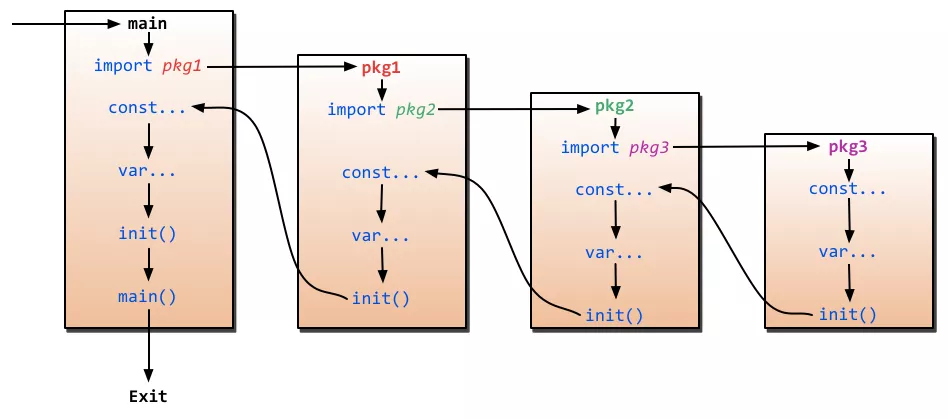

# Go Basic

## 介绍

- 类型检查：编译时。
- 运行环境：编译成机器码直接运行 (静态编译)。
- 编程范式：面向接口，函数式编程，并发编程。
- 采用CSP (Communication Sequential Process)模型。
- 不需要锁，不需要callback。

Go语言原生支持Unicode，它可以处理全世界任何语言的文本。

main包比较特殊。它定义了一个独立可执行的程序，而不是一个库。main函数也很特殊，它是整个程序执行时的入口(C系语言差不多都这样)。

Go语言不需要在语句或者声明的末尾添加分号，除非一行上有多条语句。实际上，编译器会主动把特定符号后的换行符转换为分号，因此换行符添加的位置会影响Go代码的正确解析。举个例子, 函数的左括号`{`必须和函数声明在同一行上，且位于末尾，不能独占一行。而在表达式x+y中，可在+后换行，不能在+前换行。

os包以跨平台的方式，提供了一些与操作系统交互的函数和变量。程序的命令行参数可从os包的Args变量获取。os.Args变量是一个字符串(string)的切片(slice是一个简版的动态数组)。和大多数编程语言类似，区间索引时，Go言里也采用左闭右开形式，区间包括第一个索引元素，不包括最后一个(比如`a = [1, 2, 3, 4, 5]`, `a[0:3] = [1, 2, 3]`)。os.Args的第一个元素，os.Args[0], 是命令本身的名字;其它的元素则是程序启动时传给它的参数，因此可以简写成os.Args[1:]。

Go语言只有for循环这一种循环语句（没有while）。for循环的这三个部分每个都可以省略。
```go
for initializaion; condition; post {
    //...
}
```
bufio包使处理输入和输出方便高效。Scanner类型读取输入并将其拆成行或单词，通常是处理行形式的输入最简单的方法。
`input:=bufio.NewScanner(os.Stdin)`从程序的标准输入中读取内容。每次调用，即读入下一行，并移除行末的换行符，读取的内容可以调用`input.Text()`得到。

`fmt.Printf`函数对表达式产生格式化输出。`%d`:十进制整数。`%x,%o,%b`:十六进制，八进制，二进制整数。`%f,%g,%e`:浮点数:3.141593 3.141592653589793 3.141593e+00。`%t`:布尔:true或false。`%c`:字符(rune) (Unicode码点)。`%s`:字符串。`%q`:带双引号的字符串"abc"或带单引号的字符'c'。`%v`:变量的自然形式(natural format)。`%T`:变量的类型。`%%`:字面上的百分号标志(无操作数)。按照惯例，以字母f结尾的格式化函数，如Printf和Errorf。而以ln结尾的在最后添加一个换行符。
 

## 程序结构
关键字有25个：

- break case chan const continue default func defer go else goto fallthrough if for import interface map package range return select struct switch type var

此外，还有大约30多个预定义的名字，主要对应内建的常量、类型和函数。

- 内建常量: true false iota nil
- 内建类型: int int8 int16 int32 int64 uint uint8 uint16 uint32 uint64 uintptr float32 float64 complex128 complex64 bool byte rune string error
- 内建函数: make len cap new append copy close delete complex real imag panic recover

这些内部预先定义的名字并不是关键字，可以在定义中重新使用它们。

一个名字是在函数内部定义，就只在函数内部有效。如果是在函数外部定义，将在当前包的所有文件中都可以访问。名字的开头字母的大小写决定了名字在包外的可见性。如果一个名字是大写字母开头的(译注:必须是在函数外部定义的包级名字;包级函数名本身也是包级名字)，那么它将是导出的，也就是说可以被外部的包访问，例如fmt包的Printf函数就是导出的，可以在fmt包外部访问。包本身的名字一般总是用小写字母。

Go语言主要有四种类型的声明语句:`var、const、type和func`，分别对应变量、常量、类型和函数实体对象的声明。

### 变量
`var 变量名字 类型 = 表达式` 其中“类型”或“=表达式”两个部分可以省略其中的一个。如果省略的是类型信息，那么将根据初始化表达式来推导变量的类型信息。如果初始化表达式被省略，那么将用零值初始化该变量。数值类型变量对应的零值是0，布尔类型变量对应的零值是false，字符串类型对应的零值是空字符串。**接口或引用类型(包括slice、指针、map、chan和函数)变量对应的零值是nil。其他类型都是值类型。** 数组或结构体等聚合类型对应的零值是每个元素或字段都是对应该类型的零值。Go语言中不存在未初始化的变量。

可以在一个声明语句中同时声明一组变量，或用一组初始化表达式声明并初始化一组变量。
```go
var i, j, k int // int, int, int
var b, f, s = true, 2.3, "four" // bool, float64, string
```
在函数内部，有一种称为 **短声明** 的形式可用于声明和初始化局部变量。它以`名字 := 表达式`形式声明变量，变量的类型根据表达式来自动推导。
```go
anim := gif.GIF{LoopCount: nframes} 
freq := rand.Float64() * 3.0
t := 0.0
```
简短变量声明语句也可以用来声明和初始化一组变量: `i, j := 0, 1`。

多值简短变量声明左边的变量可能并不是全部都是刚刚声明的。如果有一些已经在相同的词法域声明过了，那么简短变量声明语句对这些已经声明过的变量就只有赋值行为了。
在下面第一句声明了in和err两个变量。在第二句只声明了out一个变量，然后对已经声明的err进行了赋值操作：
```go
in, err := os.Open(infile)
out, err := os.Create(outfile)
```
简短变量声明语句中必须至少要声明一个新的变量，下面的代码将不能编译通过:
```go
f, err := os.Open(infile)
f, err := os.Create(outfile) // compile error: no new variables
```
简短变量声明语句只有对已经在同级词法域声明过的变量才和赋值操作语句等价，如果变量是在外部词法域声明的，那么简短变量声明语句将会在当前词法域重新声明一个新的变量。

任何类型的指针的零值都是nil。如果p指向某个有效变量，那么p != nil测试为真。指针之间也是 可以进行相等测试的，只有当它们指向同一个变量或全部是nil时才相等。
```go
var x, y int
fmt.Println(&x == &x, &x == &y, &x == nil) // "true false false"
```
在Go语言中，返回函数中局部变量的地址也是安全的。下面的代码，调用f函数时创建局部变量v，在局部变量地址被返回之后依然有效，因为指针p依然引用这个变量。
```go
var p = f()
func f() *int { 
    v := 1
    return &v 
}
```
每次调用f函数都将返回不同的结果:
`fmt.Println(f() == f()) // "false"`

另一个创建变量的方法是调用用内建的new函数。表达式new(T)将创建一个T类型的匿名变量，初始化为T类型的零值，然后返回变量地址，返回的指针类型为*T。
```go
p := new(int) // p, *int 类型, 指向匿名的 int 变量 
fmt.Println(*p) // "0"
```
new只是一个预定义的函数，它并不是一个关键字，因此我们可以将new名字重新定义为别的类型。例如下面的例子: `var new int = 1` 由于new被定义为int类型的变量名，因此在函数内部是无法使用内置的new函数的。

自增语句`i++`给i加1;这和`i += 1`是等价的。这是语句，而不像C系的其它语言那样是表达式。所以`j = i++`非法，而且++和­­都只能放在变量名后面，因此`--i`也非法。

Go允许同时更新多个变量的值。在赋值之前，赋值语句右边的所有表达式将会先进行求值，然后再统一更新左边对应变量的值。这样交换两个变量的值:
```go
x, y = y, x
a[i], a[j] = a[j], a[i]
```
有些表达式会产生多个值，比如map查找、类型断言或通道接收，它们都可能会产生两个结果，有一个额外的布尔结果表示操作是否成功:
```go
v, ok = m[key] // map lookup
v, ok = x.(T)  // type assertion
v, ok = <-ch   // channel receive
```
Go语言不允许使用无用的局部变量(local variables)，这会导致编译错误。解决方法是用空标识符(blank identifier)，即_(也就是下划线)。

### 类型
一个类型声明语句创建了一个新的类型名称。新命名的类型用来分隔不同概念的类型，这样即使它们底层类型相同也是不兼容的。

`type 类型名字 底层类型` 

类型声明语句一般出现在包一级，因此如果新创建的类型名字的首字符大写，则在外部包也可以使用。对于中文汉字，Unicode标志都作为小写字母处理，因此中文的命名默认不能导出。

对于每一个类型T，都有一个对应的类型转换操作T(x)，用于将x转为T类型(译注:如果T是指针类型，可能会需要用小括弧包装T，比如 (*int)(0))。只有当两个类型的底层基础类型相同时，才允许这种转型操作，或者是两者都是指向相同底层结构的指针类型，这些转换只改变类型而不会影响值本身。数值类型之间的转型也是允许的，并且在字符串和一些特定类型的slice之间也是可以转换的。

底层数据类型决定了内部结构和表达方式，也决定是否可以像底层类型一样对内置运算符的支持。这意味着，`type Celsius float64`和 `type Fahrenheit float64`类型的算术运算行为和底层的float64类型是一样的。
```go
var c Celsius
var f Fahrenheit 
fmt.Println(c == 0) // "true"
fmt.Println(f >= 0) // "true"
fmt.Println(c == f) // compile error: type mismatch
fmt.Println(c == Celsius(f))  // "true"!
fmt.Println(c - f)  // compile error: type mismatch
```

### 练习：
下面代码能编译通过吗？

```go
type info struct {
    result int
}

func work() (int,error) {
    return 13,nil
}

func main() {
    var data info

    data.result, err := work() 
    fmt.Printf("info: %+v\n",data)
}
// non-name data.result on left side of :=
// 不能使用短变量声明设置结构体字段值，修复代码：
func main() {
    var data info

    var err error
    data.result, err = work() //ok
    if err != nil {
        fmt.Println(err)
        return
    }
    fmt.Println(data)   
}
```

下面代码有什么错误？
```go
func main() {
    one := 0
    one := 1 
}
// 不能在单独的声明中重复声明一个变量，但在多变量声明的时候是可以的，但必须保证至少有一个变量是新声明的。
// 修复代码：
func main() {  
    one := 0
    one, two := 1,2
    one,two = two,one
}
```

请指出下面代码的错误？
```go
package main

var gvar int 

func main() {  
    var one int   
    two := 2      
    var three int 
    three = 3

    func(unused string) {
        fmt.Println("Unused arg. No compile error")
    }("what?")
}
// 变量 one、two 和 three 声明未使用
// 如果有未使用的变量代码将编译失败。但也有例外，函数中声明的变量必须要使用，但可以有未使用的全局变量。函数的参数未使用也是可以的。
// 如果你给未使用的变量分配了一个新值，代码也还是会编译失败。你需要在某个地方使用这个变量，才能让编译器编译。

// 修复代码：
func main() {
    var one int
    _ = one

    two := 2
    fmt.Println(two)

    var three int
    three = 3
    one = three

    var four int
    four = four
}
// 另一个选择是注释掉或者移除未使用的变量 。
```

下面代码输出正确的是？
```go
func main() {
    i := 1
    s := []string{"A", "B", "C"}
    i, s[i-1] = 2, "Z"
    fmt.Printf("s: %v \n", s)
}
// s: [Z,B,C]
// 多重赋值分为两个步骤，有先后顺序：
// - 计算等号左边的索引表达式和取址表达式，接着计算等号右边的表达式；
// - 赋值；
// 所以本例，会先计算 s[i-1]，等号右边是两个表达式是常量，所以赋值运算等同于 `i, s[0] = 2, "Z"`。
```

下面的代码输出什么？
```go
func main() {
    var a []int = nil
    a, a[0] = []int{1, 2}, 9
    fmt.Println(a)
}
// panic
```

关于变量的自增和自减操作，下面语句正确的是？
```go
// A.
i := 1
i++

// B.
i := 1
j = i++

// C.
i := 1
++i

// D.
i := 1
i--

// A D
// i++ 和 i-- 在 Go 语言中是语句，不是表达式，因此不能赋值给另外的变量。此外没有 ++i 和 --i。
```

下面这段代码输出什么？
```go
func main() {
    var k = 1
    var s = []int{1, 2}
    k, s[k] = 0, 3
    fmt.Println(s[0] + s[1])
}
// 4
// 多重赋值，会先计算 s[k]，等号右边是两个表达式是常量，所以赋值运算等同于 `k, s[1] = 0, 3`。
```

下面选项正确的是？ A,D
```go
//A. 类型可以声明的函数体内；
//B. Go 语言支持 ++i 或者 --i 操作；
//C. nil 是关键字；
//D. 匿名函数可以直接赋值给一个变量或者直接执行；
```

下面的代码有什么问题？
```go
func main() {
    data := []int{1,2,3}
    i := 0
    ++i
    fmt.Println(data[i++])
}
// - 自增、自减不在是运算符，只能作为独立语句，而不是表达式；
// - 不像其他语言，Go 语言中不支持 ++i 和 --i 操作；
// 表达式通常是求值代码，可作为右值或参数使用。而语句表示完成一个任务，比如 if、for 语句等。表达式可作为语句使用，但语句不能当做表达式。

// 修复代码：
func main() {  
    data := []int{1,2,3}
    i := 0
    i++
    fmt.Println(data[i])
}
```

下面的代码输出什么？
```go
type T struct {
    x int
    y *int
}

func main() {
    i := 20
    t := T{10,&i}

    p := &t.x

    *p++
    *p--

    t.y = p

    fmt.Println(*t.y)
}
// 10
// 递增运算符 ++ 和递减运算符 -- 的优先级低于解引用运算符 * 和取址运算符 &，解引用运算符和取址运算符的优先级低于选择器 . 中的属性选择操作符。
```

下面这段代码能否通过编译，如果可以，输出什么？
```go
var (
    size := 1024
    max_size = size * 2
)

func main() {
    fmt.Println(size, max_size)
}
// syntax error: unexpected :=, expected =

// 这道题的主要知识点是变量的简短模式，形如：x := 100 。但这种声明方式有限制：
// 1. 必须使用显示初始化；
// 2. 不能提供数据类型，编译器会自动推导；
// 3. 只能在函数内部使用简短模式；
```

假设 x 已声明，y 未声明，下面 4 行代码哪些是正确的。错误的请说明原因？答：2、3正确
```go
x, _ := f()  // 1
x, _ = f()  // 2
x, y := f()  // 3
x, y = f()  // 4
// 知识点：简短变量声明。使用简短变量声明有几个需要注意的地方：
// - 只能用于函数内部；
// - 短变量声明语句中至少要声明一个新的变量；
```

定义一个包内全局字符串变量，下面语法正确的是？答：A D
- A. var str string
- B. str := ""
- C. str = ""
- D. var str = ""

全局变量要定义在函数之外，而在函数之外定义的变量只能用 var 定义。短变量声明 := 只能用于函数之内。

下面这段代码能否通过编译？不能的话，原因是什么？如果通过，输出什么？
```go
func main() {
    sn1 := struct {
        age  int
        name string
	}{age: 11, name: "qq"}
	sn2 := struct {
        age  int
        name string
	}{age: 11, name: "11"}

    if sn1 == sn2 {
        fmt.Println("sn1 == sn2")
    }

    sm1 := struct {
        age int
        m   map[string]string
    }{age: 11, m: map[string]string{"a": "1"}}
    sm2 := struct {
        age int
        m   map[string]string
    }{age: 11, m: map[string]string{"a": "1"}}

    if sm1 == sm2 {
        fmt.Println("sm1 == sm2")
    }
}
// 不能通过,invalid operation: sm1 == sm2**
// `invalid operation: sm1 == sm2 (struct containing map[string]string cannot be compared)`

// 考点是结构体的比较，有几个需要注意的地方：

// 1. 结构体只能比较是否相等，但是不能比较大小；
// 2. 想同类型的结构体才能进行比较，结构体是否相同不但与属性类型有关，还与属性顺序相关；
// 3. 如果struct的所有成员都可以比较，则该struct就可以通过==或!=进行比较是否相同，比较时逐个项进行比较，如果每一项都相等，则两个结构体才相等，否则不相等；

// 可以比较: 常见的有bool、数值型、字符、指针、数组等
// 不能比较的有 slice、map、函数
```

通过指针变量p访问其成员变量name,有哪几种方式？答：A C

- A. p.name
- B. (&p).name
- C. (*p).name
- D. p->name

`&` 取址运算符， `*` 指针解引用，golang在不解引用的情况下也可以访问成员变量。

下面代码输出什么？
```go
func incr(p *int) int {
    *p++
    return *p
}

func main() {
    p :=1
    incr(&p)
    fmt.Println(p)
}
// 2
// incr() 函数里的 p 是 `*int` 类型的指针，指向的是 main() 函数的变量 p 的地址。`*p++`操作的意思是取出变量的值并执行加一操作，incr() 返回自增后的结果。
```

下面 A、B 两处应该填入什么代码，才能确保顺利打印出结果？
```go
type S struct {
    m string
}

func f() *S {
    return __  //A
}

func main() {
    p := __    //B
    fmt.Println(p.m) //print "foo"
}
// A. &S{"foo"} 
// B. *f() 或者 f()
// f() 函数返回参数是指针类型，所以可以用 & 取结构体的指针；B 处，如果填`*f()`，则 p 是 S 类型；如果填 `f()`，则 p 是 *S 类型，不过都可以使用 `p.m`取得结构体的成员。
```

下面这段代码能否编译通过？如果通过，输出什么？
```go
type User struct{}
type User1 User
type User2 = User

func (i User) m1() {
    fmt.Println("m1")
}
func (i User) m2() {
    fmt.Println("m2")
}

func main() {
    var i1 User1
    var i2 User2
    i1.m1()
    i2.m2()
}
// 不能，报错`i1.m1 undefined (type User1 has no field or method m1)`**
// 第 2 行代码基于类型 User 创建了新类型 User1，第 3 行代码是创建了 User 的类型别名 User2，注意使用 = 定义类型别名。因为 User2 是别名，完全等价于 User，所以 User2 具有 User 所有的方法。但是 i1.m1() 是不能执行的，因为 User1 没有定义该方法。
```

下面这段代码输出什么？
```go
func main() {  
    a := 5
    b := 8.1
    fmt.Println(a + b)
}
// compilation error  
// `invalid operation: a + b (mismatched types int and float64)`
// `a` 的类型是`int` ，`b` 的类型是`float` ，两个不同类型的数值不能相加，编译报错。
```

### 包和文件
Go语言的代码通过包(package)组织。一个包由位于单个目录下的一个或多个.go源代码文件组成。每个源文件都以一条package声明语句开始（例如package main）表示该文件属于哪个包，紧跟着一系列导入(import)的包。import声明必须跟在文件的package声明之后。

必须恰当导入需要的包，缺少了必要的包或者导入了不需要的包，程序都无法编译通过。这项严格要求避免了程序开发过程中引入未使用的包(Go语言编译过程没有警告信息，争议特性之一)。在Go语言程序中，每个包都是有一个全局唯一的导入路径。例如：`"github.com/influxdata/influxdb/client/v2"`。

当我们import了一个包路径包含有多个单词的package时，比如image/color，通常我们只需要用最后那个单词表示这个包就可以。所以当我们写color.White时，这个变量指向的是image/color包里的变量，同理gif.GIF是属于image/gif包里的变量。

每个包都对应一个独立的名字空间。例如，在image包中的Decode函数和在unicode/utf16包中的 Decode函数是不同的。要在外部引用该函数，必须显式使用image.Decode或utf16.Decode形式访问。

包的初始化首先是解决包级变量的依赖顺序，然后按照包级变量声明出现的顺序依次初始化:
```go
var a = b + c//a 第三个初始化, 为 3
var b = f() //b 第二个初始化, 为 2, 通过调用 f(依赖c) 
var c = 1 //c 第一个初始化, 为 1
func f() int { 
    return c + 1 
}
```
一个特殊的init初始化函数来简化初始化工作。每个文件都可以包含多个init初始化函数
`func init() { /* ... */ }` 这样的init初始化函数除了不能被调用或引用外，其他行为和普通函数类似。

1. init()函数是用于程序执行前做包的初始化的函数，比如初始化包里的变量等；
2. 一个包可以出现多个init()函数，一个源文件也可以包含多个init()函数；
3. 同一个包中多个init()函数的执行顺序没有明确的定义，但是不同包的init函数是根据包导入的依赖关系决定的；
4. init函数在代码中不能被显示调用、不能被引用（赋值给函数变量），否则出现编译失败；
5. 一个包被引用多次，如A import B，C import B，A import C，B被引用多次，但B包只会初始化一次；
6. 引入包，不可出现死循环。即A import B，B import A，这种情况下编译失败；



### 作用域
不要将作用域和生命周期混为一谈。声明语句的作用域对应的是一个源代码的文本区域;它是一个编译时的属性。一个变量的生命周期是指程序运行时变量存在的有效时间段，是一个运行时的概念。

语法块定了内部声明的名字的作用域范围。有一个语法块为整个源代码，称为全局语法块;然后是每个包的包语法块;每个for、if和switch语句的语法块;每个switch或select的分支也有独立的语法块;当然也包括显式书写的语法块(花括弧 包含的语句)。

当编译器遇到一个名字引用时，它首先从最内层的词法域向全局作用域查找。如果查找失败，则报告“未声明的名字”这样的错误。如果该名字在内部和外部的块分别声明过，则内部块的声明首先被找到。在这种情况下，内部声明屏蔽了外部同名的声明，让外部的声明的名字无法被访问。
```go
var cwd string
func init() {
    cwd, err := os.Getwd()  // compile error: unused: cwd 
    if err != nil {
        log.Fatalf("os.Getwd failed: %v", err) 
    }
}
```
虽然cwd在外部已经声明过，但是 := 语句还是将cwd和err重新声明为新的局部变量。因为内部声明的cwd将屏蔽外部的声明，因此上面的代码并不会正确更新包级声明的cwd变量。最直接的方法是通过单独声明err变量，来避免使用:=
的简短声明方式:
```go
var cwd string
func init() {
    var err error
    cwd, err = os.Getwd() 
    if err != nil {
        log.Fatalf("os.Getwd failed: %v", err)
    }
}
```

### 练习：

同级文件的包名不允许有多个，是否正确？ 正确，一个文件夹下只能有一个包，可以多个.go文件，但这些文件必须属于同一个包。

关于init函数，下面说法正确的是（）答：A、B

- A. 一个包中，可以包含多个init函数；
- B. 程序编译时，先执行依赖包的init函数，再执行main包内的init函数；
- C. main包中，不能有init函数；
- D. init函数可以被其他函数调用；

下面的代码有什么问题？
```go
import (  
    "fmt"
    "log"
    "time"
)
func main() {  
}
// 导入的包没有被使用
// 如果引入一个包，但是未使用其中如何函数、接口、结构体或变量的话，代码将编译失败。
// 如果你真的需要引入包，可以使用下划线操作符，`_`，来作为这个包的名字，从而避免失败。下划线操作符用于引入，但不使用。
// 我们还可以注释或者移除未使用的包。
// 修复代码：
import (  
    _ "fmt"
    "log"
    "time"
)
var _ = log.Println
func main() {  
    _ = time.Now
}
```

下面选项正确的是？ 
```go
func main() {
    if a := 1; false {
    } else if b := 2; false {
    } else {
        println(a, b)
    }
}
// 1 2
// 知识点：代码块和变量作用域。
```

下面这段代码输出什么？如果编译错误的话，为什么？
```go
var p *int

func foo() (*int, error) {
    var i int = 5
    return &i, nil
}

func bar() {
    //use p
    fmt.Println(*p)
}

func main() {
    p, err := foo()
    if err != nil {
        fmt.Println(err)
        return
    }
    bar()
    fmt.Println(*p)
}
// runtime error
// 问题出在操作符`:=`，对于使用`:=`定义的变量，如果新变量与同名已定义的变量不在同一个作用域中，那么 Go 会新定义这个变量。对于本例来说，main() 函数里的 p 是新定义的变量，会遮住全局变量 p，导致执行到`bar()`时程序，全局变量 p 依然还是 nil，程序随即 Crash。 (panic: runtime error: invalid memory address or nil pointer dereference)
// 正确的做法是将 main() 函数修改为：
func main() {
    var err error
    p, err = foo()
    if err != nil {
        fmt.Println(err)
        return
    }
    bar()
    fmt.Println(*p)
}
```

下面哪一行代码会 panic，请说明。
```go
func main() {
    nil := 123
    fmt.Println(nil)
    var _ map[string]int = nil
}
// 第 4 行
// 当前作用域中，预定义的 nil 被覆盖，此时 nil 是 int 类型值，不能赋值给 map 类型。
```

下面的代码能编译通过吗？可以的话输出什么，请说明？
```go
var f = func(i int) {
    print("x")
}

func main() {
    f := func(i int) {
        print(i)
        if i > 0 {
            f(i - 1)
        }
    }
    f(10)
}
// 10x
// 这道题一眼看上去会输出 109876543210，其实这是错误的答案，这里不是递归。假设 main() 函数里为 f2()，外面的为 f1()，当声明 f2() 时，调用的是已经完成声明的 f1()。

// 看下面这段代码你应该会更容易理解一点：
var x = 23

func main() {
    x := 2*x - 4
    println(x)    // 输出:42
}
```

下面代码最后一行输出什么？请说明原因。
```go
func main() {
    x := 1
    fmt.Println(x)
    {
        fmt.Println(x)
        i,x := 2,2
        fmt.Println(i,x)
    }
    fmt.Println(x)  // print ?
}
// 输出`1`
// 知识点：变量隐藏。
// 使用变量简短声明符号 := 时，如果符号左边有多个变量，只需要保证至少有一个变量是新声明的，并对已定义的变量尽进行赋值操作。但如果出现作用域之后，就会导致变量隐藏的问题，就像这个例子一样。
```

下面代码编译能通过吗？
```go
func main()  
{ 
    fmt.Println("hello world")
}
// syntax error: unexpected semicolon or newline before {
// Go 语言中，大括号不能放在单独的一行。
// 正确的代码:
func main() {
    fmt.Println("works")
}
```

## 基础数据类型
Go语言将数据类型分为四类:基础类型、复合类型、引用类型和接口类型。

基础类型包括:数字、字符串和布尔型。复合数据类型——数组和结构体，是通过组合简单类型，来表达更加复杂的数据结构。引用类型包括指针、切片、字典、函数、通道，虽然数据种类很多，但它们都是对程序中一个变量或状态的间接引用。这意味着对任一引用类型数据的修改都会影响所有该引用的拷贝。

### 整型
Go语言同时提供了有符号和无符号类型的整数运算。这里有int8、int16、int32和int64四种不同大小的有符号整数类型，分别对应8、16、32、64bit大小的有符号整数，与此对应的是uint8、uint16、uint32和uint64四种无符号整数类型。另外两种特定CPU平台机器字大小的有符号和无符号整数int和uint;这两种类型都有同样的大小，32或64bit，不同的编译器即使在相同的硬件平台上可能产生不同的大小。int和int32是不同的类型，即使int的大小也是32bit，在需要将int当作int32类型的地方需要一个显式的类型转换操作。

Unicode字符rune类型是和int32等价的类型。这两个名称可以互换使用。同样byte也是uint8类型的等价类型，byte类型一般用于强调数值是一个原始的数据而不是一个小的整数。

还有一种无符号的整数类型uintptr，没有指定具体的bit大小但是足以容纳指针。uintptr类型 只有在底层编程时才需要，特别是Go语言和C语言函数库或操作系统接口相交互的地方。

其中有符号整数采用2的__补码__形式表示，也就是最高bit位用来表示符号位，一个n­ bit的有符号数的 值域是从`−2^(n−1)`到`2^(n-1)−1`。无符号整数的所有bit位都用于表示非负数，值域是0到`2^n-1`。例如，int8类型整数的值域是从­-128到127，而uint8类型整数的值域是从0到255。

下面是Go语言中关于算术运算、逻辑运算和比较运算的二元运算符，它们按照先级递减的顺序的排列:
```go
*  /  %  <<  >>  &  &^ 
+  -  |  ^
== != <  <=  >  >=
&&
||
```
二元运算符有五种优先级。在同一个优先级，使用左优先结合规则，但是使用括号可以明确优先顺序，使用括号也可以用于提升优先级，例如mask & (1 << 28)。

取模运算符%仅用于整数间的运算。在Go语言中，%取模运算符的符号和被取模数的符号总是一致的，因此 `-5%3` 和 `-5%-3`结果都是­2。除法运算符 / 的行为则依赖于操作数是否为全为整数，比如 5.0/4.0 的结果是1.25，但是5/4的结果是1，因为整数除法会向着0方向截断余数。

计算结果是溢出，超出的高位的bit位部分将被丢弃。如果原始的数值是有符号类型，而且最左边的bit为是1的话，那么最终结果可能是负的：
```go
var u uint8 = 255
fmt.Println(u, u+1, u*u) // "255 0 1"
var i int8 = 127
fmt.Println(i, i+1, i*i) // "127 -128 1"
```

位操作运算符 ^ 作为二元运算符时是按位异或(XOR)，当用作一元运算符时表示按位取反;也就 是说，它返回一个每个bit位都取反的数。位操作运算符&^用于按位置零(AND NOT):如果对应y中bit位为1的话, 表达式`z = x &^ y`结果z的对应的bit位为0，否则z对应的bit位等于x相应的bit位的值。
```go
var x uint8 = 1<<1 | 1<<5 
var y uint8 = 1<<1 | 1<<2
fmt.Printf("%08b\n", x) // "00100010"
fmt.Printf("%08b\n", y) // "00000110"
fmt.Printf("%08b\n", x&y) // "00000010"
fmt.Printf("%08b\n", x|y) // "00100110"
fmt.Printf("%08b\n", x^y) // "00100100" 
fmt.Printf("%08b\n", x&^y) // "00100000"
fmt.Printf("%08b\n", x<<1) // "01000100"
fmt.Printf("%08b\n", x>>1) // "00010001"
```
整数字面值都可以用以0开始的八进制格式书写，例如0666;或用以0x或0X开头的十六进制格式书写，例如0xdeadbeef。十六进制数字可以用大写或小写字母。

当使用fmt包打印一个数值时，我们可以用%d、%o或%x参数控制输出的进制格式:
```go
o := 0666
fmt.Printf("%d %[1]o %#[1]o\n", o) // "438 666 0666" 
x := int64(0xdeadbeef)
fmt.Printf("%d %[1]x %#[1]x %#[1]X\n", x) // 3735928559 deadbeef 0xdeadbeef 0XDEADBEEF
```
`%之后的[1]告诉Printf函数再次使用第一个操作数。%后的#副词告诉Printf在用%o、%x或%X输出时生成0、0x或0X前缀。`

### rune
一个rune类型的值即可表示一个Unicode字符。Unicode是一个可以表示世界范围内的绝大部分字符的编码规范。关于它的详细信息，大家可以参看其官网(http://unicode.org/)上的文档。用于代表Unicode字符的编码值也被称为Unicode代码点。一个Unicode代码点通常由“U+”和一个以十六进制表示法表示的整数表示。例如，英文字母“A”的Unicode代码点为“U+0041”。

rune类型的值需要由单引号“'”包裹。例如，'A'或'郝'。这种表示方法一目了然。

### 浮点型
浮点数类型有两个，即float32和float64。存储这两个类型的值的空间分别需要4个字节和8个字节。
  
浮点数类型的值一般由整数部分、小数点“.”和小数部分组成。其中，整数部分和小数部分均由10进制表示法表示。不过还有另一种表示方法。那就是在其中加入指数部分。指数部分由“E”或“e”以及一个带正负号的10进制数组成。比如，3.7E-2表示浮点数0.037。又比如，3.7E+1表示浮点数37。
  
有时候，浮点数类型值的表示也可以被简化。比如，37.0可以被简化为37。又比如，0.037可以被简化为.037。
  
有一点需要注意，在Go语言里，浮点数的相关部分只能由10进制表示法表示，而不能由8进制表示法或16进制表示法表示。比如，03.7表示的一定是浮点数3.7。

浮点数的范围极限值可以在math包找到。常量math.MaxFloat32、math.MaxFloat64。math包提供了IEEE754浮点数标准中定义的特殊值:正无穷大和负无穷大，分别用于表示太大溢出的数字和除零的结果;还有NaN非数表示无效的除法操作结果0/0或Sqrt(­-1)。
```go
var z float64
fmt.Println(z, -z, 1/z, -1/z, z/z) // "0 -0 +Inf -Inf NaN"
```

### 复数
复数类型:complex64和complex128，分别对应float32和float64两种浮点数精度。

复数类型同样有两个，即complex64和complex128。存储这两个类型的值的空间分别需要8个字节和16个字节。实际上，complex64类型的值会由两个float32类型的值分别表示复数的实数部分和虚数部分。而complex128类型的值会由两个float64类型的值分别表示复数的实数部分和虚数部分。
  
复数类型的值一般由浮点数表示的实数部分、加号“+”、浮点数表示的虚数部分，以及小写字母“i”组成。比如，3.7E+1 + 5.98E-2i。正因为复数类型的值由两个浮点数类型值组成，所以其表示法的规则自然需遵从浮点数类型的值表示法的相关规则。我们就不在这里赘述了。请你通过练习题来回顾一下相关表示法的规则。

内置的complex函数用于构建复数，内建的real和imag函数分别返回复数的实部和虚部:
```go
var x complex128 = complex(1, 2)
var y complex128 = complex(3, 4)
fmt.Println(x*y)  // (-5+10i)
fmt.Println(real(x*y)) // -5
fmt.Println(imag(x*y)) // 10
```

### 字符串 String
一个字符串是一个不可改变的字节序列。文本字符串通常被解释为采用UTF8编码的Unicode码点(Unicode码点对应Go语言中的rune整数类型，rune是int32等价类型)序列。内置的len函数可以返回一个字符串中的字节数目(不是rune字符数目)，索引操作s[i]返回第i个字节的字节值，i必须满足`0 ≤ i < len(s)`条件约束。子字符串操作s[i:j]。+操作符将两个字符串链接构造一个新字符串:
```go
s := "hello, world"
fmt.Println(len(s)) // "12"
fmt.Println(s[0], s[7]) // "104 119" ('h' and 'w')
fmt.Println(s[0:5]) // "hello"
fmt.Println("goodbye" + s[5:]) // "goodbye, world"
```
第i个字节并不一定是字符串的第i个字符，因为对于非ASCII字符的UTF8编码会要两个或多个字节。字符串的值是不可变的:一个字符串包含的字节序列永远不会被改变。不变性意味如果两个字符串共享相同的底层数据也是安全的，这使得复制任何长度的字符串代价低廉，没有必要分配新的内存。

Go语言源文件总是用UTF8编码，并且Go语言的文本字符串也以UTF8编码的方式处理，因此我们可以将Unicode码点也写到字符串面值中。可以通过十六进制或八进制转义在字符串面值包含任意的字节。十六进制的转义形式是\xhh，其中两个h表示十六进制数字(大写或小写都可以)。八进制转义形式是\ooo，包含三个八进制的o数字(0到7)，但是不能超过\377(对应一个字节的范围，十进制为255)。
```go
fmt.Println("\x61")            // "a"
fmt.Println("\141")            // "a"
```

Unicode是字符集，UTF8是一个将Unicode码点编码为字节序列的变长编码编码规则。Go语言字符串面值中的Unicode转义字符让我们可以通过Unicode码点输入特殊的字符。有两种形式:\uhhhh对应16bit的码点值，\Uhhhhhhhh对应32bit的码点值，其中h是一个十六进制数字。下面的字母串面值都表示相同的值。
```go
"世界" 
"\xe4\xb8\x96\xe7\x95\x8c"  //UTF8
"\u4e16\u754c"              //Unicode 16
"\U00004e16\U0000754c"      //Unicode 32
```
字符串包含13个字节，以UTF8形式编码，但是只对应9个Unicode字符
```go
import "unicode/utf8"
s := "Hello, 世界"
fmt.Println(len(s)) // "13" 
fmt.Println(utf8.RuneCountInString(s)) // "9"

//通过rune类型处理unicode字符
fmt.Println("rune:", len([]rune(s))) // "9"
```
range循环在处理字符串的时候，会自动隐式解码UTF8字符串。
```go
for i, r := range "Hello, 世界" { 
    fmt.Printf("%d\t%q\t%d\t%x\n", i, r, r, r)
}
/*
0   'H'     72      48
1   'e'     101     65
2   'l'     108     6c
3   'l'     108     6c
4   'o'     111     6f
5   ','     44      2c
6   ' '     32      20
7   '世'    19990   4e16
10  '界'    30028   754c
*/
```
UTF8字符解码，如果遇到一个错误的UTF8编码输入，将生成一个特别的Unicode字符'\uFFFD'，在印刷中这个符号通常是一个黑色六角或钻石形状，里面包含一个白色的问号"�"。这通常是一个危险信号，说明输入并不是一个完美没有错误的UTF8字符串。

一个原生的字符串面值形式是\`...\`，使用反引号代替双引号。在原生的字符串面值中，没有转义操作;全部的内容都是字面的意思，包含退格和换行，因此一个程序中的原生字符串面值可能跨越多行(译注:在原生字符串面值内部是无法直接写\`字符的，可以用八进制或十六进制转义或+"`"链接 字符串常量完成)。

一个`[]byte(str)` 转换是分配了一个新的字节数组用于保存字符串str的拷贝。将一个字节slice转到字符串的 string(b)操作则是构造一个字符串拷贝，以确保字符串是只读的。

- byte 等同于uint8，常用来处理ascii字符
- rune 等同于int32,常用来处理unicode或utf-8字符

for loop of string
```go
func main() {
    s := "abc"
    for i := 0; i < len(s); i++ {
        fmt.Println(reflect.TypeOf(s[i]))
    }
    for _, c := range s {
        fmt.Println(reflect.TypeOf(c))
    }
}

// uint8
// uint8
// uint8
// int32
// int32
// int32
```

### 常量
常量表达式的值在编译期计算，而不是在运行期。常量的值不可修改，这样可以防止在运行期被意外或恶意的修改。如：`const pi = 3.14159` 。可以批量声明多个常量：
```go
const(
    e = 2.718
    pi = 3.14
)
```
常量间的所有算术运算、逻辑运算和比较运算的结果也是常量。一个常量的声明也可以包含一个类型和一个值，但是如果没有显式指明类型，那么将从右边的表达式推断类型。

常量声明可以使用iota常量生成器初始化，它用于生成一组以相似规则初始化的常量，但是不用每 行都写一遍初始化表达式。在一个const声明语句中，在第一个声明的常量所在的行，iota将会被置 为0，然后在每一个有常量声明的行加一。
```go
type Weekday int
const (
    Sunday Weekday = iota 
    Monday
    Tuesday
    Wednesday
    Thursday
    Friday
    Saturday
)
```
周日将对应0，周一为1，如此等等。在其它编程语言中，这种类型一般被称为枚举类型。

复杂的常量表达式中使用iota:
```go
const (
    i = 1 << iota   // i = 1 << 0, 1 
    j               // j = 1 << 1, 2 
    k               // j = 1 << 2, 4
)
```

有六种未明确类型的常量类型，分别是无类型的布尔型、无类型的整数、无类型的字符、无类型的浮点数、无类型的复数、无类型的字符串。通过延迟明确常量的具体类型，无类型的常量不仅可以提供更高的运算精度，而且可以直接用于更多的表达式而不需要显式的类型转换。

例如:math.Pi无类型的浮点数常量: `var x float32 = math.Pi` `var y float64 = math.Pi` `var z complex128 = math.Pi`。

### 练习
下面这段代码输出什么？
```go
func main() {  
    i := 65
    fmt.Println(string(i))
}
//  A
// UTF-8 编码中，十进制数字 65 对应的符号是 A。但是在Goland中会有警告 `conversion from int to string yields a string of one rune, not a string of digits`，
// 推荐使用 `var i byte = 65` 或 `var i uint8 = 65` 替代
```

关于 bool 变量 b 的赋值，下面错误的用法是？
```go
// A. b = true
// B. b = 1
// C. b = bool(1)
// D. b = (1 == 2)

// B: `cannot use 1 (untyped int constant) as bool value in assignment`
// C: `cannot convert 1 (untyped int constant) to type bool`
```

flag 是 bool 型变量，下面 if 表达式符合编码规范的是？ 答：B C D
```go
// A. if flag == 1
// B. if flag
// C. if flag == false
// D. if !flag
```

下面这段代码输出什么？
```go
func main() {  
    i := -5
    j := +5
    fmt.Printf("%+d %+d", i, j)
}
// -5 +5
// `%d`表示输出十进制数字，`+`表示输出数值的符号。这里不表示取反。
```

下面代码输出什么？
```go
func test(x byte)  {
    fmt.Println(x)
}

func main() {
    var a byte = 0x11 
    var b uint8 = a
    var c uint8 = a + b
    test(c)
}
// 34
// 0x11是16进制，相当于10进制17。
// 与 rune 是 int32 的别名一样，byte 是 uint8 的别名，别名类型无序转换，可直接转换。
```

下面的代码输出什么？ 
```go
func main() {  
    fmt.Println(~2) 
}
// cannot use ~ outside of interface or type constraint (use ^ for bitwise complement)
// 位取反运算符，Go 里面采用的是 ^ 。按位取反之后返回一个每个 bit 位都取反的数，对于有符号的整数来说，是按照补码进行取反操作的（快速计算方法：对数 a 取反，结果为 -(a+1) ），对于无符号整数来说就是按位取反。例如：

func main() {
    var a int8 = 3
    var b uint8 = 3
    var c int8 = -3

    fmt.Printf("^%b=%b %d\n", a, ^a, ^a) // ^11=-100 -4
    fmt.Printf("^%b=%b %d\n", b, ^b, ^b) // ^11=11111100 252
    fmt.Printf("^%b=%b %d\n", c, ^c, ^c) // ^-11=10 2
}

// 另外需要注意的是，如果作为二元运算符，^ 表示按位异或，即：对应位相同为 0，相异为 1。例如：

func main() {
    var a int8 = 3
    var c int8 = 5

    fmt.Printf("a: %08b\n",a) // a: 00000011
    fmt.Printf("c: %08b\n",c) // c: 00000101
    fmt.Printf("a^c: %08b\n",a ^ c) // a^c: 00000110
}

// 重点介绍下这个操作符 &^，按位置零，例如：z = x &^ y，表示如果 y 中的 bit 位为 1，则 z 对应 bit 位为 0，否则 z 对应 bit 位等于 x 中相应的 bit 位的值。
// 我们还可以这样理解或操作符 | ，表达式 z = x | y，如果 y 中的 bit 位为 1，则 z 对应 bit 位为 1，否则 z 对应 bit 位等于 x 中相应的 bit 位的值，与 &^ 完全相反。

var x uint8 = 214
var y uint8 = 92
fmt.Printf("x: %08b\n",x)  // x: 11010110 
fmt.Printf("y: %08b\n",y)  // y: 01011100  
fmt.Printf("x | y: %08b\n",x | y)   // x | y: 11011110  
fmt.Printf("x &^ y: %08b\n",x &^ y) // x &^ y: 10000010
```

下面代码输出什么？
```go
func main() {
    var x int8 = -128
    var y = x/-1
    fmt.Println(y)
}
// -128
// 溢出
```

判断题：对变量x的取反操作是 ~x？ 答：错误

Go 语言的取反操作是 `^`，它返回一个每个 bit 位都取反的数。作用类似在 C、C#、Java 语言中中符号 ~，对于有符号的整数来说，是按照补码进行取反操作的（快速计算方法：对数 a 取反，结果为 -(a+1) ），对于无符号整数来说就是按位取反。

下面这段代码输出什么？
```go
func main() {
    count := 0
    for i := range [256]struct{}{} {
        m, n := byte(i), int8(i)
        if n == -n {
            count++
        }
        if m == -m {
            count++
        }
    }
    fmt.Println(count)
}
/*  输出： 4
数值溢出。当 i 的值为 0、128 是会发生相等情况，注意 byte 是 uint8 的别名。

先看m, byte = uint8. 所以取值范围为: [0, 255]. 所以-m为负数就溢出了byte的表示范围. 那么 对 0~255 取反什么时候相等呢? 0是相等的就不用说来. 为啥128与-128相等呢?
负数是使用补位计数表示的. 所以-128, 先对128取反(^1000 0000 = 0111 1111) 然后进行加1操作, 即0111 1111 + 1 = 1000 0000, 所以-128是与正的128(1000 0000)一样.

再看n, int8 表示范围是[-128, 127]. 所以当循环中i >= 128时, 超出了int8的表示范围, 就溢出了. 那么当循环 i = 128时. 128 = 1000 0000. n = int8(128) 强制转换后时多少呢?
补位计数法中, 正整数, 0, 最高为0, 而负数最高为1.
所以1000 0000 一定是一个负数, 我们用补位计数法逆推. 就是上面步骤反向
减1操作: 1000 0000 - 1 = 0111 1111
取反操作: ^(0111 1111) = 1000 0000
int8(128) = 1000 0000 对于int8来说就是 -128, 所以当i= 128时, n = int8(128) = -128, 而-n = 128, 128刚好溢出了int8的最大值. 对于int8 就是-128.

注意:

补位计数法中, 正整数与0, 符号位和值部是分开的. 对int8来说, 符号位(左侧最高位0)表示正数, 剩余7位用来表示正整数. 所以int8的最大值为 0111 1111 = 127.
对于负数, 符号位与值部是在一起的. 左侧最高位1即是表示负数, 也是值的一部分. 如1000 0000 = -128
*/
```

下面这段代码输出什么？请简要说明。
```go
func main() {
    fmt.Println(strings.TrimRight("ABBA", "BA"))
}
// ""
// strings.TrimRight的作用是把有包含第二个参数的组合项的对应字母都替换掉，比如"BA"的组合集合为{"BA", "AB", "A", "B"}；
// 但是它有一个中止条件，如果从右到左有一个字母或字母组合不为"BA"的排列组合集合中的元素，便会停止cut，把当前已cut完的字符串返回
```

关于字符串连接，下面语法正确的是？答：B、D
```go
// A. str := 'abc' + '123'
// B. str := "abc" + "123"
// C. str := '123' + "abc"
// D. fmt.Sprintf("abc%d", 123)
// 在Golang中字符串用双引号，其实质是一个 byte 类型的数组。字符用单引号，实际是 rune 类型。字符串连接除了以上两种连接方式，还有 `strings.Join()` 、 `buffer.WriteString()` 等。
```

下面代码输出什么？
```go
func main() {
    str := "hello"
    str[0] = 'x'
    fmt.Println(str)
}
// cannot assign to str[0] (neither addressable nor a map index expression)
// 知识点：常量，Go 语言中的字符串是只读的。
```

下面代码能否编译通过？如果通过，输出什么？
```go
func GetValue(m map[int]string, id int) (string, bool) {
    if _, exist := m[id]; exist {
        return "exist", true
    }
    return nil, false
}
func main() {
    intmap := map[int]string{
        1: "a",
        2: "b",
        3: "c",
    }

    v, err := GetValue(intmap, 3)
    fmt.Println(v, err)
}
//函数返回值类型。nil 可以用作 interface、function、pointer、map、slice 和 channel 的“空值”。但是如果不特别指定的话，Go 语言不能识别类型，所以会报错:`cannot use nil as type string in return argument`
```

下面代码有什么问题？
```go
func main() {  
    var x string = nil 
    if x == nil { 
        x = "default"
    }
}
// 两个地方有语法问题。golang 的字符串类型是不能赋值 nil 的，也不能跟 nil 比较。
// 正确：
func main() {  
    var x string //defaults to "" (zero value)
    if x == "" {
        x = "default"
    }
}
```

下面代码有什么问题？
```go
const i = 100
var j = 123

func main() {
    fmt.Println(&j, j)
    fmt.Println(&i, i)
}
// 编译报错`cannot take the address of i`。知识点：常量。常量不同于变量的在运行期分配内存，常量通常会被编译器在预处理阶段直接展开，作为指令数据使用，所以常量无法寻址。
```

下面这段代码能否编译通过？如果可以，输出什么？
```go
const (
    x = iota
    _
    y
    z = "zz"
    k
    p = iota
)

func main() {
    fmt.Println(x, y, z, k, p)
}
// 输出：0 2 zz zz 5
// iota初始值为0，所以x为0，_表示不赋值，但是iota是从上往下加1的，所以y是2，z是“zz”,k和上面一个同值也是“zz”,p是iota,从上0开始数他是5。
```

下面这段代码输出什么？
```go
const (
    a = iota
    b = iota
)
const (
    name = "name"
    c    = iota
    d    = iota
)
func main() {
    fmt.Println(a)
    fmt.Println(b)
    fmt.Println(c)
    fmt.Println(d)
}
// 0 1 1 2
// iota 是 golang 语言的常量计数器，只能在常量的表达式中使用。
// iota 在 const 关键字出现时将被重置为0，const中每新增一行常量声明将使 iota 计数一次。
```

下面这段代码输出什么？
```go
type Direction int

const (
    North Direction = iota
    East
    South
    West
)

func (d Direction) String() string {
    return [...]string{"North", "East", "South", "West"}[d]
}

func main() {
    fmt.Println(South)
}
// South
// 分别对应0，1，2，3。如果类型实现 String() 方法，当格式化输出时会自动使用 String() 方法。
```

下面的代码有什么问题？
```go
func main() {
    const x = 123
    const y = 1.23
    fmt.Println(x)
}
// 编译可以通过
// 常量是一个简单值的标识符，在程序运行时，不会被修改的量。不像变量，常量未使用是能编译通过的。
```

下面代码输出什么？
```go
const (
    x uint16 = 120
    y
    s = "abc"
    z
)

func main() {
    fmt.Printf("%T %v\n", y, y)
    fmt.Printf("%T %v\n", z, z)
}
// uint16 120
// string abc
// 常量组中如不指定类型和初始化值，则与上一行非空常量右值相同
```

下面这段代码输出什么？
```go
for i, v := range "Go语言" {
    fmt.Printf("%d: %c\n", i, v)
} 
// 0: G
// 1: o
// 2: 语
// 5: 言  

// 对于字符串类型的被迭代值来说，for语句每次会迭代出两个值。第一个值代表第二个值在字符串中的索引，而第二个值则代表该字符串中的某一个字符。迭代是以索引递增的顺序进行的。
// 可以看到，这里迭代出的索引值并不是连续的。一个中文字符在经过UTF-8编码之后会表现为三个字节。所以，我们用语[0]、语[1]和、语[2]分别表示字符'语'经编码后的第一、二、三个字节。对于字符'言'，我们如法炮制。
// 这就能够解释上面那条for语句打印出的内容了，即：每次迭代出的第一个值所代表的是第二个字符值经编码后的第一个字节在该字符串经编码后的字节数组中的索引值。请大家真正理解这句话的含义。

//s是string
for i, c:= range s {
    // s[i] 是byte
    // c 是 rune
}
```

## 复合数据类型
数组和结构体是聚合类型;它们的值由许多元素或成员字段的值组成。数组元素都是完全相同的类型;结构体则是由异构的元素组成的。数组和结构体都是有固定内存大小的数据结构。slice和map则是动态的数据结构，它们将根据需要动态增长。

### Struct
结构体是一种聚合的数据类型，是由零个或多个任意类型的值聚合成的实体。如果结构体成员名字是以大写字母开头的，那么该成员就是导出的，一个结构体可能同时包含导出和未导出的成员。结构体类型的零值是每个成员都是零值。

二叉树排序：B_06_BinaryTreeSort

如果结构体的全部成员都是可以比较的，那么结构体也是可以比较的，那样的话两个结构体将可以使用`==`或`!=`运算符进行比较。比较两个结构体的每个成员。

### JSON
基本的JSON类型有数字(十进制或科学记数法)、布尔值(true或false)、字符串，以双引号包含的Unicode字符序列，支持和Go语言类似的反斜杠转义特性，不过JSON使用的是`\Uhhhh`转义数字来表示一个UTF­16编码(UTF­16和UTF­8一样是一种变长的编码，有些Unicode码点较大的字符需要用4个字节表示;而且UTF­16还有大端和小端的问题)，而不是Go语言的rune类型。

这些基础类型可以通过JSON的数组和对象类型进行递归组合。
```json
boolean     true
number      -273.15
string      "She said \"Hello, BF\"" 
array       ["gold", "silver", "bronze"] 
object      {"year": 1980,
             "event": "archery",
             "medals": ["gold", "silver", "bronze"]}
```

转为JSON的过程叫marshaling. encoding/json包提供marshal函数：
`data, err := json.Marshal(movies)`和格式化marshal函数: `data, err := json.MarshalIndent(movies, "", " ")`

在编码时，默认使用Go语言结构体的成员名字作为JSON的对象。只有导出的结构体成员才会被编码，也就是选择大写字母开头做成员名称。
构体成员可以添加Tag。一个构体成员Tag是和在编译阶段关联到该成员的元信息字符串:
```go
type Movie struct { 
    Title   string      `json:"name"`
    Year    int         `json:"released"`
    Color   bool        `json:"color, omitempty"`         
}
```
Color成员的Tag还带了一个额外的omitempty选项，表示当Go语言结构体成员为空或零值时不生成JSON对象(这里false为零值)。编码的逆操作是解码，对应将JSON数据解码为Go语言的数据结构，Go语言中一般叫unmarshaling，通过`json.Unmarshal`函数完成。

### 练习
下面这段代码输出什么？
```go
type People struct {
    name string `json:"name"`
}

func main() {
    js := `{
        "name":"seekload"
    }`
    var p People
    err := json.Unmarshal([]byte(js), &p)
    if err != nil {
        fmt.Println("err: ", err)
        return
    }
    fmt.Println(p)
}
// 输出 {}
// 结构体访问控制，因为 name 首字母是小写，导致其他包不能访问，所以输出为空结构体。
// 修复代码：
type People struct {
    Name string `json:"name"`
}
```

### 模板Template
一个模板是一个字符串或一个文件，里面包含了一个或多个由双花括号包含的`{{action}}`对象。actions部分将触发其它的行为。模板语言包含通过选择结构体的成员、调用函数或方法、表达式控制流if ­else语句和range循环语句，还有其它实例化模板等诸多特性。对于每一个action，都有一个当前值的概念，对应点`.`操作符。 `{{range .Items}} {{end}}` 对应一个循环action。 `|`操作符表示将前一个表达式的结果作为后一个函数的输入，类似于UNIX中管道。
```go
var report = template.Must(template.New("issuelist").Funcs(template.FuncMap{"daysAgo": daysAgo}).Parse(templ))
```
调用链的顺序:`template.New`先创建并返回一个模板;`Funcs`方法将daysAgo等自定义函数注 册到模板中，并返回模板;最后调用`Parse`函数分析模板。`Execute`最终执行。


## 流程控制

类型switch语句。它与一般形式有两点差别。第一点，紧随case关键字的不是表达式，而是类型说明符。类型说明符由若干个类型字面量组成，且多个类型字面量之间由英文逗号分隔。第二点，它的switch表达式是非常特殊的。这种特殊的表达式也起到了类型断言的作用，但其表现形式很特殊，如：v.(type)，其中v必须代表一个接口类型的值。注意，该类表达式只能出现在类型switch语句中，且只能充当switch表达式。一个类型switch语句的示例如下：
```go
v := 11
switch i := interface{}(v).(type) {
case int, int8, int16, int32, int64:
    fmt.Printf("A signed integer: %d. The type is %T. \n", i, i)
case uint, uint8, uint16, uint32, uint64:
    fmt.Printf("A unsigned integer: %d. The type is %T. \n", i, i)
default:
    fmt.Println("Unknown!")
}
// A signed integer: 11. The type is int.
```
请注意，我们在这里把switch表达式的结果赋给了一个变量。如此一来，我们就可以在该switch语句中使用这个结果了。
   
最后，我们来说一下fallthrough。它既是一个关键字，又可以代表一条语句。fallthrough语句可被包含在表达式switch语句中的case语句中。它的作用是使控制权流转到下一个case。不过要注意，fallthrough语句仅能作为case语句中的最后一条语句出现。并且，包含它的case语句不能是其所属switch语句的最后一条case语句。

### 练习
关于 switch 语句，下面说法正确的是？答：A C

- A. 单个 case 中，可以出现多个结果选项；
- B. 需要使用 break 来明确退出一个 case;
- C. 只有在 case 中明确添加 fallthrought 关键字，才会继续执行紧跟的下一个 case;
- D. 条件表达式必须为常量或者整数；

下面代码能编译通过吗？可以的话，输出什么？
```go
func alwaysFalse() bool {
    return false
}

func main() {
    switch alwaysFalse()
    {
    case true:
        println(true)
    case false:
        println(false)
    }
}
//可以编译通过，输出：true
//Go 代码断行规则。
// 上面代码相当于：如果去掉分号，则输出false
func main() {
	switch alwaysFalse(); {
	case true:
		println(true)
	case false:
		println(false)
	}
}
```

下面代码输出什么？
```go
func main() {
    isMatch := func(i int) bool {
        switch i {
        case 1:
        case 2:
            return true
        }
        return false
    }

    fmt.Println(isMatch(1))
    fmt.Println(isMatch(2))
}
// false true
// Go 语言的 switch 语句虽然没有"break"，但如果 case 完成程序会默认 break，可以在 case 语句后面加上关键字 fallthrough，这样就会接着走下一个 case 语句（不用匹配后续条件表达式）。或者，利用 case 可以匹配多个值的特性。
//修复代码：
func main() {
	isMatch := func(i int) bool {
		switch i {
		case 1:
			fallthrough
		case 2:
			return true
		}
		return false
	}
	fmt.Println(isMatch(1)) // true
	fmt.Println(isMatch(2)) // true
	match := func(i int) bool {
		switch i {
		case 1, 2:
			return true
		}
		return false
	}
	fmt.Println(match(1)) // true
	fmt.Println(match(2)) // true
}
```

关于循环语句，下面说法正确的有（） -- C, D
```go
// A. 循环语句既支持 for 关键字，也支持 while 和 do-while；
// B. 关键字 for 的基本使用方法与 C/C++ 中没有任何差异；
// C. for 循环支持 continue 和 break 来控制循环，但是它提供了一个更高级的 break，可以选择中断哪一个循环；
// D. for 循环不支持以逗号为间隔的多个赋值语句，必须使用平行赋值的方式来初始化多个变量；
```

关于switch语句，下面说法正确的有?  B, D
```go
// A. 条件表达式必须为常量或者整数；
// B. 单个case中，可以出现多个结果选项；
// C. 需要用break来明确退出一个case；
// D. 只有在case中明确添加fallthrough关键字，才会继续执行紧跟的下一个case；
```

下面代码有什么问题吗？
```go
func main()  {
    for i:=0;i<10 ;i++  {
    loop:
        println(i)
    }
    goto loop
}
// goto 不能跳转到其他函数或者内层代码。编译报错：
// goto loop jumps into block starting at
```

---

### Bit数组

### 封装

## Project List: 

### IO
简单的IO练习

### Pipeline: 外部排序Pipeline
选自慕课网：搭建并行处理管道

- 原始数据过大，无法一次读入内存，所以分块读入内存。每个块数据进行内部排序（直接调用API排序），最后讲各个节点归并，归并选择两两归并。

---

命令：

go run 编译并执行 可以加标记  -v, -a, -n, -x, -work

go build 编译

go install 编译并安装代码包或源码文件。
安装代码包会在当前工作区的pkg/<平台相关目录> 下生成归档文件。
安装命令源码文件会在工作区的bin目录下生成可执行文件。

go get 从远程仓库下载并安装代码包。
会先下载到gopath/src中，然后安装。
-x 查看详细信息。
-d 只下载不安装。
-fix 修复老版本不兼容问题。
-u 更新本地代码包。

## Reference

https://draveness.me/golang/docs/part3-runtime/ch07-memory/golang-garbage-collector/