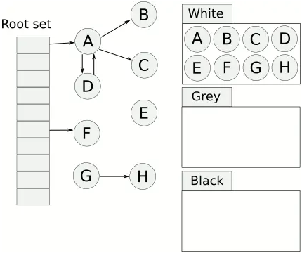

# Go 高级

## Go 内存管理


## 垃圾收集器 

### 设计原理
Go 语言使用自动的内存管理系统。

相信很多人对垃圾收集器的印象都是暂停程序（Stop the world，STW），随着用户程序申请越来越多的内存，系统中的垃圾也逐渐增多；当程序的内存占用达到一定阈值时，整个应用程序就会全部暂停，垃圾收集器会扫描已经分配的所有对象并回收不再使用的内存空间，当这个过程结束后，用户程序才可以继续执行，Go 语言在早期也使用这种策略实现垃圾收集，但是今天的实现已经复杂了很多。

#### mutator-allocator-collector

用户程序（Mutator）会通过内存分配器（Allocator）在堆上申请内存，而垃圾收集器（Collector）负责回收堆上的内存空间，内存分配器和垃圾收集器共同管理着程序中的堆内存空间。

#### 标记清除
标记清除（Mark-Sweep）算法是最常见的垃圾收集算法，标记清除收集器是跟踪式垃圾收集器，其执行过程可以分成标记（Mark）和清除（Sweep）两个阶段：

- 标记阶段 — 从根对象出发查找并标记堆中所有存活的对象；
- 清除阶段 — 遍历堆中的全部对象，回收未被标记的垃圾对象并将回收的内存加入空闲链表；

如下图所示，内存空间中包含多个对象，我们从根对象出发依次遍历对象的子对象并将从根节点可达的对象都标记成存活状态，即 A、C 和 D 三个对象，剩余的 B、E 和 F 三个对象因为从根节点不可达，所以会被当做垃圾：


标记清除的标记阶段

标记阶段结束后会进入清除阶段，在该阶段中收集器会依次遍历堆中的所有对象，释放其中没有被标记的 B、E 和 F 三个对象并将新的空闲内存空间以链表的结构串联起来，方便内存分配器的使用。


标记清除的清除阶段

这里介绍的是最传统的标记清除算法，垃圾收集器从垃圾收集的根对象出发，递归遍历这些对象指向的子对象并将所有可达的对象标记成存活；标记阶段结束后，垃圾收集器会依次遍历堆中的对象并清除其中的垃圾，整个过程需要标记对象的存活状态，用户程序在垃圾收集的过程中也不能执行，我们需要用到更复杂的机制来解决 STW 的问题。

#### 三色抽象

我们首先看一张图，大概就会对 三色标记法 有一个大致的了解：


白色对象 — 潜在的垃圾，其内存可能会被垃圾收集器回收；
黑色对象 — 活跃的对象，包括不存在任何引用外部指针的对象以及从根对象可达的对象；
灰色对象 — 活跃的对象，因为存在指向白色对象的外部指针，垃圾收集器会扫描这些对象的子对象；

原理：

- 首先把所有的对象都放到白色的集合中
- 从根节点开始遍历对象，遍历到的白色对象从白色集合中放到灰色集合中
- 遍历灰色集合中的对象，把灰色对象引用的白色集合的对象放入到灰色集合中，同时把遍历过的灰色集合中的对象放到黑色的集合中
- 循环步骤3，直到灰色集合中没有对象
- 步骤4结束后，白色集合中的对象就是不可达对象，也就是垃圾，进行回收


#### 屏障技术
内存屏障技术是一种屏障指令，它可以让 CPU 或者编译器在执行内存相关操作时遵循特定的约束，目前多数的现代处理器都会乱序执行指令以最大化性能，但是该技术能够保证内存操作的顺序性，在内存屏障前执行的操作一定会先于内存屏障后执行的操作6。

想要在并发或者增量的标记算法中保证正确性，我们需要达成以下两种三色不变性（Tri-color invariant）中的一种：

强三色不变性 — 黑色对象不会指向白色对象，只会指向灰色对象或者黑色对象；
弱三色不变性 — 黑色对象指向的白色对象必须包含一条从灰色对象经由多个白色对象的可达路径；

我们在这里想要介绍的是 Go 语言中使用的两种写屏障技术，分别是 Dijkstra 提出的插入写屏障8和 Yuasa 提出的删除写屏障9，这里会分析它们如何保证三色不变性和垃圾收集器的正确性。

插入写屏障
Dijkstra 在 1978 年提出了插入写屏障，通过如下所示的写屏障，用户程序和垃圾收集器可以在交替工作的情况下保证程序执行的正确性：

writePointer(slot, ptr):
    shade(ptr)
    *slot = ptr

上述插入写屏障的伪代码非常好理解，每当执行类似 *slot = ptr 的表达式时，我们会执行上述写屏障通过 shade 函数尝试改变指针的颜色。如果 ptr 指针是白色的，那么该函数会将该对象设置成灰色，其他情况则保持不变。


删除写屏障
Yuasa 在 1990 年的论文 Real-time garbage collection on general-purpose machines 中提出了删除写屏障，因为一旦该写屏障开始工作，它会保证开启写屏障时堆上所有对象的可达，所以也被称作快照垃圾收集（Snapshot GC）10：

This guarantees that no objects will become unreachable to the garbage collector traversal all objects which are live at the beginning of garbage collection will be reached even if the pointers to them are overwritten.

该算法会使用如下所示的写屏障保证增量或者并发执行垃圾收集时程序的正确性：

writePointer(slot, ptr)
    shade(*slot)
    *slot = ptr
Go
上述代码会在老对象的引用被删除时，将白色的老对象涂成灰色，这样删除写屏障就可以保证弱三色不变性，老对象引用的下游对象一定可以被灰色对象引用。


假设我们在应用程序中使用 Yuasa 提出的删除写屏障，在一个垃圾收集器和用户程序交替运行的场景中会出现如上图所示的标记过程：

垃圾收集器将根对象指向 A 对象标记成黑色并将 A 对象指向的对象 B 标记成灰色；
用户程序将 A 对象原本指向 B 的指针指向 C，触发删除写屏障，但是因为 B 对象已经是灰色的，所以不做改变；
用户程序将 B 对象原本指向 C 的指针删除，触发删除写屏障，白色的 C 对象被涂成灰色；
垃圾收集器依次遍历程序中的其他灰色对象，将它们分别标记成黑色；
上述过程中的第三步触发了 Yuasa 删除写屏障的着色，因为用户程序删除了 B 指向 C 对象的指针，所以 C 和 D 两个对象会分别违反强三色不变性和弱三色不变性：

强三色不变性 — 黑色的 A 对象直接指向白色的 C 对象；
弱三色不变性 — 垃圾收集器无法从某个灰色对象出发，经过几个连续的白色对象访问白色的 C 和 D 两个对象；
Yuasa 删除写屏障通过对 C 对象的着色，保证了 C 对象和下游的 D 对象能够在这一次垃圾收集的循环中存活，避免发生悬挂指针以保证用户程序的正确性。

增量和并发
传统的垃圾收集算法会在垃圾收集的执行期间暂停应用程序，一旦触发垃圾收集，垃圾收集器会抢占 CPU 的使用权占据大量的计算资源以完成标记和清除工作，然而很多追求实时的应用程序无法接受长时间的 STW。


增量垃圾收集 — 增量地标记和清除垃圾，降低应用程序暂停的最长时间；
并发垃圾收集 — 利用多核的计算资源，在用户程序执行时并发标记和清除垃圾；


混合写屏障 #
在 Go 语言 v1.7 版本之前，运行时会使用 Dijkstra 插入写屏障保证强三色不变性，但是运行时并没有在所有的垃圾收集根对象上开启插入写屏障。因为应用程序可能包含成百上千的 Goroutine，而垃圾收集的根对象一般包括全局变量和栈对象，如果运行时需要在几百个 Goroutine 的栈上都开启写屏障，会带来巨大的额外开销，所以 Go 团队在实现上选择了在标记阶段完成时暂停程序、将所有栈对象标记为灰色并重新扫描，在活跃 Goroutine 非常多的程序中，重新扫描的过程需要占用 10 ~ 100ms 的时间。

Go 语言在 v1.8 组合 Dijkstra 插入写屏障和 Yuasa 删除写屏障构成了如下所示的混合写屏障，该写屏障会将被覆盖的对象标记成灰色并在当前栈没有扫描时将新对象也标记成灰色：

writePointer(slot, ptr):
    shade(*slot)
    if current stack is grey:
        shade(ptr)
    *slot = ptr
Go
为了移除栈的重扫描过程，除了引入混合写屏障之外，在垃圾收集的标记阶段，我们还需要将创建的所有新对象都标记成黑色，防止新分配的栈内存和堆内存中的对象被错误地回收，因为栈内存在标记阶段最终都会变为黑色，所以不再需要重新扫描栈空间。


#### 回收流程
GO的GC是并行GC, 也就是GC的大部分处理和普通的go代码是同时运行的, 这让GO的GC流程比较复杂.
首先GC有四个阶段, 它们分别是:

- Sweep Termination: 对未清扫的span进行清扫, 只有上一轮的GC的清扫工作完成才可以开始新一轮的GC
- Mark: 扫描所有根对象, 和根对象可以到达的所有对象, 标记它们不被回收
- Mark Termination: 完成标记工作, 重新扫描部分根对象(要求STW)
- Sweep: 按标记结果清扫span

#### 垃圾收集的触发

除了使用后台运行的系统监控器和强制垃圾收集助手触发垃圾收集之外，另外两个方法会从任意处理器上触发垃圾收集，这种不需要中心组件协调的方式是在 v1.6 版本中引入的，接下来我们将展开介绍这三种不同的触发时机。

后台触发
运行时会在应用程序启动时在后台开启一个用于强制触发垃圾收集的 Goroutine，该 Goroutine 的职责非常简单 — 调用 runtime.gcStart 尝试启动新一轮的垃圾收集：

手动触发
用户程序会通过 runtime.GC 函数在程序运行期间主动通知运行时执行，该方法在调用时会阻塞调用方直到当前垃圾收集循环完成，在垃圾收集期间也可能会通过 STW 暂停整个程序：

手动触发垃圾收集的过程不是特别常见，一般只会在运行时的测试代码中才会出现，不过如果我们认为触发主动垃圾收集是有必要的，我们也可以直接调用该方法，但是作者并不认为这是一种推荐的做法。

申请内存
最后一个可能会触发垃圾收集的就是 runtime.mallocgc 了，我们在上一节内存分配器中曾经介绍过运行时会将堆上的对象按大小分成微对象、小对象和大对象三类，这三类对象的创建都可能会触发新的垃圾收集循环：


## Context

context可以用来在goroutine之间传递上下文信息，相同的context可以传递给运行在不同goroutine中的函数，上下文对于多个goroutine同时使用是安全的，context包定义了上下文类型，可以使用background、TODO创建一个上下文，在函数调用链之间传播context，也可以使用WithDeadline、WithTimeout、WithCancel 或 WithValue 创建的修改副本替换它，听起来有点绕，其实总结起就是一句话：context的作用就是在不同的goroutine之间同步请求特定的数据、取消信号以及处理请求的截止日期。

### context的使用

context包主要提供了两种方式创建context:

- context.Backgroud()
- context.TODO()

这两个函数其实只是互为别名，没有差别，官方给的定义是：

context.Background 是上下文的默认值，所有其他的上下文都应该从它衍生（Derived）出来。
context.TODO 应该只在不确定应该使用哪种上下文时使用；
所以在大多数情况下，我们都使用context.Background作为起始的上下文向下传递。

上面的两种方式是创建根context，不具备任何功能，具体实践还是要依靠context包提供的With系列函数来进行派生：
```go
func WithCancel(parent Context) (ctx Context, cancel CancelFunc)
func WithDeadline(parent Context, deadline time.Time) (Context, CancelFunc)
func WithTimeout(parent Context, timeout time.Duration) (Context, CancelFunc)
func WithValue(parent Context, key, val interface{}) Context
```

#### 超时控制

通常健壮的程序都是要设置超时时间的，避免因为服务端长时间响应消耗资源，所以一些web框架或rpc框架都会采用withTimeout或者withDeadline来做超时控制，当一次请求到达我们设置的超时时间，就会及时取消，不在往下执行。withTimeout和withDeadline作用是一样的，就是传递的时间参数不同而已，他们都会通过传入的时间来自动取消Context，这里要注意的是他们都会返回一个cancelFunc方法，通过调用这个方法可以达到提前进行取消，不过在使用的过程还是建议在自动取消后也调用cancelFunc去停止定时减少不必要的资源浪费。

withTimeout、WithDeadline不同在于WithTimeout将持续时间作为参数输入而不是时间对象，这两个方法使用哪个都是一样的，看业务场景和个人习惯了，因为本质withTimout内部也是调用的WithDeadline。

```go
//达到超时时间终止接下来的执行
func main()  {
    HttpHandler()
}

func NewContextWithTimeout() (context.Context,context.CancelFunc) {
    return context.WithTimeout(context.Background(), 3 * time.Second)
}

func HttpHandler()  {
    ctx, cancel := NewContextWithTimeout()
    defer cancel()
    deal(ctx)
}

func deal(ctx context.Context)  {
    for i:=0; i< 10; i++ {
        time.Sleep(1*time.Second)
        select {
        case <- ctx.Done():
            fmt.Println(ctx.Err())
            return
        default:
            fmt.Printf("deal time is %d\n", i)
        }
    }
}
// 输出结果：
// 
// deal time is 0
// deal time is 1
// deal time is 2 ??
// context deadline exceeded
```

```go
// 没有达到超时时间终止接下来的执行
func main()  {
    HttpHandler1()
}

func NewContextWithTimeout1() (context.Context,context.CancelFunc) {
    return context.WithTimeout(context.Background(), 3 * time.Second)
}

func HttpHandler1()  {
    ctx, cancel := NewContextWithTimeout1()
    defer cancel()
    deal1(ctx, cancel)
}

func deal1(ctx context.Context, cancel context.CancelFunc)  {
    for i:=0; i< 10; i++ {
        time.Sleep(1*time.Second)
        select {
        case <- ctx.Done():
            fmt.Println(ctx.Err())
            return
        default:
            fmt.Printf("deal time is %d\n", i)
            cancel()
        }
    }
}
// 输出结果：
// 
// deal time is 0
// context canceled
```
使用起来还是比较容易的，既可以超时自动取消，又可以手动控制取消。

#### withCancel
日常业务开发中我们往往为了完成一个复杂的需求会开多个gouroutine去做一些事情，这就导致我们会在一次请求中开了多个goroutine确无法控制他们，这时我们就可以使用withCancel来衍生一个context传递到不同的goroutine中，当我想让这些goroutine停止运行，就可以调用cancel来进行取消。

来看一个例子：
```go
func main()  {
    ctx,cancel := context.WithCancel(context.Background())
    go Speak(ctx)
    time.Sleep(10*time.Second)
    cancel()
    time.Sleep(1*time.Second)
}

func Speak(ctx context.Context)  {
    for range time.Tick(time.Second){
        select {
        case <- ctx.Done():
            fmt.Println("我要闭嘴了")
            return
        default:
            fmt.Println("balabalabalabala")
        }
    }
}
// 运行结果：
// 
// balabalabalabala
// ....省略
// balabalabalabala
// 我要闭嘴了
```
我们使用withCancel创建一个基于Background的ctx，然后启动一个讲话程序，每隔1s说一话，main函数在10s后执行cancel，那么speak检测到取消信号就会退出。

context.Context 是 Go 语言在 1.7 版本中引入标准库的接口1，该接口定义了四个需要实现的方法，其中包括：

- Deadline — 返回 context.Context 被取消的时间，也就是完成工作的截止日期；
- Done — 返回一个 Channel，这个 Channel 会在当前工作完成或者上下文被取消后关闭，多次调用 Done 方法会返回同一个 Channel；
- Err — 返回 context.Context 结束的原因，它只会在 Done 方法对应的 Channel 关闭时返回非空的值；
	- 如果 context.Context 被取消，会返回 Canceled 错误；
	- 如果 context.Context 超时，会返回 DeadlineExceeded 错误；
- Value — 从 context.Context 中获取键对应的值，对于同一个上下文来说，多次调用 Value 并传入相同的 Key 会返回相同的结果，该方法可以用来传递请求特定的数据；
```go
type Context interface {
	Deadline() (deadline time.Time, ok bool)
	Done() <-chan struct{}
	Err() error
	Value(key interface{}) interface{}
}
```

context reference:
https://segmentfault.com/a/1190000040917752


## sync.Once

Once 可以用来执行且仅仅执行一次动作，常常用于单例对象的初始化场景。Once 常常用来初始化单例资源，或者并发访问只需初始化一次的共享资源，或者在测试的时候初始化一次测试资源。

sync.Once 只暴露了一个方法 Do，你可以多次调用 Do 方法，但是只有第一次调用 Do 方法时 f 参数才会执行，这里的 f 是一个无参数无返回值的函数。

demo:
```go
import (
	"fmt"
	"sync"
)
func main() {
	var o sync.Once
	func1:= func() {	
		fmt.Println("only once")	
	}
	done:= make(chan bool)
	for i:= 0; i< 10; i++ {
		go func() {
			o.Do(func1)
			done <- true
		}()
	}
	for i:= 0; i< 10; i++ {
		<- done
	}
}
```

只输出一次 “only once”.

### 源码分析
接下来分析 sync.Do 究竟是如何实现的，它存储在包sync下 once.go 文件中，源代码如下:

```go
// sync/once.go

type Once struct {
	done uint32 // 初始值为0表示还未执行过，1表示已经执行过
	m    Mutex
}

func (o *Once) Do(f func()) {
	// 判断done是否为0，若为0，表示未执行过，调用doSlow()方法初始化
	if atomic.LoadUint32(&o.done) == 0 {
		// Outlined slow-path to allow inlining of the fast-path.
		o.doSlow(f)
	}
}

// 加载资源
func (o *Once) doSlow(f func()) {
	o.m.Lock()
	defer o.m.Unlock()
	// 采用双重检测机制 加锁判断done是否为零
	if o.done == 0 {
		// 执行完f()函数后，将done值设置为1
		defer atomic.StoreUint32(&o.done, 1)
		// 执行传入的f()函数
		f()
	}
}
```

为了防止多个goroutine调用 doSlow() 初始化资源时，造成资源多次初始化，因此采用 Mutex 锁机制来保证有且仅初始化一次
Do

调用 Do 函数时，首先判断done值是否为0，若为1，表示传入的匿名函数 f() 已执行过，无需再次执行；若为0，表示传入的匿名函数 f() 还未执行过，则调用 doSlow() 函数进行初始化。

在 doSlow() 函数中，若并发的goroutine进入该函数中，为了保证仅有一个goroutine执行 f() 匿名函数。为此，需要加互斥锁保证只有一个goroutine进行初始化，同时采用了双检查的机制(double-checking)，再次判断 o.done 是否为 0，如果为 0，则是第一次执行，执行完毕后，就将 o.done 设置为 1，然后释放锁。

即使此时有多个 goroutine 同时进入了 doSlow 方法，因为双检查的机制，后续的 goroutine 会看到 o.done 的值为 1，也不会再次执行 f。

这样既保证了并发的 goroutine 会等待 f 完成，而且还不会多次执行 f。

举例：
```go
func main() {
	panicDo()
	nestedDo2()
}

func panicDo() {
	once := &sync.Once{}
	defer func() {
		if err := recover(); err != nil {
			once.Do(func() {
				fmt.Println("panic happened")
			})
		}
	}()
	once.Do(func() {
		panic("panic")
	})
}

func nestedDo() {
	once := &sync.Once{}
	once.Do(func(){
		once.Do(func(){
			fmt.Println("nested do")
		})
	})
}

func nestedDo2() {
	once1 := &sync.Once{}
	once2 := &sync.Once{}
	once1.Do(func(){
		once2.Do(func(){
			fmt.Println("nested do")
		})
	})
}
```
1. sync.Once()方法中传入的函数发生了panic，重复传入还会执行吗？

执行panicDo方法,不会打印任何东西. sync.Once.Do 方法中传入的函数只会被执行一次,哪怕函数中发生了 panic；

2. sync.Once()方法传入的函数中再次调用sync.Once()方法会有什么问题吗？

会发生死锁! 执行nestedDo方法,会报 fatal error: all goroutines are asleep - deadlock! 根据源码实现,可知在第二个do方法会一直等doshow()中锁的释放导致发生了死锁;

3. 执行nestedDo2,会输出什么?

会打印出 ‘nested do’. once1，once2是两个对象,互不影响. 所以sync.Once是使方法只执行一次对象的实现。


## interface

interface 是 Go 里所提供的非常重要的特性。一个 interface 里可以定义一个或者多个函数，例如系统自带的io.ReadWriter的定义如下所示：
```go
type ReadWriter interface {
    Read(b []byte) (n int, err error)
    Write(b []byte) (n int, err error)
}
```
任何类型只要它提供了 Read 和 Write 的实现，那么这个类型便实现了这个 interface（duck-type）。

### 一个nil与interface{}比较的问题。

首先看两个例子：
```go
func IsNil(i interface{}) {
	if i == nil {
		fmt.Println("i is nil")
		return
	}
	fmt.Println("i isn't nil")
}

func main() {
	var sl []string
	if sl == nil {
		fmt.Println("sl is nil")
	}
	IsNil(sl)
}
// 输出：
// sl is nil
// i isn't nil


func main() {
	var x interface{} = nil
	var y *int = nil
	interfaceIsNil(x)
	interfaceIsNil(y)
}

func interfaceIsNil(x interface{}) {
	if x == nil {
		fmt.Println("empty interface")
		return
	}
	fmt.Println("non-empty interface")
}
// 输出：
// empty interface
// non-empty interface
```

为啥一个nil切片，nil int指针，经过空接口interface{}一中转，就变成了非 nil。

想要理解这个问题，首先需要理解 interface{} 变量的本质。

Go 语言中有两种略微不同的接口，**一种是带有一组方法的接口，另一种是不带任何方法的空接口 interface{}。**

Go 语言使用runtime.iface表示带方法的接口，使用runtime.eface表示不带任何方法的空接口interface{}。

一个 interface{} 类型的变量包含了 2 个指针，一个指针指向值的类型，另外一个指针指向实际的值。在 Go 源码中 runtime 包下，我们可以找到runtime.eface的定义。
```go
type eface struct { // 16 字节
	_type *_type
	data  unsafe.Pointer
}
```
从空接口的定义可以看到，当一个空接口变量为 nil 时，需要其两个指针均为 0 才行。

回到最初的问题，我们打印下传入函数中的空接口变量值，来看看它两个指针值的情况。

```go
// InterfaceStruct 定义了一个 interface{} 的内部结构
type InterfaceStruct struct {
	pt uintptr // 到值类型的指针
	pv uintptr // 到值内容的指针
}

// ToInterfaceStruct 将一个 interface{} 转换为 InterfaceStruct
func ToInterfaceStruct(i interface{}) InterfaceStruct {
	return *(*InterfaceStruct)(unsafe.Pointer(&i))
}

func IsNil(i interface{}) {
	fmt.Printf("i value is %+v\n", ToInterfaceStruct(i))
}

func main() {
	var sl []string
	IsNil(sl)
	IsNil(nil)
}
// 运行输出：
// i value is {pt:6769760 pv:824635080536}
// i value is {pt:0 pv:0}
```
可见，虽然 sl 是 nil 切片，但是其本上是一个类型为 []string，值为空结构体 slice 的一个变量，所以 sl 传给空接口时是一个非 nil 变量。

再细究的话，你可能会问，既然 sl 是一个有类型有值的切片，为什么又是个 nil。

针对具体类型的变量，判断是否是 nil 要根据其值是否为零值。因为 sl 一个切片类型，而切片类型的定义在源码包src/runtime/slice.go我们可以找到。

```go
type slice struct {
	array unsafe.Pointer
	len   int
	cap   int
}
```
我们继续看一下值为 nil 的切片对应的 slice 是否为零值。
```go
type slice struct {
	array unsafe.Pointer
	len   int
	cap   int
}

func main() {
	var sl []string
	fmt.Printf("sl value is %+v\n", *(*slice)(unsafe.Pointer(&sl)))
}
// 运行输出：
// sl value is {array:<nil> len:0 cap:0}
```
不出所料，果然是零值。

至此解释了开篇出乎意料的比较结果背后的原因：空切片为 nil 因为其值为零值，类型为 []string 的空切片传给空接口后，因为空接口的值并不是零值，所以接口变量不是 nil。

有两个办法：

1. 既然值为 nil 的具型变量赋值给空接口会出现如此莫名其妙的情况，我们不要这么做，再赋值前先做判空处理，不为 nil 才赋给空接口；

2. 使用reflect.ValueOf().IsNil()来判断。不推荐这种做法，因为当空接口对应的具型是值类型，会 panic。

```go
func IsNil(i interface{}) {
	if i != nil {
		if reflect.ValueOf(i).IsNil() {
			fmt.Println("i is nil")
			return
		}
		fmt.Println("i isn't nil")
	}
	fmt.Println("i is nil")
}

func main() {
	var sl []string
	IsNil(sl)	// i is nil
	IsNil(nil)  // i is nil
}
```

切记，Go 中变量是否为 nil 要看变量的值是否是零值。

切记，不要将值为 nil 的变量赋给空接口。


https://juejin.cn/post/7100078516334493733
