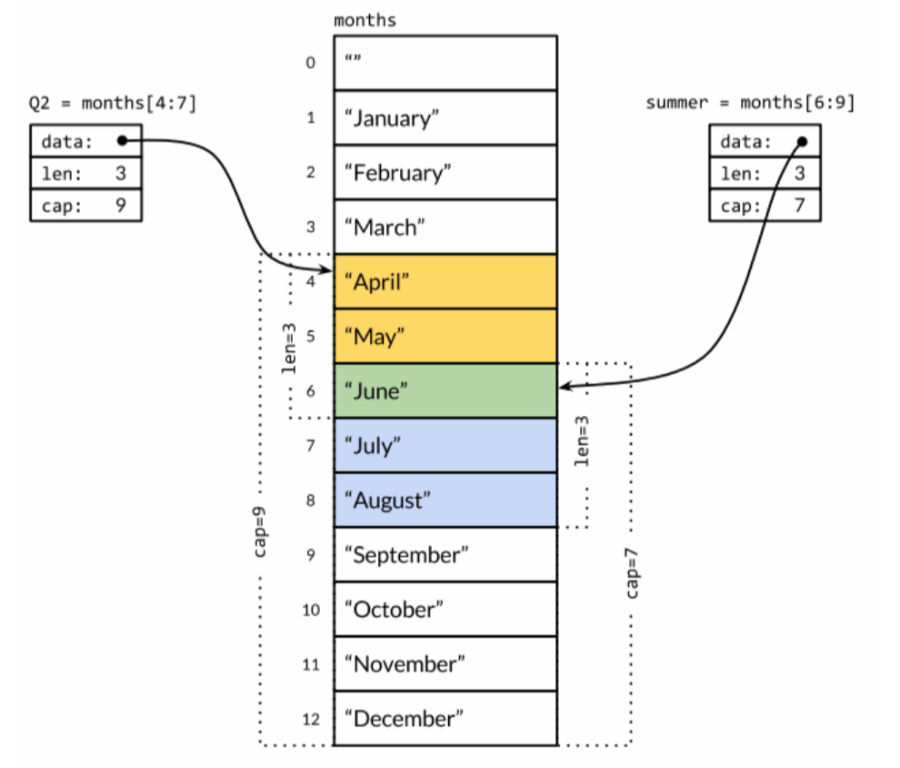

# Slice and Array
## 数组
一个数组可以由零个或多个元素组成。数组的长度是固定的。定义方式：
```go
var a [3]int
var b [3]int = [3]int{1, 2, 3} 
var c [3]int = [3]int{1, 2}
d := [...]int{1, 2, 2, 4}
```
数组的长度是数组类型的一个组成部分，因此[3]int和[4]int是两种不同的数组类型。数组的长度必须是常量表达式，因为数组的长度需要在编译阶段确定。

如果一个数组的元素类型是可以相互比较的，那么数组类型也是可以相互比较的，可以直接通过`==`比较运算符来比较两个数组，只有当两个数组的所有元素都是相等的时候数组才是相等的。
```go
a := [2]int{1, 2}
b := [...]int{1, 2}
c := [2]int{1, 3}
fmt.Println(a == b, a == c, b == c) // "true false false"
d := [3]int{1, 2}
fmt.Println(a == d) // compile error
```

## Slice
Slice(切片)代表变长的序列，序列中每个元素都有相同的类型。slice的语法和数组很像，只是没有固定长度而已。而且slice的底层引用一个数组对象。一个slice由三个部分构成:指针、长度和容量。指针指向第一个slice元素对应的底层数组元素的地址，要注意的是slice的第一个元素并不一定就是数组的第一个元素。长度对应slice中元素的数目;长度不能超过容量，容量一般是从slice的开始位置到底层数据的结尾位置。内置的len和cap函数分别返回slice的长度和容量。


slice值包含指向第一个slice元素的指针，因此向函数传递slice将允许在函数内部修改底层数组的元素。换句话说，复制一个slice只是对底层的数组创建了一个新的slice别名。
```go
func reverse(s []int) {
    for i, j := 0, len(s)-1; i < j; i, j = i+1, j-1 {
        s[i], s[j] = s[j], s[i] 
    }
}

a := [...]int{0, 1, 2, 3, 4, 5} 
reverse(a[:])
fmt.Println(a) // "[5 4 3 2 1 0]"

//循环向左旋转n个元素:
s := []int{0, 1, 2, 3, 4, 5}
// Rotate s left by two positions. 
reverse(s[:2])
reverse(s[2:])
reverse(s)
fmt.Println(s) // "[2 3 4 5 0 1]"
```

`slice之间不能比较，因此我们不能使用==操作符来判断两个slice是否含有全部相等元素。slice唯一合法的比较操作是和nil比较。`

```go
var s []int // len(s) == 0, s == nil 
s = nil // len(s) == 0, s == nil 
s = []int(nil) // len(s) == 0, s == nil 
s = []int{} // len(s) == 0, s != nil
```
内置的make函数创建一个指定元素类型、长度和容量的slice。容量部分可以省略，在这种情况下，容量将等于长度。
```go
make([]T, len)
make([]T, len, cap) // same as make([]T, cap)[:len]
```

一个切片值的容量即为它的第一个元素值在其底层数组中的索引值与该数组长度的差值的绝对值。

## append函数

通过appendInt函数模拟Go内置append函数。

每次调用appendInt函数，必须先检测slice底层数组是否有足够的容量来保存新添加的元素。如果 有足够空间的话，直接扩展slice(依然在原有的底层数组之上)，将新添加的y元素复制到新扩展的空间，并返回slice。因此，输入的x和输出的z共享相同的底层数组。
如果没有足够的增长空间的话，appendInt函数则会先分配一个足够大(2倍)的slice用于保存新的结果，先将输入的x复制到新的空间，然后添加y元素。结果z和输入的x引用的将是不同的底层数组。
```go
/*
Go1.18版本前
新申请的容量如果大于当前容量的两倍，会将新申请的容量直接作为新的容量，如果新申请的容量小于当前容量的两倍，会有一个阈值，即当前切片容量小于1024时，切片会将当前容量的2倍作为新申请的容量，如果大于等于1024，会将当前的容量的1.25倍作为新申请的容量。
*/
//源码片段

newcap := old.cap
doublecap := newcap + newcap
if cap > doublecap {
    newcap = cap
} else {
    if old.cap < 1024 {
        newcap = doublecap
    } else {
        // Check 0 < newcap to detect overflow
        // and prevent an infinite loop.
        for 0 < newcap && newcap < cap {
            newcap += newcap / 4
        }
        // Set newcap to the requested cap when
        // the newcap calculation overflowed.
        if newcap <= 0 {
            newcap = cap
        }
    }
}

/*Go 1.18版本后
新申请的容量如果大于当前容量的两倍，会将新申请的容量直接作为新的容量，如果新申请的容量小于当前容量的两倍，会有一个阈值，即当前切片容量小于256时，切片会将当前容量的2倍作为新申请的容量，如果大于等于256，会将当前的容量的1.25倍+192作为新申请的容量，扩容的时候更加平滑，不会出现从2到1.25的突变。
*/
// 源码片段

newcap := old.cap
doublecap := newcap + newcap
if cap > doublecap {
    newcap = cap
} else {
    const threshold = 256
    if old.cap < threshold {
        newcap = doublecap
    } else {
        // Check 0 < newcap to detect overflow
        // and prevent an infinite loop.
        for 0 < newcap && newcap < cap {
            // Transition from growing 2x for small slices
            // to growing 1.25x for large slices. This formula
            // gives a smooth-ish transition between the two.
            newcap += (newcap + 3*threshold) / 4
        }
        // Set newcap to the requested cap when
        // the newcap calculation overflowed.
        if newcap <= 0 {
            newcap = cap
        }
    }
}
```

```go
var numbers3 = [5]int{1, 2, 3, 4, 5}
var slice1 = numbers3[1:4]  
```    
这时，变量slice1的值是[]int{2, 3, 4}。但是我们可以通过如下操作将其长度延展得与其容量相同：

`slice1 = slice1[:cap(slice1)]`   

通过此操作，变量slice1的值变为了`[]int{2, 3, 4, 5}`，且其长度和容量均为4。现在，numbers3的值中的索引值在`[1,5)`范围内的元素都被体现在了slice1的值中。这是以numbers3的值是slice1的值的底层数组为前提的。

如果我们在切片表达式中加入了第三个索引（即容量上界索引），如：

`var slice1 = numbers3[1:4:4]`

那么在这之后，无论我们怎样做都无法通过slice1访问到numbers3的值中的第五个元素。因为这超出了我们刚刚设定的slice1的容量。如果我们指定的元素上界索引或容量上界索引超出了被操作对象的容量，那么就会引发一个运行时panic，而不会有求值结果返回。因此，这是一个有力的访问控制手段。
  
虽然切片值在上述方面受到了其容量的限制，但是我们却可以通过append对其进行不受任何限制地扩展。

`slice1 = append(slice1, 6, 7)`

通过上述操作，slice1的值变为了[]int{2, 3, 4, 6, 7}。注意，一旦扩展操作超出了被操作的切片值的容量，那么该切片的底层数组就会被自动更换。这也使得通过设定容量上界索引来对其底层数组进行访问控制的方法更加严谨了。
  
我们要介绍的最后一种操作切片值的方法是“复制”。该操作的实施方法是调用copy函数。该函数接受两个类型相同的切片值作为参数，并会把第二个参数值中的元素复制到第一个参数值中的相应位置（索引值相同）上。这里有两点需要注意：
  
1. 这种复制遵循最小复制原则，即：被复制的元素的个数总是等于长度较短的那个参数值的长度。
2. 与append函数不同，copy函数会直接对其第一个参数值进行修改。
```go
var slice4 = []int{0, 0, 0, 0, 0, 0, 0}
copy(slice4, slice1)   
// 通过上述复制操作，slice4会变为[]int{2, 3, 4, 6, 7, 0, 0}。
```

```go
var numbers4 = [...]int{1, 2, 3, 4, 5, 6, 7, 8, 9, 10}
slice5 := numbers4[4:6:8]
// length := 2
// capacity := 4
```

## 比较
1. 长度固定 vs 动态长度：
- 数组是长度固定的，在声明时需要指定长度，并且无法改变长度。
- 切片是动态长度的，可以根据需要自动调整长度，无需在声明时指定长度。

2. 值类型 vs 引用类型：
- 数组是值类型，赋值或传递数组时会进行值的复制。
- 切片是引用类型，赋值或传递切片时会共享底层数据，修改其中一个切片会影响其他引用该底层数组的切片。

3. 内存分配：
- 数组在声明时会直接分配连续的内存空间，长度固定。
- 切片是基于数组的动态长度的视图，底层使用数组来存储数据，但可以根据需要动态调整切片的长度。

4. 使用场景：
- 数组适用于固定长度的数据集合，如存储一组固定大小的元素。
- 切片适用于动态长度的数据集合，如存储可变数量的元素，并且经常需要进行动态调整。

## 练习

下面这段代码输出什么？说明原因。
```go
func main() {
    slice := []int{0, 1, 2, 3}
    m := make(map[int]*int)
    for key, val := range slice {
        m[key] = &val
    }
    for k, v := range m {
        fmt.Println(k, "->", *v)
    }
}

/* 注：key的顺序无法确定
go 1.22输出为：
0 -> 0
1 -> 1
2 -> 2
3 -> 3

当循环内部将&val（即val的地址）存入map时，实际上是为val当前指向的整数值创建了一个新的指针，并将这个指针的副本存入map中。因此，尽管在下一次迭代中val会指向切片中的下一个值，之前存入map的指针仍然指向它们最初分配时val所指向的值的地址，没有改变。
*/
```

下面代码输出什么？
```go
func main() {
    x := []string{"a", "b", "c"}
    for v := range x {
        fmt.Print(v)
    }
}
/*答：012, 因为只写一个变量，range遍历的是数组的索引，而不是数组的值。*/
```

下面这段代码输出什么？
```go
func main() {
    var a = [5]int{1, 2, 3, 4, 5}
    var r [5]int
    for i, v := range a {
        if i == 0 {
            a[1] = 12
            a[2] = 13
        }
        r[i] = v
    }
    fmt.Println("r = ", r)
    fmt.Println("a = ", a)
}
// r =  [1 2 3 4 5]
// a =  [1 12 13 4 5]
// range 表达式是副本参与循环，就是说例子中参与循环的是 a 的副本，而不是真正的 a。就这个例子来说，假设 b 是 a 的副本，则 range 循环代码是这样的：

for i, v := range b {
    if i == 0 {
        a[1] = 12
        a[2] = 13
    }
    r[i] = v
}
// 因此无论 a 被如何修改，其副本 b 依旧保持原值，并且参与循环的是 b，因此 v 从 b 中取出的仍旧是 a 的原值，而非修改后的值。
// 如果想要 r 和 a 一样输出，修复办法：

func main() {
    var a = [5]int{1, 2, 3, 4, 5}
    var r [5]int

    for i, v := range &a {
        if i == 0 {
            a[1] = 12
            a[2] = 13
        }
        r[i] = v
    }
    fmt.Println("r = ", r)
    fmt.Println("a = ", a)
}
// r =  [1 12 13 4 5]
// a =  [1 12 13 4 5]
// 修复代码中，使用 *[5]int 作为 range 表达式，其副本依旧是一个指向原数组 a 的指针，因此后续所有循环中均是 &a 指向的原数组亲自参与的，因此 v 能从 &a 指向的原数组中取出 a 修改后的值。
```

下面这段代码输出什么？
```go
func main() {
    var a = []int{1, 2, 3, 4, 5}
    var r [5]int

    for i, v := range a {
        if i == 0 {
            a[1] = 12
            a[2] = 13
        }
        r[i] = v
    }
    fmt.Println("r = ", r)
    fmt.Println("a = ", a)
}
// r =  [1 12 13 4 5]
// a =  [1 12 13 4 5]

/* 上题是数组。此题为切片，切片在 go 的内部结构有一个指向底层数组的指针，当 range 表达式发生复制时，副本的指针依旧指向原底层数组，所以对切片的修改都会反应到底层数组上，所以通过 v 可以获得修改后的数组元素。*/
```

下面这段代码能否正常结束？
```go
func main() {
    v := []int{1, 2, 3}
    for i:= range v {
        v = append(v, i)
    }
}
// 不会出现死循环，能正常结束
// 循环次数在循环开始前就已经确定，循环内改变切片的长度，不影响循环次数。
```

下面代码输出什么？
```go
func test() []func() {
    var funs []func()
    for i := 0; i < 2; i++ {
        funs = append(funs, func() {
            println(&i, i)
        })
    }
    return funs
}

func main() {
    funs := test()
    for _, f := range funs {
        f()
    }
}
//0xc000012028 0
//0xc000012040 1
```

下面两段代码输出什么？
```go
// 1.
func main() {
    s := make([]int, 5)
    s = append(s, 1, 2, 3)
    fmt.Println(s)
}

// 2.
func main() {
    s := make([]int, 0)
    s = append(s, 1, 2, 3, 4)
    fmt.Println(s)
}
// 1.  [0 0 0 0 0 1 2 3]
// 2.  [1 2 3 4]
// 使用 `append` 向 `slice` 中添加元素，第一题中slice长度为5，容量为5的零值，第二题为长度为0。
```

下面这段代码能否通过编译?
```go
func main() {
    s1 := []int{1, 2, 3}
    s2 := []int{4, 5}
    s1 = append(s1, s2)
    fmt.Println(s1)
}
// 不能通过, append()的第二个参数不能直接使用 slice ，需使用 `...` 操作符，将一个切片追加到另一个切片上： `append(s1, s2...)` 。或者直接跟上元素，形如： `append(s1, 1, 2, 3)`  。
```

以下代码输出什么？
```go
func main() {
    a := []int{7, 8, 9}
    fmt.Printf("%+v\n", a)
    ap(a)
    fmt.Printf("%+v\n", a)
    app(a)
    fmt.Printf("%+v\n", a)
}

func ap(a []int) {
    a = append(a, 10)
}

func app(a []int) {
    a[0] = 1
}
/*
[7 8 9]
[7 8 9]
[1 8 9]
因为append导致slice的capacity发生变化，所以底层数组重新分配内存了，append中的a这个alice的底层数组和外面不是一个，并没有改变外面的。
*/
```

下面这段代码输出什么？
```go
func hello(num ...int) {
    num[0] = 18
}

func main() {
    i := []int{5, 6, 7}
    hello(i...)
    fmt.Println(i[0])
}
// 18
// 可变参数传递过去，改变了第一个值。
```

下面这段代码输出什么？
```go
package main

import (  
    "fmt"
)

func main() {  
    a := [5]int{1, 2, 3, 4, 5}
    t := a[3:4:4]
    fmt.Println(t[0])
}
// 4
```
操作符 `[i, j]`。基于数组（切片）可以使用操作符 `[i, j]`创建新的切片，从索引 `i` ，到索引 `j` 结束，截取已有数组（切片）的任意部分，返回新的切片，新切片的值包含原数组（切片）的 `i` 索引的值，但是不包含 `j` 索引的值。`i` 、`j` 都是可选的，`i` 如果省略，默认是0，`j` 如果省略，默认是原数组（切片）的长度。`i` 、`j` 都不能超过这个长度值。

- 假如底层数组的大小为 k，截取之后获得的切片的长度和容量的计算方法：`长度：j-i，容量：k-i`。

- 截取操作符还可以有第三个参数，形如 [i,j,k]，第三个参数 k 用来限制新切片的容量，但 k 不能小于i，j，也不能超过原数组（切片）的底层数组大小。截取获得的切片的长度和容量分别是：`j-i、k-i`。所以例子中，切片 t 为 [4]，长度和容量都是 1。如果`t := a[3:4]`, 则切片长度为1，容量是2。

切片 a、b、c 的长度和容量分别是多少？
```go
func main() {
    s := [3]int{1, 2, 3}
    a := s[:0]
    b := s[:2]
    c := s[1:2:cap(s)]
}
/*
0  3、
2  3、
1  2

截取操作有带 2 个或者 3 个参数，形如：[i:j] 和 [i:j:k]，假设截取对象的底层数组长度为 l。在操作符 [i:j] 中，如果 i 省略，默认 0，如果 j 省略，默认底层数组的长度，截取得到的切片长度和容量计算方法是 j-i、l-i。操作符 [i:j:k]，k 主要是用来限制切片的容量，但是不能大于数组的长度 l，截取得到的切片长度和容量计算方法是 j-i、k-i。
*/
```

关于 cap() 函数的适用类型，下面说法正确的是() -- 答：A、B、D。cap() 函数不适用 map

- A. array
- B. slice
- C. map
- D. channel

下面这段代码输出什么？

```go
func main() {
    a := [2]int{5, 6}
    b := [3]int{5, 6}
    if a == b {
        fmt.Println("equal")
    } else {
        fmt.Println("not equal")
    }
}
// compilation error  
// `invalid operation: a == b (mismatched types [2]int and [3]int)`
// Go中的数组是值类型，可比较，另外一方面，数组的长度也是数组类型的组成部分，所以 `a` 和 `b` 是不同的类型，是不能比较的，所以编译错误。
```

下面这段代码输出什么？
```go
func change(s ...int) {
    s = append(s,3)
}

func main() {
    slice := make([]int,5,5)
    slice[0] = 1
    slice[1] = 2
    change(slice...)
    fmt.Println(slice)
    change(slice[0:2]...)
    fmt.Println(slice)
}
/*
 [1 2 0 0 0]
 [1 2 3 0 0]

Go 提供的语法糖`...`，可以将 slice 传进可变函数，不会创建新的切片。第一次调用 change() 时，append() 操作使切片底层数组发生了扩容，change函数内部s的地址发生了变化，原 slice 的底层数组不会改变；第二次调用change() 函数时，使用了操作符`[i,j]`获得一个新的切片，假定为 slice1，它的底层数组和原切片底层数组是重合的，不过 slice1 的长度、容量分别是 2、5，所以在 change() 函数中对 slice1 底层数组的修改会影响到原切片。
*/
// 这个代码帮助理解
func change(s ...int) {
	fmt.Println("IN: ", s, &s, &s[0])
	s = append(s, 3)
	fmt.Println("IN: ", s, &s, &s[0])
}

func main() {
	slice := make([]int, 5, 5)
	slice[0] = 1
	slice[1] = 2

	fmt.Println(slice, len(slice), cap(slice))
	change(slice...)
	fmt.Println(slice, len(slice), cap(slice))
	change(slice[0:2]...)
	fmt.Println(slice, len(slice), cap(slice))
}

/* 结果：
[1 2 0 0 0] 5 5
IN:  [1 2 0 0 0] &[1 2 0 0 0] 0xc00011a000
IN:  [1 2 0 0 0 3] &[1 2 0 0 0 3] 0xc000124000
[1 2 0 0 0] 5 5
IN:  [1 2] &[1 2] 0xc00011a000
IN:  [1 2 3] &[1 2 3] 0xc00011a000
[1 2 3 0 0] 5 5
*/
```


下面的代码有什么问题？
```go
package main

import "fmt"

func main() {
    s := make([]int, 3, 9)
    fmt.Println(len(s)) 
    s2 := s[4:8]
    fmt.Println(len(s2)) 
}
/* 输出 3 4**
从一个基础切片派生出的子切片的长度可能大于基础切片的长度。假设基础切片是 baseSlice，使用操作符 [low,high]，有如下规则：0 <= low <= high <= cap(baseSlice)，只要上述满足这个关系，下标 low 和 high 都可以大于 len(baseSlice)。
*/
```

下面代码输出什么？
```go
func main() {
    a := [3]int{0, 1, 2}
    s := a[1:2]

    s[0] = 11
    s = append(s, 12)
    s = append(s, 13)
    s[0] = 21

    fmt.Println(a)
    fmt.Println(s)
}
// [0 11 12]
// [21 12 13]
```

下面代码输出什么？
```go
func main() {
    var src, dst []int
    src = []int{1, 2, 3}
    copy(dst, src) 
    fmt.Println(dst)
}
/* 输出结果为[]

copy函数实际上会返回一个int值，这个int是一个size，计算逻辑为size = min(len(dst), len(src))，这个size的大小，
决定了src要copy几个元素给dst，由于题目中，dst声明了，但是没有进行初始化，所以dst的len是0，因此实际没有从src上copy到任何元素给dst
*/
```

下面的代码输出什么？
```go
type T struct {
    n int
}

func main() {
    ts := [2]T{}
    for i, t := range ts {
        switch i {
        case 0:
            t.n = 3
            ts[1].n = 9
        case 1:
            fmt.Print(t.n, " ")
        }
    }
    fmt.Print(ts)
}
/* 0 [{0} {9}]

for-range 循环数组。此时使用的是数组 ts 的副本，所以 t.n = 3 的赋值操作不会影响原数组。但ts[1]是指针，会改变原有值。 */
```

下面的代码输出什么？
```go
type T struct {
    n int
}

func main() {
    ts := [2]T{}
    for i, t := range &ts {
        switch i {
        case 0:
            t.n = 3
            ts[1].n = 9
        case 1:
            fmt.Print(t.n, " ")
        }
    }
    fmt.Print(ts)
}
/* 9 [{0} {9}]
和上题的区别是 for-range 数组指针。
但循环中的循环变量 t 是原数组元素的副本。如果数组元素是结构体值，则副本的字段和原数组字段是两个不同的值。
*/
```

下面的代码输出什么？
```go
type T struct {
    n int
}

func main() {
    ts := [2]T{}
    for i := range ts[:] {
        switch i {
        case 0:
            ts[1].n = 9
        case 1:
            fmt.Print(ts[i].n, " ")
        }
    }
    fmt.Print(ts)
}
/* 9 [{0} {9}]
for-range 切片时使用的是切片的副本，但不会复制底层数组，换句话说，此副本切片与原数组共享底层数组。
*/
```

下面的代码输出什么？
```go
type T struct {
    n int
}

func main() {
    ts := [2]T{}
    for i := range ts[:] {
        switch t := &ts[i]; i {
        case 0:
            t.n = 3;
            ts[1].n = 9
        case 1:
            fmt.Print(t.n, " ")
        }
    }
    fmt.Print(ts)
}
// 9 [{3} {9}]
// 每次 t拿到了ts[i] 指针。
```

下面代码输出什么？
```go
func main() {
    var a = []int{1, 2, 3, 4, 5}
    var r = make([]int, 0)
    for i, v := range a {
        if i == 0 {
            a = append(a, 6, 7)
        }
        r = append(r, v)
    }
    fmt.Println(r)
}
/*
[1 2 3 4 5]

a 在 for range 过程中增加了两个元素，len 由 5 增加到 7，但 for range 时会使用 a 的副本 a' 参与循环，副本的 len 依旧是 5，因此 for range 只会循环 5 次，也就只获取 a 对应的底层数组的前 5 个元素。
*/
```

下面这段代码输出什么？
```go
var x = []int{2: 2, 3, 0: 1}

func main() {
    fmt.Println(x)
}
/*
[1 0 2 3]
字面量初始化切片时候，可以指定索引，没有指定索引的元素会在前一个索引基础之上加一，所以输出`[1 0 2 3]`，而不是`[1 3 2]`。
*/
```

下面代码下划线处可以填入哪个选项以输出yes nil？
```go
func main() {
    var s1 []int
    var s2 = []int{}
    if __ == nil {
        fmt.Println("yes nil")
    }else{
        fmt.Println("no nil")
    }
    fmt.Println(s1, s2) // for bypass declare but not use.
}
/* s1

nil 切片和空切片。
nil 切片和 nil 相等，一般用来表示一个不存在的切片；空切片和 nil 不相等，表示一个空的集合。
*/
```

下面的两个切片声明中有什么区别？哪个更可取？
```go
A. var a []int
B. a := []int{}
//A 声明的是 nil 切片；B 声明的是长度和容量都为 0 的空切片。第一种切片声明不会分配内存，优先选择。
```

下面这段代码输出什么？为什么？
```go
func main() {
    s1 := []int{1, 2, 3}
    s2 := s1[1:]
    s2[1] = 4
    fmt.Println(s1)
    s2 = append(s2, 5, 6, 7)
    fmt.Println(s1)
}
/*
[1 2 4]
[1 2 4]
golang 中切片底层的数据结构是数组。当使用 s1[1:] 获得切片 s2，和 s1 共享同一个底层数组，这会导致 s2[1] = 4 语句影响 s1。

而 append 操作会导致底层数组扩容，生成新的数组，因此追加数据后的 s2 不会影响 s1。

这里注意，如果分三次append 5,6,7, cap(s2)是8，但一次append(5,6,7), cap(s2)是6。
*/
```


下面的代码有什么问题？
```go
func main() {
    fmt.Println([...]int{1} == [2]int{1})
    fmt.Println([]int{1} == []int{1})
}
// go 中不同类型是不能比较的，而数组长度是数组类型的一部分，所以 `[…]int{1}` 和 `[2]int{1}` 是两种不同的类型，不能比较；
// 切片是不能比较的；
```

下面这段代码输出什么？为什么？
```go
func main() {
    var m = [...]int{1, 2, 3}
    for i, v := range m {
        go func() {
            fmt.Println(i, v)
        }()
    }
    time.Sleep(time.Second * 3)
}
// 0 1
// 1 2
// 2 3 
// 不保证顺序

for i, v := range m {
    go func(i,v int) {
        fmt.Println(i, v)
    }(i,v)
}
  
for i, v := range m {
    i := i  // 这里的 := 会重新声明变量，而不是重用
    v := v
    go func() {
        fmt.Println(i, v)
    }()
}
```

下面这段代码输出结果正确正确吗？ 正确
```go
type Foo struct {
    bar string
}
func main() {
    s1 := []Foo{
        {"A"},
        {"B"},
        {"C"},
    }
    s2 := make([]*Foo, len(s1))
    for i, value := range s1 {
        s2[i] = &value
    }
    fmt.Println(s1[0], s1[1], s1[2])
    fmt.Println(s2[0], s2[1], s2[2])
}
// 输出：
// {A} {B} {C}
// &{A} &{B} &{C}
```

关于整型切片的初始化，下面正确的是？答：B C D

- A. s := make([]int)
- B. s := make([]int, 0)
- C. s := make([]int, 5, 10)
- D. s := []int{1, 2, 3, 4, 5}

下面哪一行代码会 panic，请说明原因？
```go
package main

func main() {
    x := make([]int, 2, 10)
    _ = x[6:10]
    _ = x[6:] // panic
    _ = x[2:]
}
//第 6 行，截取符号 [i:j]，如果 j 省略，默认是原切片或者数组的长度，x 的长度是 2，小于起始下标 6 ，所以 panic。
```

下面哪一行代码会 panic，请说明原因？
```go
package main

func main() {
    var m map[int]bool // nil
    _ = m[123]
    var p *[5]string // nil
    for range p {
        _ = len(p)
    }
    var s []int // nil
    _ = s[:]
    s, s[0] = []int{1, 2}, 9  // panic
}
// 因为左侧的 s[0] 中的 s 为 nil。
```

下面代码输出什么？
```go
func main() {
    var k = 9
    for k = range []int{} {}
    fmt.Println(k)

    for k = 0; k < 3; k++ {
    }
    fmt.Println(k)

    for k = range (*[3]int)(nil) {
    }
    fmt.Println(k)
}
// 932
```

关于 cap 函数适用下面哪些类型？答：A B D
- A. 数组；
- B. channel;
- C. map；
- D. slice；

`cap()`函数的作用是：
    
    array 返回数组的元素个数
    slice 返回slice的最大容量
    channel 返回 channel的容量

new() 与 make() 的区别？
- `new(T)`  和 `make(T, args)`  是Go语言内建函数，用来分配内存，但适用的类型不用。
- `new(T)` 会为了 `T` 类型的新值分配已置零的内存空间，并返回地址（指针），即类型为 `*T` 的值。换句话说就是，返回一个指针，该指针指向新分配的、类型为 `T` 的零值。适用于值类型，如 `数组` 、 `结构体` 等。
- `make(T, args)` 返回初始化之后的T类型的值，也不是指针 `*T` ，是经过初始化之后的T的引用。 `make()` 只适用于 `slice` 、 `map` 和 `channel` 。

下面这段代码能否通过编译，不能的话原因是什么；如果能，输出什么？
```go
func main() {
    list := new([]int)
    list = append(list, 1)
    fmt.Println(list)
}
//不能通过编译， `new([]int)` 之后的 `list` 是一个 `*[]int` 类型的指针，不能对指针执行 `append` 操作。可以使用 `make()` 初始化之后再用。同样的， `map` 和 `channel` 建议使用 `make()` 或字面量的方式初始化，不要用 `new` 。

//如果一定要`append`操作可以这样：
func main() {
	list := new([]int)
	*list = append(*list, 1)
	fmt.Println(list)
}
// 结果：&[1]
```

下面代码有什么问题？
```go
func main() {
    x := []int{
        1,
        2
    }
    _ = x
}
// 编译错误
// 第四行代码没有逗号。用字面量初始化数组、slice 和 map 时，最好是在每个元素后面加上逗号，即使是声明在一行或者多行都不会出错。
// 修复代码：
func main() {
	x := []int{ // 多行
		1,
		2,
	}
	_ = x

	y := []int{3, 4,} // 一行 no error
	_ = y
}
```


range 看源代码？